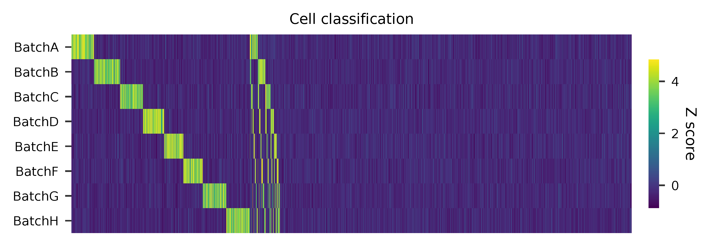

# fba tutorial

Dataset: Cell hashing

Stoeckius, M., Zheng, S., Houck-Loomis, B., Hao, S., Yeung, B.Z., Mauck, W.M., 3rd, Smibert, P., and Satija, R. (2018). [Cell Hashing with barcoded antibodies enables multiplexing and doublet detection for single cell genomics](https://doi.org/10.1186/s13059-018-1603-1). Genome Biol. 19, 224.

<br>

## Preparation

Download fastq files ([NCBI GEO](https://www.ncbi.nlm.nih.gov/geo/query/acc.cgi?acc=GSM2895283)).

```shell
$ wget ftp.sra.ebi.ac.uk/vol1/fastq/SRR828/007/SRR8281307/SRR8281307_1.fastq.gz
$ wget ftp.sra.ebi.ac.uk/vol1/fastq/SRR828/007/SRR8281307/SRR8281307_2.fastq.gz
```

Download cell barcode info.

These are the cell-associated barcodes in this single cell RNA-Seq library (determined by the number of transcriptomic UMIs caputured per barcode).

```shell
$ curl -O https://ftp.ncbi.nlm.nih.gov/geo/samples/GSM2895nnn/GSM2895283/suppl/GSM2895283_Hashtag-HTO-count.csv.gz

$ gzip -dc GSM2895283_Hashtag-HTO-count.csv.gz | head -1 | sed 's/,/\n/g' | grep -v '^$' > cell_barcodes.txt
```

Inspect cell barcodes.

```shell
$ head cell_barcodes.txt

GGCGACTAGAGGACGG
CATCAAGGTCTTGTCC
AAACCTGAGTGATCGG
TGAGGGAGTACTTAGC
CCTAAAGAGATGTGGC
AGACGTTTCAGCCTAA
TGGGAAGCAACACCCG
CGATTGATCTTCGGTC
CATCGAAGTGATGCCC
TCAGATGCACGAGAGT
```

Prepare feature barcodes (hashtag-oligos, HTO).

```shell
$ gzip -dc GSM2895283_Hashtag-HTO-count.csv.gz | cut -d ',' -f1 | grep Batch | gsed 's/-/\t/g' > feature_barcodes.tsv
```

Inspect feature barcodes.

```shell
$ cat feature_barcodes.tsv

BatchA  AGGACCATCCAA
BatchB  ACATGTTACCGT
BatchC  AGCTTACTATCC
BatchD  TCGATAATGCGA
BatchE  GAGGCTGAGCTA
BatchF  GTGTGACGTATT
BatchG  ACTGTCTAACGG
BatchH  TATCACATCGGT
```

<br>

## QC

Sample the first 20,000 (set by `-n`) read pairs for quality control. Use `-t` to set the number of threads. The diagnostic results and plots are generated in the `qc` directory (set by `--output_directory`). By default, full length of read 1 and read 2 are searched against reference cell and feature barcodes, respectively. The per base content of both read pairs and the distribution of matched barcode positions are summarized. Use `-r1_coords` and/or `-r2_coords` to limit the search range.  Use `-cb_n` and/or `-fb_n` to set the mismatch tolerance for cell and feature barcode matching.

```shell
$ fba qc \
    -1 SRR8281307_1.fastq.gz \
    -2 SRR8281307_2.fastq.gz \
    -w cell_barcodes.txt \
    -f feature_barcodes.tsv \
    --output_directory qc \
    -n 20000
```

This library is constructed using Chromium Single Cell 3' Reagent Kits (v2 Chemistry). The first 16 bases are cell barcodes and the following 10 bases are UMIs. Based on the base content plot, the GC content of cell barcodes and UMIs are quite even. Ploy-A/T tail starts at base 26.

<p align='center'>
    
</p>

<p align='center'>
    
</p>

As for read 2, based on the per base content, it suggests that bases 0-11 are relatively GC balanced for the reads we have sampled. Starting from base 12, it is poly-A tail. Bases 0-11 are hashtag oligo sequences. Most of the reads have the correct structure.

<p align='center'>
    
</p>

<p align='center'>
    
</p>

The detailed qc results are stored in `feature_barcoding_output.tsv.gz` file. `matching_pos` columns indicate the matched positions on reads. `matching_description` columns indicate mismatches in substitutions:insertions:deletions format.

```shell
$ gzip -dc qc/feature_barcoding_output.tsv.gz | head

read1_seq       cell_barcode    cb_matching_pos cb_matching_description read2_seq       feature_barcode fb_matching_pos fb_matching_description
NTCCGAACATATGAGAGCAATAGTCGTTT   CGAACATGTAAGAGAG        3:17    1:0:2   NCATGTTACCGTGAAAAAAAAAAAAAAAAAAAAAAAAAAAAAAAAACAGCAATTGTCACTTATAGGAGGAGAAGAAGGGAAGGGGGGGGGGGGGGGAAA     BatchB_ACATGTTACCGT     0:12    1:0:0
NAACGGATCCACGAATGAAGGACGCCTTT   TACGGTATCCACGAAT        1:16    1:0:1   NNGNNAATGCGAGAAAAAAAAAAAAAAAAAAAAAAAAAAAAGGGGCGCTCTCTTCGGGGGGGCGGGGAGAGCGAAGGAGGGGGGGGGGGGGGGAAGGAG     no_match        NA      NA
NGGCCAGTCTTCAACTGTTAACACTATTT   GTCCTCAAGCTGTCTA        6:20    1:0:2   NNNNNNNNNNNNNAAANNAAAAAAAAAAAAAAAAAAAAAAAAAAAAAAGGTTTAAAAAGTGAAAGAGGGACAAAACGGGAAAAACGGGGGTGGGGAAAA     no_match        NA      NA
NATCCAGCAATACGCTTTCCACGACATTT   ATCCACCCATACGCTA        1:17    3:0:0   NNNNNNNNNNNNNAAANNAAAAAAAAAAAAAAAAAAAAAGTGGGGGGAAAGCGGTTTTGGGAGATAAAACGAAAAAGCGGCGGGGGGGGAAAAAGGTGA     no_match        NA      NA
NTGCGATAGACACTAAGAGGAGTTCATTT   CGCGGTAAGACACTAA        1:16    2:0:1   NCGATAATGCGACAAAAAAAAAAAAAAAAAAAAAAAAAAAAAAAAAAAACCCCCTTTGTTTTTATCGTAAAGATGGGAAGGGGGCGGTGGAGGGAAAAA     BatchD_TCGATAATGCGA     0:12    1:0:0
NTGATCCAGAAGGTGAGGGAGGCTGATTT   AGATTGCGTGAGGGAG        7:21    1:0:2   NNNNNNNNNNNNNNAANNAAAAAAAAAAAAAAAAAATCACCCCCCCCCCCCTTTTGGTTCAAAAACGGAAAAAGCGCCGCGGGGGGAAAGAGTGTAAAT     no_match        NA      NA
NTGGGTCAGGCCGAATTGAAGGGATGTTT   GAAATGAAGTGAAGTT        12:28   3:0:0   NNNNNNCTATCCAAAANNAAAAAAAAAAAAAAAAAAAAAAAAAAAAAAACCCCTTCAATTGGCCCAGACCCAACACTCGAAGGGCCGGCTGGCAGCAAA     no_match        NA      NA
NGAGAAGTCTCGATGAATCTAGCCGCTTT   CGATTGAAGCTAGCCC        10:25   2:0:1   NNNNNNNNNCTNCAAANNAAAAAAAAAAAAAAATAAAAAAAACGGGCTGATCCCAAGCAGACGTCACAAAGAAGCGAGAGAGTGGGATTGAGAAAAAGA     no_match        NA      NA
NCACGGAGTTCCCTTGCCAATGTAGTTTT   AGGGAGTTCGTTTGCC        2:18    3:0:0   NGCTTACTATCCTAAAAAAAAAAAAAAAAAAAAAAAAAAAAAAAAATATGGGGGGGGGGAATCGGGGGGGAGGGGAAAGGGGGGGTGGGGGAAAAAAGA     BatchC_AGCTTACTATCC     0:12    1:0:0
```

<br>

## Barcode extraction

The lengths of cell and feature barcodes (hashtags) are all identical (16 and 12, respectively). And based on qc results, the distributions of starting and ending positions of cell and feature barcodes are very uniform.  Search ranges are set to `0,16` on read 1 and `0,12` on read 2. One mismatch for cell and feature barcodes (`-cb_m`, `-cf_m`) are allowed. Three ambiguous nucleotides (Ns) for read 1 and read2 (`-cb_n`, `-cf_n`) are allowed.

```shell
$ fba extract \
    -1 SRR8281307_1.fastq.gz \
    -2 SRR8281307_2.fastq.gz \
    -w cell_barcodes.txt \
    -f feature_barcodes.tsv \
    -o feature_barcoding_output.tsv.gz \
    -r1_coords 0,16 \
    -r2_coords 0,12 \
    -cb_m 1 \
    -fb_m 1 \
    -cb_n 3 \
    -fb_n 3 \
    -e
```

Preview of result.

```shell
gzip -dc feature_barcoding_output.tsv.gz | head

read1_seq       cell_barcode    cb_num_mismatches       read2_seq       feature_barcode fb_num_mismatches
NTCCGAACATATGAGAgcaatagtcgttt   ATCCGAACATATGAGA        1       NCATGTTACCGTgaaaaaaaaaaaaaaaaaaaaaaaaaaaaaaaaacagcaattgtcacttataggaggagaagaagggaagggggggggggggggaaa    BatchB_ACATGTTACCGT     1
NTGCGATAGACACTAAgaggagttcattt   ATGCGATAGACACTAA        1       NCGATAATGCGAcaaaaaaaaaaaaaaaaaaaaaaaaaaaaaaaaaaaaccccctttgtttttatcgtaaagatgggaagggggcggtggagggaaaaa    BatchD_TCGATAATGCGA     1
NCACGGAGTTCCCTTGccaatgtagtttt   CCACGGAGTTCCCTTG        1       NGCTTACTATCCtaaaaaaaaaaaaaaaaaaaaaaaaaaaaaaaaatatggggggggggaatcgggggggaggggaaagggggggtgggggaaaaaaga    BatchC_AGCTTACTATCC     1
NGGGATGCAGCTTAACcgggcatcgcttt   AGGGATGCAGCTTAAC        1       NCATGTTACCGTcaaaaaaaaaaaaaaaaaaaaaaaaaaaaaatgaaatggaagtaggggtgtccctagtctgtagaagcggcgactggggaaatgtat    BatchB_ACATGTTACCGT     1
NTTGTCACATACGCTAcgagcctgcattt   TTTGTCACATACGCTA        1       NATCACATCGGTtaaaaaaaaaaaaaaaaaaaaaaaaaaaagaaggccggggggggggggaaaaaaaaaaaaaaaaagggcggggtggggagagagtga    BatchH_TATCACATCGGT     1
NGCTCTCGTTCCACGGaggttatcggttt   AGCTCTCGTTCCACGG        1       NCTGTCTAACGGgaaaaaaaaaaaaaaaaaaaaaaaaaaaaaaaaaaacccccggggaggggaaaaaaagcaggaaaagcgccatgggggaaaaaaaaa    BatchG_ACTGTCTAACGG     1
GATCTAGCAATGTTGCcaaccattttttt   GATCTAGCAATGTTGC        0       AGGACCATCCAAgaaaaaaaaaaaaaaaaaaaaaaaaaaaaaaaaaaaaaaagatggaggaacttggttagaacagaaggaggaggggtggggggggaa    BatchA_AGGACCATCCAA     0
NTTGCGCCATGGTCATagtaacaagattt   TTTGCGCCATGGTCAT        1       NCATGTTACCGTcaaaaaaaaaaaaaaaaaaaaaaaaaaaaatctttttcttttgccctgggcgaaaaagatgggaggagggggggggggggaaagggt    BatchB_ACATGTTACCGT     1
CGCGGTAAGACACTAAcggccgtggtttt   CGCGGTAAGACACTAA        0       TATCACATCGGTtaaaaaaaaaaaaaaaaaaaaaaaaaaaaaaacccgggcgggtggggttttacgaggaaggggagcagggggggtggaggaaaaaaa    BatchH_TATCACATCGGT     0
```

Result summary.

91.5 % (67,916,430 out of 74,219,921) of total read pairs have valid cell and feature barcodes. Majority of the fragments in this library have the correct structure.

```shell
2021-02-17 16:16:13,003 - fba.__main__ - INFO - fba version: 0.0.7
2021-02-17 16:16:13,003 - fba.__main__ - INFO - Initiating logging ...
2021-02-17 16:16:13,003 - fba.__main__ - INFO - Python version: 3.7
2021-02-17 16:16:13,003 - fba.__main__ - INFO - Using extract subcommand ...
2021-02-17 16:16:13,026 - fba.levenshtein - INFO - Number of reference cell barcodes: 65,000
2021-02-17 16:16:13,027 - fba.levenshtein - INFO - Number of reference feature barcodes: 8
2021-02-17 16:16:13,027 - fba.levenshtein - INFO - Read 1 coordinates to search: [0, 16)
2021-02-17 16:16:13,027 - fba.levenshtein - INFO - Read 2 coordinates to search: [0, 12)
2021-02-17 16:16:13,027 - fba.levenshtein - INFO - Cell barcode maximum number of mismatches: 1
2021-02-17 16:16:13,027 - fba.levenshtein - INFO - Feature barcode maximum number of mismatches: 1
2021-02-17 16:16:13,027 - fba.levenshtein - INFO - Read 1 maximum number of N allowed: 3
2021-02-17 16:16:13,027 - fba.levenshtein - INFO - Read 2 maximum number of N allowed: 3
2021-02-17 16:16:15,500 - fba.levenshtein - INFO - Matching ...
2021-02-17 16:28:20,306 - fba.levenshtein - INFO - Read pairs processed: 10,000,000
2021-02-17 16:40:24,344 - fba.levenshtein - INFO - Read pairs processed: 20,000,000
2021-02-17 16:52:14,506 - fba.levenshtein - INFO - Read pairs processed: 30,000,000
2021-02-17 17:04:04,292 - fba.levenshtein - INFO - Read pairs processed: 40,000,000
2021-02-17 17:15:52,792 - fba.levenshtein - INFO - Read pairs processed: 50,000,000
2021-02-17 17:27:43,975 - fba.levenshtein - INFO - Read pairs processed: 60,000,000
2021-02-17 17:39:35,941 - fba.levenshtein - INFO - Read pairs processed: 70,000,000
2021-02-17 17:44:36,162 - fba.levenshtein - INFO - Number of read pairs processed: 74,219,921
2021-02-17 17:44:36,162 - fba.levenshtein - INFO - Number of read pairs w/ valid barcodes: 67,916,430
2021-02-17 17:44:36,264 - fba.__main__ - INFO - Done.
```

<br>

## Matrix generation

Only fragments with valid (passed the criteria) cell and feature barcodes are included. UMI deduplication is powered by UMI-tools ([Smith, T., et al. 2017. Genome Res. 27, 491–499.](http://www.genome.org/cgi/doi/10.1101/gr.209601.116)). Use `-us` to set the UMI starting position on read 1. Use `-ul` to set the UMI length. Fragments with UMI length less than this value are discarded. Use `-um` to set mismatch threshold. UMI deduplication method is set by `-ud`.

The generated feature count matrix can be easily imported into well-established single cell analysis packages: [Seruat](https://satijalab.org/seurat/) and [Scanpy](https://scanpy.readthedocs.io/en/stable/).


```shell
$ fba count \
    -i feature_barcoding_output.tsv.gz \
    -o matrix_featurecount.csv.gz \
    -us 16 \
    -ul 10 \
    -um 1 \
    -ud directional
```

Result summary.

25.1% (17,022,091 out of 67,916,430) of read pairs with valid cell and feature barcodes are unique fragments. 22.9% (17,022,125 out of 74,219,921) of total sequenced read pairs contribute to the final matrix.

```shell
2021-02-17 17:44:43,315 - fba.__main__ - INFO - fba version: 0.0.7
2021-02-17 17:44:43,315 - fba.__main__ - INFO - Initiating logging ...
2021-02-17 17:44:43,315 - fba.__main__ - INFO - Python version: 3.7
2021-02-17 17:44:43,315 - fba.__main__ - INFO - Using count subcommand ...
2021-02-17 17:44:43,315 - fba.count - INFO - UMI-tools version: 1.0.0
2021-02-17 17:44:43,318 - fba.count - INFO - UMI starting position on read 1: 16
2021-02-17 17:44:43,318 - fba.count - INFO - UMI length: 10
2021-02-17 17:44:43,318 - fba.count - INFO - UMI-tools deduplication threshold: 1
2021-02-17 17:44:43,318 - fba.count - INFO - UMI-tools deduplication method: directional
2021-02-17 17:44:43,318 - fba.count - INFO - Header line: read1_seq cell_barcode cb_num_mismatches read2_seq feature_barcode fb_num_mismatches
2021-02-17 17:48:32,866 - fba.count - INFO - Number of lines processed: 67,916,430
2021-02-17 17:48:33,127 - fba.count - INFO - Number of cell barcodes detected: 64,998
2021-02-17 17:48:33,127 - fba.count - INFO - Number of features detected: 8
2021-02-17 18:01:15,176 - fba.count - INFO - Total UMIs after deduplication: 17,022,091
2021-02-17 18:01:15,298 - fba.count - INFO - Median number of UMIs per cell: 63.0
2021-02-17 18:01:16,924 - fba.__main__ - INFO - Done.
```

<br>

## Demultiplexing

Cells are classified based on feature count matrix. The method 1 is implemented based on the method described in [Stoeckius, M., et al. (2018)](https://doi.org/10.1186/s13059-018-1603-1) with some modifications. A cell identity matrix is generated in the output directory: 0 means negative, 1 means positive. Use `-q` to set the quantile threshold for demulitplexing. Set `-v` to enable generating visualization plots.

```shell
$ fba demultiplex \
    -i matrix_featurecount.csv.gz \
    --output_directory demultiplexed \
    -v
```


Heatmap of relative abundance of features across all cells. Each column represents a single cell.
<p align='center'>
    
</p>

t-SNE embedding based on the abundance of features.
<p align='center'>
    
</p>
