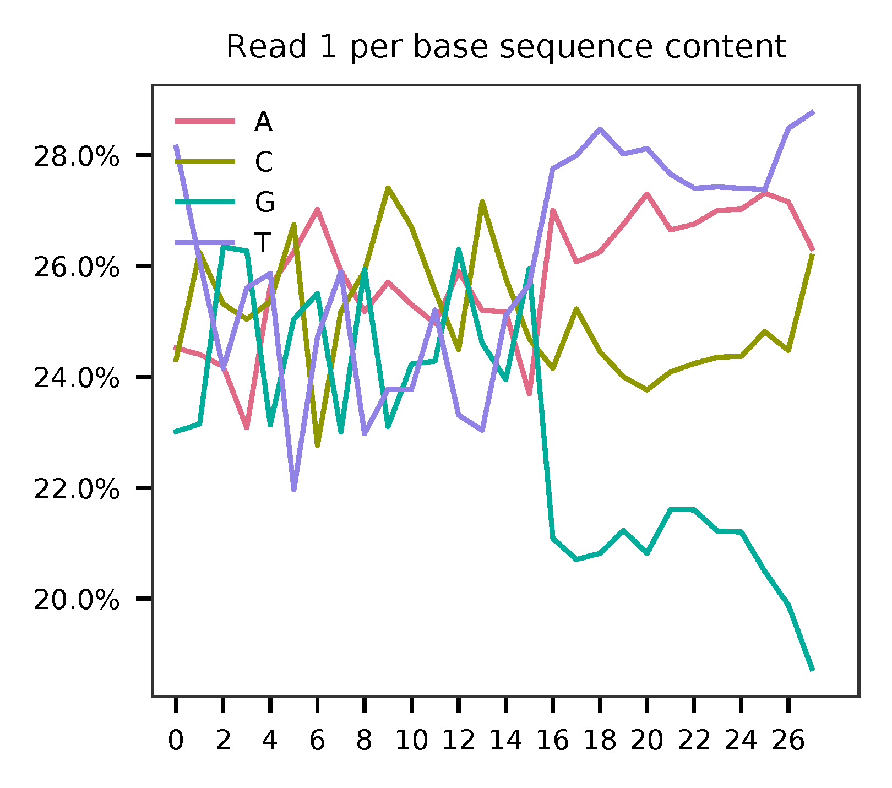
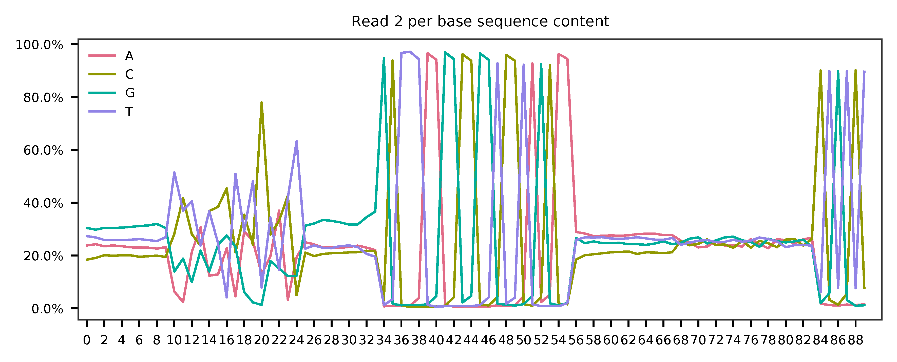
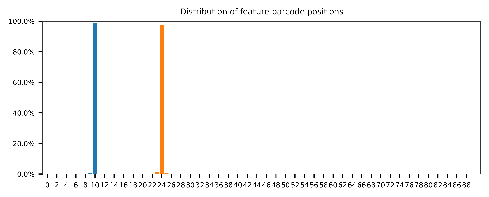

# fba tutorial

Dataset: 1k Human PBMCs Stained with a Panel of TotalSeq B Antibodies, Dual Indexed

The detailed description of this dataset can be found at [here](https://support.10xgenomics.com/single-cell-gene-expression/datasets/4.0.0/SC3_v3_NextGem_DI_PBMC_CSP_1K).

<br>

## Preparation

Download fastq files.

```shell
$ wget https://cf.10xgenomics.com/samples/cell-exp/4.0.0/SC3_v3_NextGem_DI_PBMC_CSP_1K/SC3_v3_NextGem_DI_PBMC_CSP_1K_fastqs.tar

$ tar xvf SC3_v3_NextGem_DI_PBMC_CSP_1K/SC3_v3_NextGem_DI_PBMC_CSP_1K_fastqs.tar
```

Combine reads of different lanes.

```shell
$ cat SC3_v3_NextGem_DI_CSP-Labeled_PBMCs_1K_fastqs/SC3_v3_NextGem_DI_CSP-Labeled_PBMCs_1K_antibody_fastqs/SC3_v3_NextGem_DI_CSP-Labeled_PBMCs_1K_antibody_S1_L00?_R1_001.fastq.gz > SC3_v3_NextGem_DI_CSP-Labeled_PBMCs_1K_antibody_S1_combined_R1.fastq.gz

$ cat SC3_v3_NextGem_DI_CSP-Labeled_PBMCs_1K_fastqs/SC3_v3_NextGem_DI_CSP-Labeled_PBMCs_1K_antibody_fastqs/SC3_v3_NextGem_DI_CSP-Labeled_PBMCs_1K_antibody_S1_L00?_R2_001.fastq.gz > SC3_v3_NextGem_DI_CSP-Labeled_PBMCs_1K_antibody_S1_combined_R2.fastq.gz
```

Download cell barcode info. These are the cell-associated barcodes in this single cell RNA-Seq library.

```shell
$ wget https://cf.10xgenomics.com/samples/cell-exp/4.0.0/SC3_v3_NextGem_DI_PBMC_CSP_1K/SC3_v3_NextGem_DI_PBMC_CSP_1K_filtered_feature_bc_matrix.tar.gz

$ tar zxvf SC3_v3_NextGem_DI_PBMC_CSP_1K_filtered_feature_bc_matrix.tar.gz
```

Inspect cell barcodes.

```shell
$ gzip -dc filtered_feature_bc_matrix/barcodes.tsv.gz | head

AAACCCAGTACCAGAG-1
AAACGCTTCGGTCTGG-1
AAACGCTTCGTTGCCT-1
AAAGAACAGGAACTCG-1
AAAGGATAGGTCGAGT-1
AAAGGGCCAAGACGGT-1
AAAGGGCCATCCTCAC-1
AAAGGTATCGTGGACC-1
AAAGTCCGTCGCGTTG-1
AAAGTCCTCCTTATCA-1
```

Prepare feature barcodes.

```shell
$ wget https://cf.10xgenomics.com/samples/cell-exp/4.0.0/SC3_v3_NextGem_DI_PBMC_CSP_1K/SC3_v3_NextGem_DI_PBMC_CSP_1K_feature_ref.csv
```

Inspect feature barcode info.

```shell
$ head SC3_v3_NextGem_DI_PBMC_CSP_1K_feature_ref.csv

id,name,read,pattern,sequence,feature_type
CD3,CD3,R2,^NNNNNNNNNN(BC)NNNNNNNNN,CTCATTGTAACTCCT,Antibody Capture
CD4,CD4,R2,^NNNNNNNNNN(BC)NNNNNNNNN,TGTTCCCGCTCAACT,Antibody Capture
CD8a,CD8a,R2,^NNNNNNNNNN(BC)NNNNNNNNN,GCTGCGCTTTCCATT,Antibody Capture
CD11b,CD11b,R2,^NNNNNNNNNN(BC)NNNNNNNNN,GACAAGTGATCTGCA,Antibody Capture
CD14,CD14,R2,^NNNNNNNNNN(BC)NNNNNNNNN,TCTCAGACCTCCGTA,Antibody Capture
CD15,CD15,R2,^NNNNNNNNNN(BC)NNNNNNNNN,TCACCAGTACCTAGT,Antibody Capture
CD16,CD16,R2,^NNNNNNNNNN(BC)NNNNNNNNN,AAGTTCACTCTTTGC,Antibody Capture
CD19,CD19,R2,^NNNNNNNNNN(BC)NNNNNNNNN,CTGGGCAATTACTCG,Antibody Capture
CD20,CD20,R2,^NNNNNNNNNN(BC)NNNNNNNNN,TTCTGGGTCCCTAGA,Antibody Capture

```

Clean up.

```shell
$ wc -l SC3_v3_NextGem_DI_PBMC_CSP_1K_feature_ref.csv
33 SC3_v3_NextGem_DI_PBMC_CSP_1K_feature_ref.csv
```

```shell
$ cut -d',' -f1,5 SC3_v3_NextGem_DI_PBMC_CSP_1K_feature_ref.csv | tail -32 | sed 's/,/\t/g' > feature_barcode_ref.tsv

$ head feature_barcode_ref.tsv

CD3     CTCATTGTAACTCCT
CD4     TGTTCCCGCTCAACT
CD8a    GCTGCGCTTTCCATT
CD11b   GACAAGTGATCTGCA
CD14    TCTCAGACCTCCGTA
CD15    TCACCAGTACCTAGT
CD16    AAGTTCACTCTTTGC
CD19    CTGGGCAATTACTCG
CD20    TTCTGGGTCCCTAGA
CD25    TTTGTCCTGTACGCC
```

<br>

## QC

Sample the first 20,000 (set by `-n`) read pairs for quality control. Use `-t` to set the number of threads. The diagnostic results and plots are generated in the `qc` directory (set by `--output_directory`). By default, full length of read 1 and read 2 are searched against reference cell and feature barcodes, respectively. The per base content of both read pairs and the distribution of matched barcode positions are summarized. Use `-r1_coords` and/or `-r2_coords` to limit the search range. Use `-cb_n` and/or `-fb_n` to set the mismatch tolerance for cell and feature barcode matching.

```shell
$ fba qc \
    -1 SC3_v3_NextGem_DI_CSP-Labeled_PBMCs_1K_antibody_S1_combined_R1_001.fastq.gz \
    -2 SC3_v3_NextGem_DI_CSP-Labeled_PBMCs_1K_antibody_S1_combined_R2_001.fastq.gz \
    -w filtered_feature_bc_matrix/barcodes.tsv.gz \
    -f SC3_v3_NextGem_DI_PBMC_CSP_1K_feature_ref.tsv \
    --output_directory qc \
    -n 20000
```

This library is constructed using Chromium Next GEM Single Cell 3ʹ Reagent Kit v3.1. The first 16 bases are cell barcodes and the following 12 bases are UMIs. Based on the base content plot, the GC content of cell barcodes are quite even. The UMIs are slightly T enriched.

<p align='center'>
  
</p>

As for read 2, based on the per base content, it suggests that bases 0-9, 25-33, and 56-83 are GC balanced for the reads we have sampled, which could mean that their sequences are random at library-level. While bases 34-55 and 84-89 are constant sequences and we can almost read the bases. Bases 10-24 are less random but also not constant. They are actually our feature barcodes (See the distribution of matched barcode positions on read 2).

<p align='center'>
    
</p>

<p align='center'>
    
</p>


The fragment structure in this feature barcoding library inferred from qc results matches the design ([Table 1](https://assets.ctfassets.net/an68im79xiti/6p0emIeLO8bsxinEbKgcfF/275a5752f4e4347f75a1f649bd824463/CG000149_DemonstratedProtocol_CellSurfaceProteinLabeling_RevB.pdf). Of course, this is an example dataset from 10x Genomics). Bases 34-56 are actually called 'Capture Sequence 1' on beads.

The detailed qc results are stored in `feature_barcoding_output.tsv.gz` file. `matching_pos` columns indicate the matched positions on reads. `matching_description` columns indicate mismatches in substitutions:insertions:deletions format.

```shell
$ gzip -dc qc/feature_barcoding_output.tsv.gz | head

read1_seq       cell_barcode    cb_matching_pos cb_matching_description read2_seq       feature_barcode fb_matching_pos fb_matching_description
GNAGGTTTCGTCGACACGGGTATGGCCA    GTAGGTTAGGTCGACA        0:16    3:0:0   GGAACGACGATCTCAGACCTCCGTAACGAACGTAGCTTTAAGGCCGGTCCTAGCAATGGCCATACCCGTGTCGACGAAACCTACCTGTCT      CD14_TCTCAGACCTCCGTA    10:25   0:0:0
TCGTGGGCAAGATTGAGTAAAAATTCAG    TCGTGGGCAAACTAGA        0:16    3:0:0   CAATCTACCGCTGGGCAATTACTCGCCCGATGTGGCTTTAAGGCCGGTCCTAGCAACTGAATTTTTACTCAATCTTGCCCACGACTGTCT      CD19_CTGGGCAATTACTCG    10:25   0:0:0
TCCGGGATCGTGGCTATGTGTTCGAGGG    no_match        NA      NA      TGGGTCAATTCTCATTGTAACTCCTTCCCTCAAAGCTTTAAGGCCGGTCCTAGCAACCCTCGAACACATAGCCACGATCCCGGACTGTCT      NA      NA      NA
GATTGGTGTGTCTCTCGGTGCCCAAAAT    no_match        NA      NA      TACACTGACAGCCGGACGACATTAAACGGAAGCCGCTTTAAGGCCGGTCCTAGCAAATTTTGGGCACCGAGAGACACACCAATCCTGTCT      NA      NA      NA
TGCTCGTAGTACAGGTAAGCGTGAAGCA    CATCGTCGTACAGGTG        2:17    2:0:1   GCCCACAACACTCCGAATCATGTTGACGGGGTTCGCTTTAAGGCCGGTCCTAGCAATGCTTCACGCTTACCTGTACTACGAGCACTGTCG      CD45RO_CTCCGAATCATGTTG  10:25   0:0:0
AGATGAAAGGGAGTAGGGTGCGGGTTAT    AGGGAGTAGGAGGGTG        7:22    2:0:1   TGCGTTTCTTCACCAGTACCTAGTCACACGTCAGCTTTAAGGCCGGCCCTAGCAAATAACCCGCACCCTACTCCCTTTCATCTCTGTCTC      CD15_TCACCAGTACCTAGT    9:24    0:0:0
CCTCCTCAGCTCTGCATATGAGCGAATT    no_match        NA      NA      AAGCAATGCTTCACCAGTACCTAGTCGTTCGTGTGCTTAAGGCCGGTCCTAGCAAAATTCGCTCATATGCAGAGCTGAGGAGGCTGTCTC      NA      NA      NA
TGATCTTAGAACACGTCAGGGTCCTGAA    TGATCTTTCAACACGT        0:16    2:0:0   GGGGGGGGGGGGGGGGAGGGGGCCGGAAAAGAACCCCGAGAGGCCAGCGCCAAACAAAAAAGAACAAAAAAGAGGAAAAAAAAAAAAAAA      no_match        NA      NA
GGGCTACAGGACGCTGGTTTCATTTTTT    CTGGTCTTCATTGTTC        13:28   2:0:1   CCTTAATCAACTCATTGTAACTCCTGTTCCCACAGCTTTAAGGCCGGTCCTAGCAAAAAAAATGAAACCAGCGTCCTGTAGCCCCTGTCT      CD3_CTCATTGTAACTCCT     10:25   0:0:0
```

<br>

## Barcode extraction

The lengths of cell and feature barcodes are all identical (16 and 15, respectively). And based on qc results, the distributions of starting and ending positions of cell and feature barcodes are very uniform. Search ranges are set to `0,16` on read 1 and `10,25` on read 2. Two mismatches for cell and feature barcodes (`-cb_m`, `-cf_m`) are allowed. And by default, three ambiguous nucleotides (Ns) for read 1 and read2 (`-cb_n`, `-cf_n`) are allowed.

```shell
$ fba extract \
    -1 SC3_v3_NextGem_DI_CSP-Labeled_PBMCs_1K_antibody_S1_combined_R1_001.fastq.gz \
    -2 SC3_v3_NextGem_DI_CSP-Labeled_PBMCs_1K_antibody_S1_combined_R2_001.fastq.gz \
    -w filtered_feature_bc_matrix/barcodes.tsv.gz \
    -f SC3_v3_NextGem_DI_PBMC_CSP_1K_feature_ref.tsv \
    -o feature_barcoding_output.tsv.gz \
    -r1_coords 0,16 \
    -r2_coords 10,25 \
    -cb_m 2 \
    -fb_m 2
```

Preview of result.

```shell
$ gzip -dc feature_barcoding_output.tsv.gz | head

read1_seq       cell_barcode    cb_num_mismatches       read2_seq       feature_barcode fb_num_mismatches
TCGTGGGCAAGATTGAgtaaaaattcag    TCGTGGGGTAGATTGA        2       caatctaccgCTGGGCAATTACTCGcccgatgtggctttaaggccggtcctagcaactgaatttttactcaatcttgcccacgactgtct    CD19_CTGGGCAATTACTCG     0
TGTCCACTCTAGGGTCcagaaatcgcag    TGTCCACAGTAGGGTC        2       gtggccgtgtTCAATCCTTCCGCTTcgtcgttctgctttaaggccggtcctagcaagctgcgatttctggaccctagagtggacactgtc    CD45RA_TCAATCCTTCCGCTT   0
TTTCGATAGTGTCAGAtttacttatggt    TTTCGATTCTGTCAGA        2       caaagtcctaTCTCAGACCTCCGTAaagcatgtggctttaaggccggtcctagcaaaccataagtaaatctgacactatcgaaactgtct    CD14_TCTCAGACCTCCGTA     0
ACCATTTCAGAGTAGCaaaaccgttggg    ACCATTTGTGAGTAGC        2       acacgtggcgTGTTCCCGCTCAACTgtgcttcaagctttaaggccggtcctagcaacccaacggttttgctactctgaaatggtctgtct    CD4_TGTTCCCGCTCAACT      0
CATGCGGAGCACAGCGctagttacaaac    CATGCGGTCCACAGCG        2       ctgagcaggaTCTCAGACCTCCGTAatgggttaagctttaaggccggtcctagcaagtttgtaactagcgctgtgctccgcatgctgtct    CD14_TCTCAGACCTCCGTA     0
TGCCGAGCAACGTAGGgcgtaattagcg    TGCCGAGGTACGTAGG        2       aggagacccgTCTCAGACCTCCGTAagtacccgagctttaaggccggtcctagcaacgctaattacgccctacgttgctcggcactgtct    CD14_TCTCAGACCTCCGTA     0
ATTCCATGTCTCTCGTcgtctaactccc    ATTCCATCACTCTCGT        2       atgcagagtgCTCATTGTAACTCCTccgtttgacgctttaaggccggtcctagcaagggagttagacgacgagagacatggaatctgtct    CD3_CTCATTGTAACTCCT      0
GGCAGTCGTAAGGTTAtgcaccacacga    GGCAGTCCAAAGGTTA        2       gcaacatggtTCTCAGACCTCCGTAgcatgttaggctttaaggccggtcctagcaatcgtgtggtgcataaccttacgactgccctgtct    CD14_TCTCAGACCTCCGTA     0
GATGGAGGTGAGCTAGaaatgccaagtt    GATGGAGCAGAGCTAG        2       acacaatgaaTGTTCCCGCTCAACTtaccggggtgctttaaggccggtcctagcaaaacttggcatttctagctcacctccatcctgtct    CD4_TGTTCCCGCTCAACT      0
```

Result summary.

59.8 % (4,607,787 out of 7,704,799) of total read pairs have valid cell and feature barcodes.

```shell
2021-02-17 23:37:41,353 - fba.__main__ - INFO - fba version: 0.0.7
2021-02-17 23:37:41,353 - fba.__main__ - INFO - Initiating logging ...
2021-02-17 23:37:41,353 - fba.__main__ - INFO - Python version: 3.7
2021-02-17 23:37:41,353 - fba.__main__ - INFO - Using extract subcommand ...
2021-02-17 23:37:41,356 - fba.levenshtein - INFO - Number of reference cell barcodes: 1,200
2021-02-17 23:37:41,356 - fba.levenshtein - INFO - Number of reference feature barcodes: 32
2021-02-17 23:37:41,356 - fba.levenshtein - INFO - Read 1 coordinates to search: [0, 16)
2021-02-17 23:37:41,356 - fba.levenshtein - INFO - Read 2 coordinates to search: [10, 25)
2021-02-17 23:37:41,356 - fba.levenshtein - INFO - Cell barcode maximum number of mismatches: 2
2021-02-17 23:37:41,356 - fba.levenshtein - INFO - Feature barcode maximum number of mismatches: 2
2021-02-17 23:37:41,356 - fba.levenshtein - INFO - Read 1 maximum number of N allowed: 3
2021-02-17 23:37:41,356 - fba.levenshtein - INFO - Read 2 maximum number of N allowed: 3
2021-02-17 23:37:41,634 - fba.levenshtein - INFO - Matching ...
2021-02-17 23:53:22,264 - fba.levenshtein - INFO - Number of read pairs processed: 7,704,799
2021-02-17 23:53:22,264 - fba.levenshtein - INFO - Number of read pairs w/ valid barcodes: 4,607,787
2021-02-17 23:53:22,279 - fba.__main__ - INFO - Done.
```

<br>

## Matrix generation

Only fragments with valid (passed the criteria) cell and feature barcodes are included. UMI deduplication is powered by UMI-tools ([Smith, T., et al. 2017. Genome Res. 27, 491–499.](http://www.genome.org/cgi/doi/10.1101/gr.209601.116)). Use `-us` to set the UMI starting position on read 1. Use `-ul` to set the UMI length. Fragments with UMI length less than this value are discarded. Use `-um` to set mismatch threshold. UMI deduplication method is set by `-ud`.

The generated feature count matrix can be easily imported into well-established single cell analysis packages: [Seruat](https://satijalab.org/seurat/) and [Scanpy](https://scanpy.readthedocs.io/en/stable/).

```shell
$ fba count \
    -i feature_barcoding_output.tsv.gz \
    -o matrix_featurecount.csv.gz \
    -us 16 \
    -ul 12 \
    -um 1 \
    -ud directional
```

Result summary.

69.8% (3,214,503 out of 4,607,787) of read pairs with valid cell and feature barcodes are unique fragments. 41.7% (3,214,503 out of 7,704,799) of total sequenced read pairs contribute to the final matrix.

```shell
2021-02-17 23:53:36,024 - fba.__main__ - INFO - fba version: 0.0.7
2021-02-17 23:53:36,024 - fba.__main__ - INFO - Initiating logging ...
2021-02-17 23:53:36,024 - fba.__main__ - INFO - Python version: 3.7
2021-02-17 23:53:36,024 - fba.__main__ - INFO - Using count subcommand ...
2021-02-17 23:53:36,024 - fba.count - INFO - UMI-tools version: 1.1.1
2021-02-17 23:53:36,027 - fba.count - INFO - UMI starting position on read 1: 16
2021-02-17 23:53:36,027 - fba.count - INFO - UMI length: 12
2021-02-17 23:53:36,027 - fba.count - INFO - UMI-tools deduplication threshold: 1
2021-02-17 23:53:36,027 - fba.count - INFO - UMI-tools deduplication method: directional
2021-02-17 23:53:36,027 - fba.count - INFO - Header line: read1_seq cell_barcode cb_num_mismatches read2_seq feature_barcode fb_num_mismatches
2021-02-17 23:53:49,419 - fba.count - INFO - Number of lines processed: 4,607,787
2021-02-17 23:53:49,422 - fba.count - INFO - Number of cell barcodes detected: 1,199
2021-02-17 23:53:49,422 - fba.count - INFO - Number of features detected: 30
2021-02-17 23:55:18,907 - fba.count - INFO - Total UMIs after deduplication: 3,214,503
2021-02-17 23:55:18,910 - fba.count - INFO - Median number of UMIs per cell: 2,564.0
2021-02-17 23:55:18,944 - fba.__main__ - INFO - Done.
```
