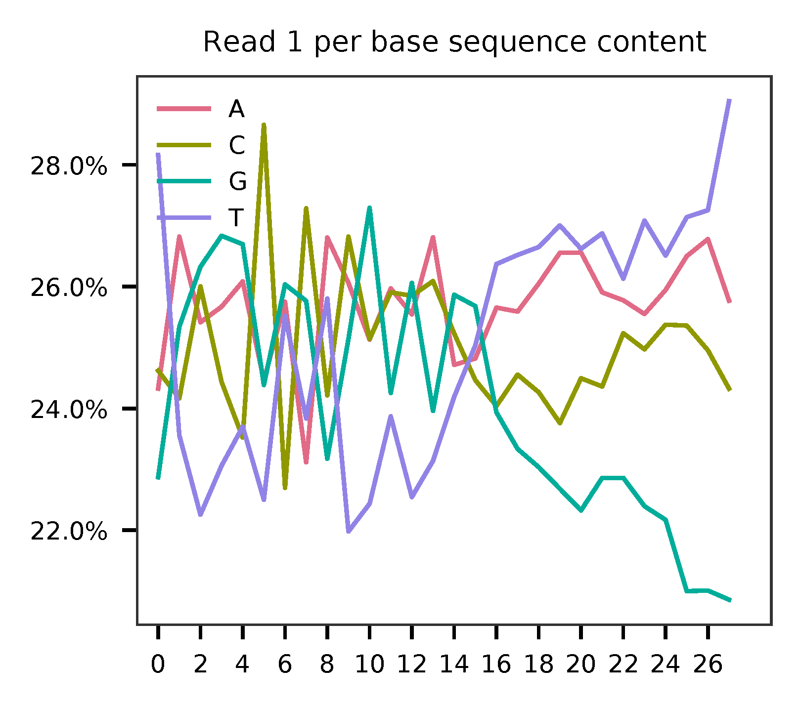
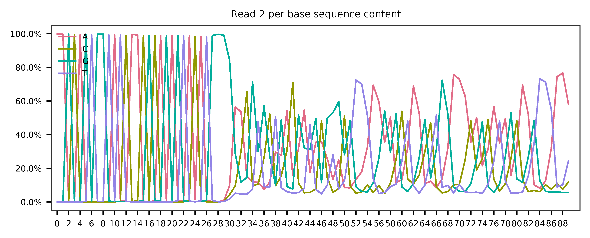
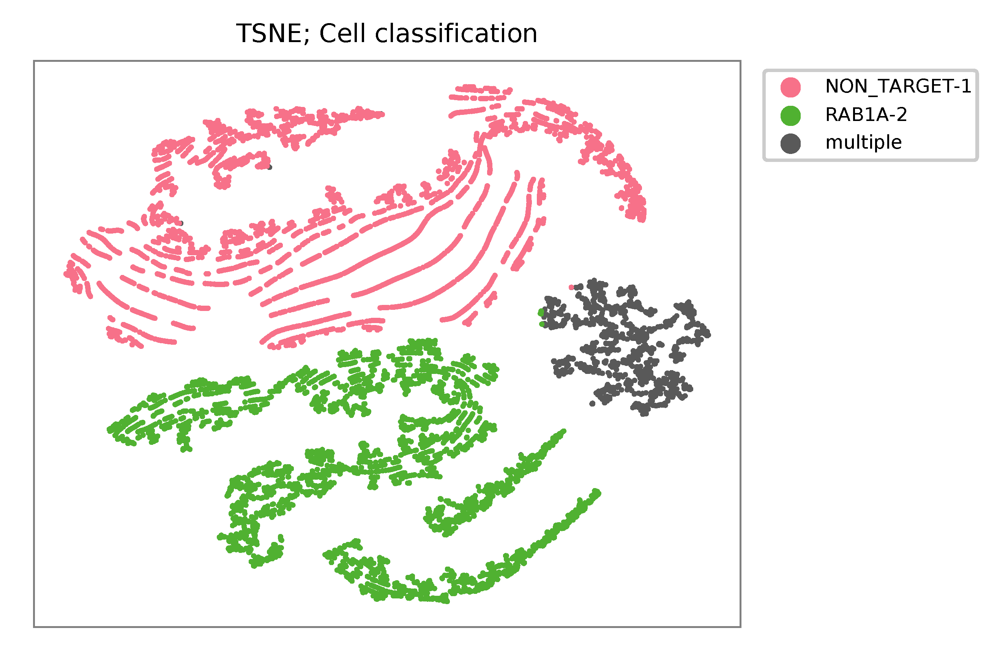

# fba tutorial

Dataset: 10k A375 Cells Transduced with (1) Non-Target and (1) Target sgRNA, Dual Indexed

The detailed description of this dataset can be found at [here](https://support.10xgenomics.com/single-cell-gene-expression/datasets/4.0.0/SC3_v3_NextGem_DI_CRISPR_10K).

<br>

## Preparation

Download fastq files.

```shell
$ wget https://cg.10xgenomics.com/samples/cell-exp/4.0.0/SC3_v3_NextGem_DI_CRISPR_10K/SC3_v3_NextGem_DI_CRISPR_10K_fastqs.tar

$ tar xvf SC3_v3_NextGem_DI_PBMC_CSP_1K/SC3_v3_NextGem_DI_PBMC_CSP_1K_fastqs.tar
```

Combine reads of different lanes.

```shell
$ cat SC3_v3_NextGem_DI_CRISPR_10K_fastqs/SC3_v3_NextGem_DI_CRISPR_10K_crispr_fastqs/SC3_v3_NextGem_DI_CRISPR_10K_crispr_S1_L00?_R1_001.fastq.gz > SC3_v3_NextGem_DI_CRISPR_10K_crispr_S1_combined_R1_001.fastq.gz

$ cat SC3_v3_NextGem_DI_CRISPR_10K_fastqs/SC3_v3_NextGem_DI_CRISPR_10K_crispr_fastqs/SC3_v3_NextGem_DI_CRISPR_10K_crispr_S1_L00?_R2_001.fastq.gz > SC3_v3_NextGem_DI_CRISPR_10K_crispr_S1_combined_R2_001.fastq.gz
```

Download cell barcode info. These are the cell-associated barcodes in this single cell RNA-Seq library.

```shell
$ wget https://cf.10xgenomics.com/samples/cell-exp/4.0.0/SC3_v3_NextGem_DI_CRISPR_10K/SC3_v3_NextGem_DI_CRISPR_10K_filtered_feature_bc_matrix.tar.gz

$ tar zxvf SC3_v3_NextGem_DI_CRISPR_10K_filtered_feature_bc_matrix.tar.gz
```

Inspect cell barcodes.

```shell
$ gzip -dc filtered_feature_bc_matrix/barcodes.tsv.gz | head

AAACCCACACATAGCT-1
AAACCCACATCATGAC-1
AAACCCAGTCATCGGC-1
AAACCCAGTCGCACAC-1
AAACCCAGTGCAACGA-1
AAACCCATCAAGCGTT-1
AAACCCATCAGATGCT-1
AAACCCATCATCTACT-1
AAACCCATCCTTATGT-1
AAACCCATCTCGGCTT-1
```

Prepare feature barcodes.

```shell
$ wget https://cf.10xgenomics.com/samples/cell-exp/4.0.0/SC3_v3_NextGem_DI_CRISPR_10K/SC3_v3_NextGem_DI_CRISPR_10K_feature_ref.csv
```

Inspect feature barcode info.

```shell
$ cat SC3_v3_NextGem_DI_CRISPR_10K_feature_ref.csv

id,name,read,pattern,sequence,feature_type,target_gene_id,target_gene_name
RAB1A-2,RAB1A-2,R2,(BC)GTTTAAGAGCTAAGCTGGAA,GCCGGCGAACCAGGAAATA,CRISPR Guide Capture,ENSG00000138069,RAB1A
NON_TARGET-1,NON_TARGET-1,R2,(BC)GTTTAAGAGCTAAGCTGGAA,AACGTGCTGACGATGCGGGC,CRISPR Guide Capture,Non-Targeting,Non-Targeting
```

Clean up.

```shell
$ cut -d ',' -f1,5 SC3_v3_NextGem_DI_CRISPR_10K_feature_ref.csv | sed 's/,/\t/g' | tail -2 > SC3_v3_NextGem_DI_CRISPR_10K_feature_ref.tsv

$ cat SC3_v3_NextGem_DI_CRISPR_10K_feature_ref.tsv

RAB1A-2 GCCGGCGAACCAGGAAATA
NON_TARGET-1    AACGTGCTGACGATGCGGGC
```

<br>

## QC

Sample the first 20,000 (set by `-n`) read pairs for quality control. Use `-t` to set the number of threads. The diagnostic results and plots are generated in the `qc` directory (set by `--output_directory`). By default, full length of read 1 and read 2 are searched against reference cell and feature barcodes, respectively. The per base content of both read pairs and the distribution of matched barcode positions are summarized. Use `-r1_coords` and/or `-r2_coords` to limit the search range. Use `-cb_n` and/or `-fb_n` to set the mismatch tolerance for cell and feature barcode matching.


```shell
fba qc \
    -1 SC3_v3_NextGem_DI_CRISPR_10K_crispr_S1_combined_R1_001.fastq.gz \
    -2 SC3_v3_NextGem_DI_CRISPR_10K_crispr_S1_combined_R2_001.fastq.gz \
    -w filtered_feature_bc_matrix/barcodes.tsv.gz \
    -f SC3_v3_NextGem_DI_CRISPR_10K_feature_ref.tsv \
    -r1_coords 0,16 \
    -n 20000
```

This library is constructed using Chromium Next GEM Single Cell 3ʹ Reagent Kit v3.1. The first 16 bases are cell barcodes and the following 12 bases are UMIs. Based on the base content plot, the GC content of cell barcodes are quite even. The UMIs are slightly T enriched.

<p align='center'>
    
</p>

As for read 2, based on the per base content, it suggests that bases 0-31 are constant and we can almost read the bases. They are actually [Template Switch Oligo (TSO) sequence](https://assets.ctfassets.net/an68im79xiti/4HEC1M6tFbBJXXTv7jVVo1/a271ac8d5fa73180e603df21030f9e9a/CG000316_ChromiumNextGEMSingleCell3__v3.1_CRISPR_Screening_Dual_Index_RevA.pdf). Starting from base 32, it seems there are two genotypes for the reads we have sampled.

<p align='center'>
    
</p>

<p align='center'>
    
</p>

The detailed qc results are stored in `feature_barcoding_output.tsv.gz` file. `matching_pos` columns indicate the matched positions on reads. `matching_description` columns indicate mismatches in substitutions:insertions:deletions format.

```shell
$ gzip -dc qc/feature_barcoding_output.tsv.gz | head

read1_seq       cell_barcode    cb_matching_pos cb_matching_description read2_seq       feature_barcode fb_matching_pos fb_matching_description
CNCCACACACGTGTTAatgagtactagc    CCTCACACACGTAGTT        0:15    2:0:1   AAGCAGTGGTATCAACGCAGAGTACATGGGATAGGTTTGGTCCTAGCCTTTCTATTAGCTCTTAGTAAGATTACACATGCAAGCATCCCC    no_match        NA      NA
GNCGCGATCAGCATTActtttgtcaccc    GTCGCGAAGAGCATTA        0:16    3:0:0   AAGCAGTGGTATCAACGCAGAGTACATGGGGACTGTTGCTGGTGTGTACTTGCTAAGGTTTATGTCAGTTCAAGATTATAAGCCCCCCAG    no_match        NA      NA
TNGGAAGGTAAGTGTAatcgagggaaca    TGGGAAGCAAAGTGTA        0:16    3:0:0   AAGCAGTGGTATCAACGCAGAGTACATGGGGGCCGGCGAACCAGGAAATAGTTTAAGAGCTAAGCTGGAAACAGCATAGCAAGTTTAAAT    RAB1A-2_GCCGGCGAACCAGGAAATAG    31:51   0:0:0
CNCCCAAGTCGATAGGgagcgcaagcat    CCCAACTCACGATAGG        2:16    1:0:2   AAGCAGTGGTATCAACGCAGAGTACATGGGGGCCGGCGAACCAGGAAATAGTTTAAGAGCTAAGCTGGAAACAGCATAGCAAGTTTAAAT    RAB1A-2_GCCGGCGAACCAGGAAATAG    31:51   0:0:0
CNCACTGCAAACGGTGggcgtaaatgag    CTCACTGGTAACGGTG        0:16    3:0:0   AAGCAGTGGTATCAACGCAGAGTACATGGGGGCCGGCGAACCAGGAAATAGTTTAAGAGCTAAGCTGGAAACAGCATAGCAAGTTTAAAT    RAB1A-2_GCCGGCGAACCAGGAAATAG    31:51   0:0:0
ANCATCACAGGCGCTTgtcccactatat    AGCATCAGTGGCGCTT        0:16    3:0:0   AAGCAGTGGTATCAACGCAGAGTACATGGGGGCCGGCGAACCAGGAAATAGTTTAAGAGCTAAGCTGGAAACAGCATAGCAAGTTTAAAT    RAB1A-2_GCCGGCGAACCAGGAAATAG    31:51   0:0:0
ANACGAACACTTTCATccaaaagaagtt    AAACGAAGTCTTTCAT        0:16    3:0:0   AAGCAGTGGTATCAACGCAGAGTACATGGGGGCCGGCGAACCAGGAAATAGTTTAAGAGCTAAGCTGGAAACAGCATAGCAAGTTTAAAT    RAB1A-2_GCCGGCGAACCAGGAAATAG    31:51   0:0:0
ANCAACCAGTATCGTTgaaatcctggta    AACAACCTCTATCGTT        0:16    3:0:0   AAGCAGTGGTATCAACGCAGAGTACATGGGGAACGTGCTGACGATGCGGGCGTTTAAGAGCTAAGCTGGAAACAGCATAGCAAGTTTAAA    NON_TARGET-1_AACGTGCTGACGATGCGGGC       31:51   0:0:0
GNAGCCCGTACCACATgggcccagtatg    GAAGCCCCAACCACAT        0:16    3:0:0   AAGCAGTGGTATCAACGCAGAGTACATGGGGGCCGGCGAACCAGGAAATAGTTTAAGAGCTAAGCTGGAAACAGCATAGCAAGTTTAAAT    RAB1A-2_GCCGGCGAACCAGGAAATAG    31:51   0:0:0
```

<br>

## Barcode extraction

Although the lengths of the two feature barcodes are one base different, they all start at the same position on read 2. For the purpose of feature barcode identification, let's include one extra downstream base (G) for the RAB1A-2 feature barcode to make their lengths equal.

```shell
$ cat SC3_v3_NextGem_DI_CRISPR_10K_feature_ref_edited.tsv

RAB1A-2 GCCGGCGAACCAGGAAATAG
NON_TARGET-1    AACGTGCTGACGATGCGGGC
```

Search ranges are set to `0,16` on read 1 and `31,51` on read 2. Two mismatches for cell and feature barcodes (`-cb_m`, `-cf_m`) are allowed.

```shell
$ fba extract \
    -1 SC3_v3_NextGem_DI_CRISPR_10K_crispr_S1_combined_R1_001.fastq.gz \
    -2 SC3_v3_NextGem_DI_CRISPR_10K_crispr_S1_combined_R2_001.fastq.gz \
    -w filtered_feature_bc_matrix/barcodes.tsv.gz \
    -f SC3_v3_NextGem_DI_CRISPR_10K_feature_ref_edited.tsv \
    -o feature_barcoding_output.tsv.gz \
    -r1_coords 0,16 \
    -r2_coords 31,51 \
    -cb_m 2 \
    -fb_m 2
```

Preview of result.

```shell
$ gzip -dc feature_barcoding_output.tsv.gz  | head

read1_seq       cell_barcode    cb_num_mismatches       read2_seq       feature_barcode fb_num_mismatches
GGCAGTCTCCGTTACTtatccagccttc    GGCAGTCTCGGTAACT        2       aagcagtggtatcaacgcagagtacatggggGCCGGCGAACCAGGAAATAGtttaagagctaagctggaaacagcatagcaagtttaaat    RAB1A-2_GCCGGCGAACCAGGAAATAG     0
TTACGTTGTGAATCGGgtggggctcttc    TTACGTTCAGAATCGG        2       aagcagtggtatcaacgcagagtacatggggAACGTGCTGACGATGCGGGCgtttaagagctaagctggaaacagcatagcaagtttaaa    NON_TARGET-1_AACGTGCTGACGATGCGGGC        0
TCGGGCAAGGATTGGTttctactcggaa    TCGGGCATCGATTGGT        2       aagcagtggtatcaacgcagagtacatgggaACGTGCTGACGATGCGGGCGtttaagagctaagctggaaacagcatagcaagtttaaat    NON_TARGET-1_AACGTGCTGACGATGCGGGC        2
ACAACCACACATCTAGcggcatcatact    ACAACCAGTCATCTAG        2       aagcagtggtatcaacgcagagtacatggggCCGGCGAACCAGGAAATAGTttaagagctaagctggaaacagcatagcaagtttaaata    RAB1A-2_GCCGGCGAACCAGGAAATAG     2
AGACTCAAGTGCTAGAacagaactggtg    AGACTCATCTGCTAGA        2       aagcagtggtatcaacgcagagtacatggggAACGTGCTGACGATGCGGGCgtttaagagctaagctggaaacagcatagcaagtttaaa    NON_TARGET-1_AACGTGCTGACGATGCGGGC        0
GAGTTGTTCGAACATTctgcccgacgtc    GAGTTGTAGGAACATT        2       aagcagtggtatcaacgcagagtacatggggAACGTGCTGACGATGCGGGCgtttaagagctaagctggaaacagcatagcaagtttaaa    NON_TARGET-1_AACGTGCTGACGATGCGGGC        0
AGACTCAGTGGCACAAtgtcagaattca    AGACTCACAGGCACAA        2       aagcagtggtatcaacgcagagtacatggggGCCGGCGAACCAGGAAATAGtttaagagctaagctggaaacagcatagcaagtttaaat    RAB1A-2_GCCGGCGAACCAGGAAATAG     0
TGCACGGAGGATAACCcgtgcacgtaca    TGCACGGTCGATAACC        2       aagcagtggtatcaacgcagagtacatggggGCCGGCGAACCAGGAAATAGtttaagagctaagctggaaacagcatagcaagtttaaat    RAB1A-2_GCCGGCGAACCAGGAAATAG     0
CGTAGTAGTAACACGGaagagggaactg    CGTAGTAGTAACGCGA        2       aagcagtggtatcaacgcagagtacatggggAACGTGCTGACGATGCGGGCgtttaagagctaagctggaaacagcatagcaagtttaaa    NON_TARGET-1_AACGTGCTGACGATGCGGGC        0
```

Result summary.

64.7 % (93,795,979 out of 145,032,428) of total read pairs have valid cell and feature barcodes. Majority of fragments in this library have correct structure.

```shell
2021-02-15 01:51:59,262 - fba.__main__ - INFO - fba version: 0.0.7
2021-02-15 01:51:59,262 - fba.__main__ - INFO - Initiating logging ...
2021-02-15 01:51:59,262 - fba.__main__ - INFO - Python version: 3.7
2021-02-15 01:51:59,262 - fba.__main__ - INFO - Using extract subcommand ...
2021-02-15 01:51:59,276 - fba.levenshtein - INFO - Number of reference cell barcodes: 11,791
2021-02-15 01:51:59,276 - fba.levenshtein - INFO - Number of reference feature barcodes: 2
2021-02-15 01:51:59,276 - fba.levenshtein - INFO - Read 1 coordinates to search: [0, 16)
2021-02-15 01:51:59,276 - fba.levenshtein - INFO - Read 2 coordinates to search: [31, 51)
2021-02-15 01:51:59,276 - fba.levenshtein - INFO - Cell barcode maximum number of mismatches: 2
2021-02-15 01:51:59,276 - fba.levenshtein - INFO - Feature barcode maximum number of mismatches: 2
2021-02-15 01:51:59,276 - fba.levenshtein - INFO - Read 1 maximum number of N allowed: 3
2021-02-15 01:51:59,276 - fba.levenshtein - INFO - Read 2 maximum number of N allowed: 3
2021-02-15 01:52:02,510 - fba.levenshtein - INFO - Matching ...
2021-02-15 02:20:39,807 - fba.levenshtein - INFO - Read pairs processed: 10,000,000
2021-02-15 02:49:04,142 - fba.levenshtein - INFO - Read pairs processed: 20,000,000
2021-02-15 03:17:27,422 - fba.levenshtein - INFO - Read pairs processed: 30,000,000
2021-02-15 03:45:54,615 - fba.levenshtein - INFO - Read pairs processed: 40,000,000
2021-02-15 04:14:23,049 - fba.levenshtein - INFO - Read pairs processed: 50,000,000
2021-02-15 04:42:49,377 - fba.levenshtein - INFO - Read pairs processed: 60,000,000
2021-02-15 05:11:15,736 - fba.levenshtein - INFO - Read pairs processed: 70,000,000
2021-02-15 05:39:43,011 - fba.levenshtein - INFO - Read pairs processed: 80,000,000
2021-02-15 06:08:09,940 - fba.levenshtein - INFO - Read pairs processed: 90,000,000
2021-02-15 06:36:39,658 - fba.levenshtein - INFO - Read pairs processed: 100,000,000
2021-02-15 07:05:08,115 - fba.levenshtein - INFO - Read pairs processed: 110,000,000
2021-02-15 07:33:32,101 - fba.levenshtein - INFO - Read pairs processed: 120,000,000
2021-02-15 08:02:01,233 - fba.levenshtein - INFO - Read pairs processed: 130,000,000
2021-02-15 08:30:29,660 - fba.levenshtein - INFO - Read pairs processed: 140,000,000
2021-02-15 08:44:47,038 - fba.levenshtein - INFO - Number of read pairs processed: 145,032,428
2021-02-15 08:44:47,038 - fba.levenshtein - INFO - Number of read pairs w/ valid barcodes: 93,795,979
2021-02-15 08:44:47,153 - fba.__main__ - INFO - Done.
```

<br>

## Matrix generation

Only fragments with correct (passed the criteria) cell and feature barcodes are included. UMI removal is powered by UMI-tools ([Smith, T., et al. 2017. Genome Res. 27, 491–499.](http://www.genome.org/cgi/doi/10.1101/gr.209601.116)). Use `-us` to set the UMI starting position on read 1. Use `-ul` to set the UMI length. Fragments with UMI length less than this value are discarded. Use `-um` to set mismatch threshold. UMI deduplication method is set by `-ud`.

The generated feature count matrix can be easily imported into well-established single cell analysis packages: [Seruat](https://satijalab.org/seurat/) and [Scanpy](https://scanpy.readthedocs.io/en/stable/).

```shell
$ fba count \
    -i feature_barcoding_output.tsv.gz \
    -o matrix_featurecount.csv.gz \
    -us 16 \
    -ul 12 \
    -um 1 \
    -ud directional
```

Result summary.

7.6% (7,143,943 out of 93,795,979) of read pairs with valid cell and feature barcodes are unique fragments. 4.9% (7,143,943 out of 145,032,428) of total sequenced read pairs contribute to the final matrix.

```shell
2021-02-15 08:45:01,748 - fba.__main__ - INFO - fba version: 0.0.7
2021-02-15 08:45:01,748 - fba.__main__ - INFO - Initiating logging ...
2021-02-15 08:45:01,748 - fba.__main__ - INFO - Python version: 3.7
2021-02-15 08:45:01,749 - fba.__main__ - INFO - Using count subcommand ...
2021-02-15 08:45:01,749 - fba.count - INFO - UMI-tools version: 1.0.0
2021-02-15 08:45:01,752 - fba.count - INFO - UMI starting position on read 1: 16
2021-02-15 08:45:01,752 - fba.count - INFO - UMI length: 12
2021-02-15 08:45:01,752 - fba.count - INFO - UMI-tools deduplication threshold: 1
2021-02-15 08:45:01,752 - fba.count - INFO - UMI-tools deduplication method: directional
2021-02-15 08:45:01,752 - fba.count - INFO - Header line: read1_seq cell_barcode cb_num_mismatches read2_seq feature_barcode fb_num_mismatches
2021-02-15 08:49:36,776 - fba.count - INFO - Number of lines processed: 93,795,979
2021-02-15 08:49:36,784 - fba.count - INFO - Number of cell barcodes detected: 11,756
2021-02-15 08:49:36,784 - fba.count - INFO - Number of features detected: 2
2021-02-15 08:59:40,056 - fba.count - INFO - Total UMIs after deduplication: 7,143,943
2021-02-15 08:59:40,078 - fba.count - INFO - Median number of UMIs per cell: 478.0
2021-02-15 08:59:40,194 - fba.__main__ - INFO - Done.
```

<br>

## Demultiplexing

Cells are classified based on feature count matrix. The method 1 is implemented based on the method described in [Stoeckius, M., et al. (2018)](https://doi.org/10.1186/s13059-018-1603-1) with some modifications. A cell identity matrix is generated in the output directory: 0 means negative, 1 means positive. Use `-q` to set the quantile threshold for demulitplexing. Set `-v` to enable generating visualization plots.

```shell
$ fba demultiplex \
    -i matrix_featurecount.csv.gz \
    --output_directory demultiplexed \
    -m 1 \
    -q 0.75 \
    -v
```

Heatmap of relative expressions of features across all cells. Each column represents a single cell.
<p align='center'>
    
</p>

t-SNE embedding based on the abundance of features.
<p align='center'>
    
</p>
