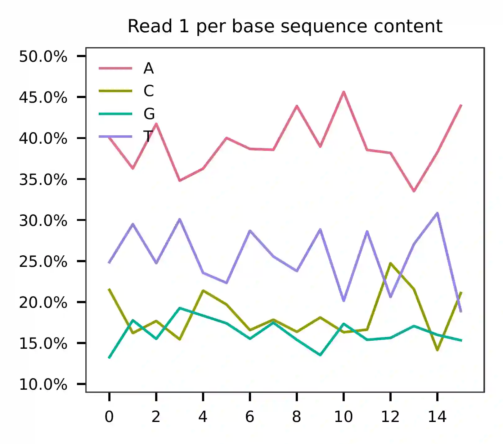

.. _tutorial_cell_surface_protein_labeling_prjna658075:

###############################################################
 ASAP-seq; Multiplexed CRISPR Perturbations in Primary T Cells
###############################################################

**Dataset**: ASAP-seq: Multiplexed CRISPR Perturbations in Primary T
Cells

Mimitou, E.P., Lareau, C.A., Chen, K.Y., Zorzetto-Fernandes, A.L., Hao,
Y., Takeshima, Y., Luo, W., Huang, T.-S., Yeung, B.Z., Papalexi, E., et
al. (2021). `Scalable, multimodal profiling of chromatin accessibility,
gene expression and protein levels in single cells`_. *Nat. Biotechnol.*
**39**, 1246–1258.

.. _scalable, multimodal profiling of chromatin accessibility, gene expression and protein levels in single cells: https://doi.org/10.1038/s41587-021-00927-2

|

*************
 Preparation
*************

Download fastq files from `Gene Expression Omnibus`_.

.. _gene expression omnibus: https://www.ncbi.nlm.nih.gov/geo/query/acc.cgi?acc=GSE156478

.. code:: console

   $ ls -l

   SRR12476627_1.fastq.gz
   SRR12476627_2.fastq.gz
   SRR12476627_3.fastq.gz
   SRR12476628_1.fastq.gz
   SRR12476628_2.fastq.gz
   SRR12476628_3.fastq.gz
   SRR12476630_1.fastq.gz
   SRR12476630_2.fastq.gz
   SRR12476630_3.fastq.gz
   SRR12476631_1.fastq.gz
   SRR12476631_2.fastq.gz
   SRR12476631_3.fastq.gz

Hashtag oligos

.. code:: console

   $ cat SRR12476630_2.fastq.gz SRR12476631_2.fastq.gz > hto_read_2.fq.gz

   $ cat SRR12476630_3.fastq.gz SRR12476631_3.fastq.gz > hto_read_3.fq.gz

Antibody-derived tags

.. code:: console

   $ cat SRR12476627_2.fastq.gz SRR12476628_2.fastq.gz > adt_read_2.fq.gz

   $ cat SRR12476627_3.fastq.gz SRR12476628_3.fastq.gz > adt_read_3.fq.gz

Download cell barcode info from the manuscript's wonderful GitHub
repository_. We need to get the cell-associated barcodes of this
single-cell ATAC-Seq library.

.. _repository: https://github.com/caleblareau/asap_reproducibility

.. code:: console

   $ wget https://github.com/caleblareau/asap_reproducibility/blob/master/CD4_CRISPR_asapseq/data/filtered_peak_bc_matrix.h5

   $ ls -l

   filtered_peak_bc_matrix.h5

Retrieve cell-associated barcodes from this downloaded h5 file generated
by 10x Genomics' `Cell Ranger ATAC`_.

.. _cell ranger atac: https://support.10xgenomics.com/single-cell-atac/software/pipelines/latest/algorithms/overview

.. code:: R

   R version 4.1.3 (2022-03-10) -- "One Push-Up"
   Platform: aarch64-apple-darwin21.3.0 (64-bit)

   r$> h5f <- rhdf5::H5Fopen(name = "filtered_peak_bc_matrix.h5")

   r$> cell_barcodes <- h5f$matrix$barcodes

   r$> rhdf5::H5Fclose(h5f)

   r$> write.table(
           x = cell_barcodes,
           file = "cell_barcodes.txt",
           col.names = FALSE,
           row.names = FALSE,
           quote = FALSE
       )

Inspect cell barcodes.

.. code:: console

   $ head cell_barcodes.txt

   AAACGAAAGCTCGTTA-1
   AAACGAAAGCTGAGGT-1
   AAACGAAAGGTGAACC-1
   AAACGAACAACATAAG-1
   AAACGAACAATAGCGG-1
   AAACGAACAATCCATG-1
   AAACGAACACGTTAGT-1
   AAACGAACAGAGATGC-1
   AAACGAACAGCGTAGA-1
   AAACGAAGTAAACGAT-1

Prepare feature barcodes (hashtag oligos, HTOs) from sheet
'Supplementary_1_Perturbation' in the supplementary table file.

.. code:: console

   $ cat feature_barcodes_HTO.tsv

   anti-human_hashtag_1    GTCAACTCTTTAGCG
   anti-human_hashtag_2    TGATGGCCTATTGGG
   anti-human_hashtag_3    TTCCGCCTCTCTTTG
   anti-human_hashtag_4    AGTAAGTTCAGCGTA
   anti-human_hashtag_5    AAGTATCGTTTCGCA
   anti-human_hashtag_12   TAACGACCAGCCATA
   anti-human_hashtag_13   AAATCTCTCAGGCTC

Prepare feature barcodes (antibody-derived tags, ADTs) from sheet
'Supplementary_1_Hashing' in the supplementary table file.

.. code:: console

   $ cat feature_barcodes_ADT.tsv

   UCHT1   CTCATTGTAACTCCT
   RPA-T4  TGTTCCCGCTCAACT
   SK1     GCGCAACTTGATGAT
   HI100   TCAATCCTTCCGCTT
   UCHL1   CTCCGAATCATGTTG
   EH12.2H7        ACAGCGCCGTATTTA
   A019D5  GTGTGTTGTCCTATG
   DX2     CCAGCTCATTAGAGC
   G043H7  AGTTCAGTCAACCGA
   WM59    ACCTTTATGCCACGG
   BC96    TTTGTCCTGTACGCC
   QA17A04 AACTCCCTATGGAGG
   FN50    GTCTCTTGGCTTAAA
   O323    GCACTCCTGCATGTA
   C398.4A CGCGCACCCATTAAA
   BJ18    AATCCTTCCGAATGT
   A15153G TTGCTTACCGCCAGA
   CD7-6B7 TGGATTCCCGGACTT
   Ber-ACT35_(ACT35)       AACCCACCGTTGTTA
   DREG-56 GTCCCTGCAACTTGA
   A1      TTACCTGGTATCCGT
   4B4-1   CAGTAAGTTCGGGAC
   108-17  ACCTTTCGACACTCG
   CD28.2  TGAGAACGACCCTAA
   HIT2    TGTACCCGCTTGTGA
   AD2     CAGTTCCTCAGTTCG
   HP-3G10 GTACGCAGTCCTTCT
   HIB19   CTGGGCAATTACTCG
   2D1     TCCCTTGCGATTTAC
   M5E2    TCTCAGACCTCCGTA
   5.1H11  TCCTTTCCTGATAGG
   3G8     AAGTTCACTCTTTGC
   IP26    CGTAACGTAGAGCGA
   F38-2E2 TGTCCTACCCAACTT
   J252D4  AATTCAACCGTCGCC
   S-HCL-3 TACGCCTATAACTTG
   MOPC-21 GCCGGACGACATTAA

|

**************
 Cell hashing
**************

QC
==

Sample the first 10,000 (set by ``-n``) read pairs for quality control.
Use ``-t`` to set the number of threads. The diagnostic results and
plots are generated in the ``qc`` directory (set by
``--output_directory``, default ``qc``). By default, full length of read
1 and read 2 are searched against reference cell and feature barcodes,
respectively. The per base content of both read pairs and the
distribution of matched barcode positions are summarized. Use ``-r1_c``
and/or ``-r2_c`` to limit the search range. Use ``-cb_n`` and/or
``-fb_n`` to set the mismatch tolerance for cell and feature barcode
matching (default ``3``).

This library is built using 10x Genomics' `Chromium Single Cell ATAC
Reagent Kits`_. The 10x Barcode (16 bp) is sequenced in the i5 index
read. 10x Genomics' `Cell Ranger ATAC`_ may convert the raw 16 bp
sequences to their reverse-complement counterparts as cell barcodes in
the outputs. In ``fba``, use ``-cb_rc`` to reverse-complement cell
barcode sequences for processing.

.. _chromium single cell atac reagent kits: https://support.10xgenomics.com/single-cell-atac/sequencing/doc/technical-note-sequencing-metrics-and-base-composition-of-chromium-single-cell-atac-libraries

.. code:: console

   $ fba qc \
       -1 hto_read_2.fq.gz \
       -2 hto_read_3.fq.gz \
       -w cell_barcodes.txt \
       -f feature_barcodes_HTO.tsv \
       --output_directory qc \
       -cb_rc

This library is built using the `Chromium Single Cell ATAC Reagent
Kits`_ and sequenced on Illumina NextSeq 550. The GC content of cell
barcodes (read 2) are A-rich.

As for read 3, based on the per base content, it suggests that bases
0-14 are actually our feature barcodes (See the distribution of matched
barcode positions on read 3).

The detailed ``qc`` results are stored in
``feature_barcoding_output.tsv.gz`` file. ``matching_pos`` columns
indicate the matched positions on reads. ``matching_description``
columns indicate mismatches in substitutions:insertions:deletions
format.

.. code:: console

   $ gzip -dc feature_barcoding_output.tsv.gz | grep -v no | head

   read1_seq       cell_barcode    cb_matching_pos cb_matching_description read2_seq       feature_barcode fb_matching_pos fb_matching_description
   TTTAAGCTGCCTAACA        TTGTTAGCTGCCCAAC        0:15    2:0:1   TAACGACCAGCCATNNNANAANNANNANNNANNNNANNNNNANNNNNNNANNNNNNNNNNNNNNNNNANNNN        anti-human_hashtag_12_TAACGACCAGCCATA   0:15       1:0:0
   AGAACGCGAAAAGGTT        AGAACGCGAGTACGTT        0:16    3:0:0   TGATGACCTATTGGNNNAAAANNANNANNNANNNNANANNNANNNANNNANNNNNNANNNNNNNNNNANNAN        anti-human_hashtag_2_TGATGGCCTATTGGG    0:15       2:0:0
   TGAGACTTGGCAGGAT        TGAGACTTGGCAGGAT        0:16    0:0:0   TTTCGCCTTTCTTTGNAAAAANNANNAANAANNANANANAAANNAAANNAANANNAAAAANNANNNNAANAN        anti-human_hashtag_3_TTCCGCCTCTCTTTG    0:15       2:0:0
   ATTTATTGACGCAAAG        CTTATTGTGCGCAAAG        1:16    2:0:1   TTCCACCTCTCTTTGNAAAAAANAANAAAAANAANAAANAAANAAAANAAAAANNAAAAAANAANNNAAAAN        anti-human_hashtag_3_TTCCGCCTCTCTTTG    0:15       1:0:0
   CGCCCTTCTGGGTAGT        CGCCCTTCTGGGTAGT        0:16    0:0:0   AAGTATCGTTTCGCATAAAAAAAAANAAAAANAANAAANAAAAAAAAAAAAAAAAAAAAAANAAANNAAAAN        anti-human_hashtag_5_AAGTATCGTTTCGCA    0:15       0:0:0
   TACCTCGACCTGGAAG        TACCTCGACCTGGAAG        0:16    0:0:0   ATCAACTCTTTAGCGCAAAAAAAAAAAAAAAAAAAAAANAAAAAAAAAAAAAAAAAAAAAANAAAANAAAAN        anti-human_hashtag_1_GTCAACTCTTTAGCG    0:15       1:0:0
   ACCACCCCCAACACCC        TACCACCACCCTAACA        0:13    0:0:3   ATCAACTCTTTAACATAAAAAAAAAAAAAAAAAAAAAANAAAAAAAAAAAAAAAAAAAAAANAAAAAAAAAA        anti-human_hashtag_1_GTCAACTCTTTAGCG    0:15       3:0:0
   GCTAACTGATTCGGGC        AACTCGATGTCGGGCT        3:16    0:0:3   TAACAACCAGCCATAGAAAAAAAAAAAAAAAAAAAAAAAAAAAAAAAACAAAAAAAAAAAANAAAAAAAAAA        anti-human_hashtag_12_TAACGACCAGCCATA   0:15       1:0:0
   TTTGCGGCTCTCCTAC        TTTGCGGCTCATGCAT        0:14    1:0:2   TTCCACCTCTCTTTGCAAAAAAAAAAAAAAAAAAAAAAAAAAAAAAAAAAAAAAAAAAAAANAAAAAAAAAA        anti-human_hashtag_3_TTCCGCCTCTCTTTG    0:15       1:0:0

|

Barcode extraction
==================

The lengths of cell and feature barcodes are all identical (16 and 15,
respectively). And based on the ``qc`` results, the distributions of
starting and ending positions of cell and feature barcodes are very
uniform. Search ranges are set to ``0,16`` on read 2 and ``0,15`` on
read 3. One mismatch for cell and feature barcodes (``-cb_m``,
``-cf_m``) are allowed. And by default, three ambiguous nucleotides (Ns)
for read 1 and read 2 (``-cb_n``, ``-cf_n``) are allowed. Use ``-cb_rc``
to reverse-complement cell barcode sequences for processing.

.. code:: console

   $ fba extract \
       -1 hto_read_2.fq.gz \
       -2 hto_read_3.fq.gz \
       -w cell_barcodes.txt \
       -f feature_barcodes_HTO.tsv \
       -o feature_barcoding_output_HTO.tsv.gz \
       -r1_c 0,16 \
       -r2_c 0,15 \
       -cb_m 1 \
       -fb_m 1 \
       -cb_n 3 \
       -fb_n 3 \
       -cb_rc

Preview of result.

.. code:: console

   $ gzip -dc feature_barcoding_output_HTO.tsv.gz | head

   read1_seq       cell_barcode    cb_num_mismatches       read2_seq       feature_barcode fb_num_mismatches
   AATAACCGACAGGTGA        AATCACCGACAGGTGA        1       ATCAACTCTTTAGCGtaaaaaaaaaaaaaaaaaaaaaaaaaaaaaaaaaaaaaaaaaaaaanaaaaaaaaaa        anti-human_hashtag_1_GTCAACTCTTTAGCG    1
   TGCAGTATGCCTCGTA        TGCAGTATGCCTCGTT        1       TAATGGCCTATTGGGgaaaaaaaaaaaaaaaaaaaaaaaaaaaaaaaaaaaacacccaaaaaaaaaaaaaaa        anti-human_hashtag_2_TGATGGCCTATTGGG    1
   TCGCGGTGAGCTTACA        TCGCGGTGAGCTTACA        0       TTCCGCCTCTCTTTGcaaaaaaaaaaaaaaaaaaaaaaaaaaaaaaaaaaaaaaaaaaaaaaaaaaaaaaaa        anti-human_hashtag_3_TTCCGCCTCTCTTTG    0
   AACTAGCACTATTGCG        AACTAGCACTATTGCG        0       AAGTATCGTTTCGCAcaaaaaaaaaaaaaaaaaaaaaaaaataacacttaaaaataaaaaaaaaaaacccaa        anti-human_hashtag_5_AAGTATCGTTTCGCA    0
   TGCAATGTGGGGTTCC        TGCAATGTGGGGTTCC        0       TTCCGCCTCTCTTTGaaaaaaaaaaaaaaaaaaaaaaaaaaaaaaaaaaaaaaaaaaaaaaaaaaaaaaaaa        anti-human_hashtag_3_TTCCGCCTCTCTTTG    0
   TGGATAGCTATCTGTG        TGGATAGCTATCTGTG        0       AAGTATCGTTTCGCAcaaaaaaaaaaaaaaaaaaaaaaaaaaaaaaaaaaaaaacccaaaaaaaaaaaaaaa        anti-human_hashtag_5_AAGTATCGTTTCGCA    0
   AGCAGAGACATCCTAG        AGCAGAGACATCCTAG        0       TTCCGCCTCTCTTTGaaaaaaaaaaaaaaaaaaaaaaaaaaaaaaaaaaaaaaaaaaaaaaaaaaaaaaaaa        anti-human_hashtag_3_TTCCGCCTCTCTTTG    0
   CTTAATCTGTGTTGTG        CTTAATCTGTGTTGTG        0       AAGTATCGTTTCGCAcaaaaaaaaaaaaggtgtattactgtctcttatacacatctgacgctgccgacgact        anti-human_hashtag_5_AAGTATCGTTTCGCA    0
   GTTTCATTGTGGCATT        GTTTCATTGTGGCATT        0       AATAAGTTCAGCGTAgaaaaaaaaaaaaaaaaaaaaaaaaaatttaaatttgaattaaaataaaaaaaaata        anti-human_hashtag_4_AGTAAGTTCAGCGTA    1

Result summary.

72.4% (22,820,698 out of 31,512,084) of total read pairs have valid cell
and feature barcodes.

.. code:: console

   2022-03-16 00:14:08,601 - fba.__main__ - INFO - fba version: 0.0.x
   2022-03-16 00:14:08,601 - fba.__main__ - INFO - Initiating logging ...
   2022-03-16 00:14:08,601 - fba.__main__ - INFO - Python version: 3.10
   2022-03-16 00:14:08,601 - fba.__main__ - INFO - Using extract subcommand ...
   2022-03-16 00:14:08,635 - fba.levenshtein - INFO - Number of reference cell barcodes: 9,151
   2022-03-16 00:14:08,635 - fba.levenshtein - INFO - Number of reference feature barcodes: 7
   2022-03-16 00:14:08,635 - fba.levenshtein - INFO - Read 1 coordinates to search: [0, 16)
   2022-03-16 00:14:08,635 - fba.levenshtein - INFO - Read 2 coordinates to search: [0, 15)
   2022-03-16 00:14:08,635 - fba.levenshtein - INFO - Cell barcode maximum number of mismatches: 1
   2022-03-16 00:14:08,635 - fba.levenshtein - INFO - Feature barcode maximum number of mismatches: 1
   2022-03-16 00:14:08,635 - fba.levenshtein - INFO - Read 1 maximum number of N allowed: 3
   2022-03-16 00:14:08,635 - fba.levenshtein - INFO - Read 2 maximum number of N allowed: 3
   2022-03-16 00:14:08,871 - fba.levenshtein - INFO - Matching ...
   2022-03-16 00:19:01,333 - fba.levenshtein - INFO - Read pairs processed: 10,000,000
   2022-03-16 00:23:44,891 - fba.levenshtein - INFO - Read pairs processed: 20,000,000
   2022-03-16 00:28:29,304 - fba.levenshtein - INFO - Read pairs processed: 30,000,000
   2022-03-16 00:29:12,889 - fba.levenshtein - INFO - Number of read pairs processed: 31,512,084
   2022-03-16 00:29:12,890 - fba.levenshtein - INFO - Number of read pairs w/ valid barcodes: 22,820,698
   2022-03-16 00:29:12,902 - fba.__main__ - INFO - Done.

|

Matrix generation
=================

Only fragments with correct (passed the criteria) cell and feature
barcodes are included. Use ``-ul`` to set the UMI length (default
``12``). Setting to ``0`` means no UMIs and read counts are summarized
instead. Use ``-cb_rc`` to reverse-complement cell barcode sequences in
the output matrix if needed.

The generated feature count matrix can be easily imported into
well-established single cell analysis packages: Seruat_ and Scanpy_.

.. _scanpy: https://scanpy.readthedocs.io/en/stable

.. _seruat: https://satijalab.org/seurat/

.. code:: console

   $ fba count \
       -i feature_barcoding_output_HTO.tsv.gz \
       -o matrix_featurecount_HTO.csv.gz \
       -ul 0

Result summary.

The median number of reads per cell of this HTO library is 1,893.0.

.. code:: console

   2022-03-16 00:29:13,026 - fba.__main__ - INFO - fba version: 0.0.x
   2022-03-16 00:29:13,026 - fba.__main__ - INFO - Initiating logging ...
   2022-03-16 00:29:13,026 - fba.__main__ - INFO - Python version: 3.10
   2022-03-16 00:29:13,026 - fba.__main__ - INFO - Using count subcommand ...
   2022-03-16 00:29:14,943 - fba.count - INFO - UMI-tools version: 1.1.2
   2022-03-16 00:29:14,950 - fba.count - INFO - UMI length set to 0, ignoring UMI information. Skipping arguments: "-us/--umi_start".
   2022-03-16 00:29:14,950 - fba.count - INFO - Header: read1_seq cell_barcode cb_num_mismatches read2_seq feature_barcode fb_num_mismatches
   2022-03-16 00:29:52,721 - fba.count - INFO - Number of read pairs processed: 22,820,698
   2022-03-16 00:29:52,730 - fba.count - INFO - Number of cell barcodes detected: 9,151
   2022-03-16 00:29:52,730 - fba.count - INFO - Number of features detected: 7
   2022-03-16 00:29:52,730 - fba.count - INFO - Counting ...
   2022-03-16 00:29:52,940 - fba.count - INFO - Total reads: 22,820,698
   2022-03-16 00:29:52,941 - fba.count - INFO - Median number of reads per cell: 1,893.0
   2022-03-16 00:29:53,099 - fba.__main__ - INFO - Done.

.. code:: python

   In [1]: import pandas as pd

   In [2]: m = pd.read_csv("matrix_featurecount.csv.gz", index_col=0)

   In [3]: m.sum(axis=1)
   Out[3]:
   anti-human_hashtag_12_TAACGACCAGCCATA    4402031
   anti-human_hashtag_13_AAATCTCTCAGGCTC    2225016
   anti-human_hashtag_1_GTCAACTCTTTAGCG     4107376
   anti-human_hashtag_2_TGATGGCCTATTGGG     2672503
   anti-human_hashtag_3_TTCCGCCTCTCTTTG     2469687
   anti-human_hashtag_4_AGTAAGTTCAGCGTA     3172034
   anti-human_hashtag_5_AAGTATCGTTTCGCA     3772051
   dtype: int64

   In [4]: m1 = m.loc[
   ...:     [
   ...:         "anti-human_hashtag_1_GTCAACTCTTTAGCG",
   ...:         "anti-human_hashtag_2_TGATGGCCTATTGGG",
   ...:         "anti-human_hashtag_3_TTCCGCCTCTCTTTG",
   ...:         "anti-human_hashtag_4_AGTAAGTTCAGCGTA",
   ...:         "anti-human_hashtag_5_AAGTATCGTTTCGCA",
   ...:     ],
   ...:     :,
   ...: ]

   In [5]: m1.to_csv(path_or_buf="matrix_featurecount_HTO_1-5.csv.gz",
                     compression="infer")

   In [6]: m2 = m.loc[[
   ...:     "anti-human_hashtag_12_TAACGACCAGCCATA",
   ...:     "anti-human_hashtag_13_AAATCTCTCAGGCTC"
   ...: ], :]

   In [7]: m2.to_csv(path_or_buf="matrix_featurecount_HTO_12-13.csv.gz",
                     compression="infer")

|

Demultiplexing
==============

Gaussian mixture model
----------------------

The implementation of demultiplexing method ``2`` (set by ``-dm``) is
inspired by the method described on `10x Genomics' website`_. Use ``-p``
to set the probability threshold for demulitplexing (default ``0.9``).

.. _10x genomics' website: https://support.10xgenomics.com/single-cell-gene-expression/software/pipelines/latest/algorithms/crispr

.. code:: console

   $ fba demultiplex \
       -i matrix_featurecount_HTO_1-5.csv.gz \
       -dm 2 \
       -v

.. code:: console

   2022-03-16 00:38:18,749 - fba.__main__ - INFO - fba version: 0.0.x
   2022-03-16 00:38:18,749 - fba.__main__ - INFO - Initiating logging ...
   2022-03-16 00:38:18,749 - fba.__main__ - INFO - Python version: 3.9
   2022-03-16 00:38:18,749 - fba.__main__ - INFO - Using demultiplex subcommand ...
   2022-03-16 00:38:21,709 - fba.__main__ - INFO - Skipping arguments: "-q/--quantile", "-cm/--clustering_method"
   2022-03-16 00:38:21,709 - fba.demultiplex - INFO - Output directory: demultiplexed
   2022-03-16 00:38:21,709 - fba.demultiplex - INFO - Demultiplexing method: 2
   2022-03-16 00:38:21,709 - fba.demultiplex - INFO - UMI normalization method: clr
   2022-03-16 00:38:21,709 - fba.demultiplex - INFO - Visualization: On
   2022-03-16 00:38:21,709 - fba.demultiplex - INFO - Visualization method: tsne
   2022-03-16 00:38:21,709 - fba.demultiplex - INFO - Loading feature count matrix: matrix_featurecount_HTO_1-5.csv.gz ...
   2022-03-16 00:38:21,796 - fba.demultiplex - INFO - Number of cells: 9,151
   2022-03-16 00:38:21,796 - fba.demultiplex - INFO - Number of positive cells for a feature to be included: 200
   2022-03-16 00:38:21,810 - fba.demultiplex - INFO - Number of features: 5 / 5 (after filtering / original in the matrix)
   2022-03-16 00:38:21,810 - fba.demultiplex - INFO - Features: anti-human_hashtag_1 anti-human_hashtag_2 anti-human_hashtag_3 anti-human_hashtag_4 anti-human_hashtag_5
   2022-03-16 00:38:21,810 - fba.demultiplex - INFO - Total UMIs/reads: 16,193,651 / 16,193,651
   2022-03-16 00:38:21,817 - fba.demultiplex - INFO - Median number of UMIs/reads per cell: 1,326.0 / 1,326.0
   2022-03-16 00:38:21,817 - fba.demultiplex - INFO - Demultiplexing ...
   2022-03-16 00:38:24,130 - fba.demultiplex - INFO - Generating heatmap ...
   2022-03-16 00:38:26,376 - fba.demultiplex - INFO - Embedding ...
   2022-03-16 00:38:43,503 - fba.__main__ - INFO - Done.

Heatmap of the relative abundance of features (hashtag oligos, HTOs)
across all cells. Each column represents a single cell. This is a
re-creation of `Extended Data Fig. 6`_\b in `Mimitou, E.P., et al.
(2021)`_.

.. _extended data fig. 6: https://www.nature.com/articles/s41587-021-00927-2/figures/13

.. _mimitou, e.p., et al. (2021): https://doi.org/10.1038/s41587-021-00927-2

Preview the demultiplexing result: the numbers of singlets, multiplets
and negatives are 7,728 (84.4%), 1,224 (13.4%), and 199 (2.2%),
respectively.

.. code:: python

   In [1]: import pandas as pd

   In [2]: m = pd.read_csv("demultiplexed/matrix_cell_identity.csv.gz", index_col=0)

   In [3]: m.loc[:, m.sum(axis=0) == 1].sum(axis=1)
   Out[3]:
   anti-human_hashtag_1    1493
   anti-human_hashtag_2    1511
   anti-human_hashtag_3    1395
   anti-human_hashtag_4    1675
   anti-human_hashtag_5    1654
   dtype: int64

   In [4]: sum(m.sum(axis=0) == 1)
   Out[4]: 7728

   In [5]: sum(m.sum(axis=0) > 1)
   Out[5]: 1224

   In [6]: sum(m.sum(axis=0) == 0)
   Out[6]: 199

   In [7]: m.shape
   Out[7]: (5, 9151)

t-SNE embedding of cells based on the abundance of features
(phage-derived tags, no transcriptome information used). Colors indicate
the hashtag status for each cell, as called by FBA.

|

.. code:: console

   $ fba demultiplex \
       -i matrix_featurecount_HTO_12-13.csv.gz \
       -dm 2 \
       -v

.. code:: console

   2022-03-16 00:39:44,380 - fba.__main__ - INFO - Initiating logging ...
   2022-03-16 00:39:44,380 - fba.__main__ - INFO - Python version: 3.9
   2022-03-16 00:39:44,380 - fba.__main__ - INFO - Using demultiplex subcommand ...
   2022-03-16 00:39:47,238 - fba.__main__ - INFO - Skipping arguments: "-q/--quantile", "-cm/--clustering_method"
   2022-03-16 00:39:47,238 - fba.demultiplex - INFO - Output directory: demultiplexed
   2022-03-16 00:39:47,238 - fba.demultiplex - INFO - Demultiplexing method: 2
   2022-03-16 00:39:47,238 - fba.demultiplex - INFO - UMI normalization method: clr
   2022-03-16 00:39:47,238 - fba.demultiplex - INFO - Visualization: On
   2022-03-16 00:39:47,238 - fba.demultiplex - INFO - Visualization method: tsne
   2022-03-16 00:39:47,238 - fba.demultiplex - INFO - Loading feature count matrix: matrix_featurecount_HTO_12-13.csv.gz ...
   2022-03-16 00:39:47,329 - fba.demultiplex - INFO - Number of cells: 9,151
   2022-03-16 00:39:47,341 - fba.demultiplex - INFO - Number of positive cells for a feature to be included: 200
   2022-03-16 00:39:47,355 - fba.demultiplex - INFO - Number of features: 2 / 2 (after filtering / original in the matrix)
   2022-03-16 00:39:47,363 - fba.demultiplex - INFO - Features: anti-human_hashtag_12 anti-human_hashtag_13
   2022-03-16 00:39:47,363 - fba.demultiplex - INFO - Total UMIs/reads: 6,627,047 / 6,627,047
   2022-03-16 00:39:47,370 - fba.demultiplex - INFO - Median number of UMIs/reads per cell: 559.0 / 559.0
   2022-03-16 00:39:47,370 - fba.demultiplex - INFO - Demultiplexing ...
   2022-03-16 00:39:48,484 - fba.demultiplex - INFO - Generating heatmap ...
   2022-03-16 00:39:49,412 - fba.demultiplex - INFO - Embedding ...
   2022-03-16 00:40:06,551 - fba.__main__ - INFO - Done.

Heatmap of the relative abundance of features (hashtag oligos, HTOs)
across all cells. Each column represents a single cell. This is a
re-creation of `Extended Data Fig. 6`_\b in `Mimitou, E.P., et al.
(2021)`_.

Preview the demultiplexing result: the numbers of singlets, multiplets
and negatives are 7,924 (86.6%), 856 (9.4%), and 371 (4.1%),
respectively.

.. code:: python

   In [1]: import pandas as pd

   In [2]: m = pd.read_csv("demultiplexed/matrix_cell_identity.csv.gz", index_col=0)

   In [3]: m.loc[:, m.sum(axis=0) == 1].sum(axis=1)
   Out[3]:
   anti-human_hashtag_12    4018
   anti-human_hashtag_13    3906
   dtype: int64

   In [4]: [sum(m.sum(axis=0) == i) for i in (1, 2, 0)]
   Out[4]: [7924, 856, 371]

   In [5]: m.shape
   Out[5]: (2, 9151)

t-SNE embedding of cells based on the abundance of features
(phage-derived tags, no transcriptome information used). Colors indicate
the hashtag status for each cell, as called by FBA.

|

**********
 CITE-seq
**********

QC
==

Same as the HTO library, sample the first 10,000 (set by ``-n``) read
pairs for quality control.

.. code:: console

   $ fba qc \
       -1 adt_read_2.fq.gz \
       -2 adt_read_3.fq.gz \
       -w cell_barcodes.txt \
       -f feature_barcodes_HTO.tsv \
       --output_directory qc \
       -cb_rc

Cell barcodes are A-rich.

As for read 3, based on the per base content, it suggests that bases
0-14 are actually our feature barcodes (See the distribution of matched
barcode positions on read 3).

The detailed ``qc`` results are stored in
``feature_barcoding_output.tsv.gz`` file. ``matching_pos`` columns
indicate the matched positions on reads. ``matching_description``
columns indicate mismatches in substitutions:insertions:deletions
format.

.. code:: console

   $ gzip -dc feature_barcoding_output.tsv.gz | grep -v no | head

   read1_seq       cell_barcode    cb_matching_pos cb_matching_description read2_seq       feature_barcode fb_matching_pos fb_matching_description
   CCTAAGAAAAAGCTGC        CCTAAGAACAAGACAT        0:14    1:0:2   AATCCTTCCGAATNNNNNNANNNNNNANNNANNNNNNNNNNNNNNNNNNNNNNNNNNNNNNNNNNNNNNNNN        BJ18_AATCCTTCCGAATGT    0:15    2:0:0
   TTATCCAAGGACTGTT        TCCCACATGGACTGTT        3:16    0:0:3   TATTCCCGCTCAANNNNNNANNNNNNANNNANNNNNNNNNNNNNNNNNNNNNNNNNNNNNNNNNNNNNNNNN        RPA-T4_TGTTCCCGCTCAACT  0:15    3:0:0
   GAGAAGAGACCGATTA        AGGAAGAGACCCGAGT        1:15    1:0:2   CTCATTGTAACTCCNNNANAANNANNANNNANNNNANNNNNANNNNNNNANNNNNNNNNNNNNNNNNANNNN        UCHT1_CTCATTGTAACTCCT   0:15    1:0:0
   ATACATCATAAACAAA        ATACATCCTTAACGAA        0:16    3:0:0   ATCCTTCCGAATGTNNNAAAANNANNANNAANNNNANANNNANNNANNNANNNNNNANNNNNANNNNANNAN        BJ18_AATCCTTCCGAATGT    0:14    0:0:1
   GATCATGTGCTTTGTT        TGAACTGTGCTTTGTT        0:16    1:1:1   CACACACCCATTAAANAAAAANNANNANNAANNNNANANNNANNNANNNAANNNNNAAAANNANNNNAANAN        C398.4A_CGCGCACCCATTAAA 0:15    2:0:0
   AACACTCGACAGGTGA        AACACTCGAGAAGGCT        0:14    1:0:2   ATCCCTGCAACTTGANAAAAANNANNAANAANNANANANNNANNNANNNAANANNNAAAANNANNNNAANAN        DREG-56_GTCCCTGCAACTTGA 0:15    1:0:0
   ACTGTTCGACTACTCC        AGTGTTCGACTATCTT        0:15    2:0:1   TCCCTTGCGATTTACNAAAAAANAANAANAANAANAAANAAANCAAANNAANANNAAAAANNANNNNAANAN        2D1_TCCCTTGCGATTTAC     0:15    0:0:0
   ACTTATCTGTGCATCA        ACTTATCTGTGCATCA        0:16    0:0:0   ACCTTTATGCCACGGNAAAAAANAANAAAAANAANAAANAAANAAAANTTTAANNAAAAAANAANNNAAAAN        WM59_ACCTTTATGCCACGG    0:15    0:0:0
   GAGCATAATTTAGCAG        GAGCATACTTGAGCAG        0:16    2:0:0   CAATAAGTTCGGGACCAAAAAAAAANAAAAANAANAAANAAANAAAAAAAAAANAAAAAAANAAANNAAAAN        4B4-1_CAGTAAGTTCGGGAC   0:15    1:0:0

|

Barcode extraction
==================

The lengths of cell and feature barcodes are all identical (16 and 15,
respectively). And based on the ``qc`` results, the distributions of
starting and ending positions of cell and feature barcodes are very
uniform. Search ranges are set to ``0,16`` on read 2 and ``0,15`` on
read 3. One mismatch for cell and feature barcodes (``-cb_m``,
``-cf_m``) are allowed. And by default, three ambiguous nucleotides (Ns)
for read 1 and read 2 (``-cb_n``, ``-cf_n``) are allowed. Use ``-cb_rc``
to reverse-complement cell barcode sequences for processing.

.. code:: console

   $ fba extract \
       -1 adt_read_2.fq.gz \
       -2 adt_read_3.fq.gz \
       -w cell_barcodes.txt \
       -f feature_barcodes_ADT.tsv \
       -o feature_barcoding_output_ADT.tsv.gz \
       -r1_c 0,16 \
       -r2_c 0,15 \
       -cb_m 1 \
       -fb_m 1 \
       -cb_n 3 \
       -fb_n 3 \
       -cb_rc

Preview of result.

.. code:: console

   $ gzip -dc feature_barcoding_output_ADT.tsv.gz | head

   read1_seq       cell_barcode    cb_num_mismatches       read2_seq       feature_barcode fb_num_mismatches
   CAAGAAATGCATTCAG        CAAGAAATGCATTCAG        0       TATACCCGCTTGTGAtaaaaaaaaaaaaaaaaaaaaaanaaaaaaaaaaaaaaaaaaaaaanaaaaaaaaaa        HIT2_TGTACCCGCTTGTGA    1
   GTGGCTGTGTTTGTCT        GTGGCTGTGTTTGTCT        0       TAGATTCCCGGACTTgaaaaaaaaaaaaaaaaaaaaaaaaaaaaaaaaaaaaaaaaaaaaanaaaaaaaaaa        CD7-6B7_TGGATTCCCGGACTT 1
   ACTGATTCTGCCCTAG        ACTGATTCTGCCCTAG        0       TAGATTCCCGGACTTtaaaaaaaaaaaaaaaaaaaaaaaaaaaaaaaaaaaaaaaaaaaaanaaaaaaaaaa        CD7-6B7_TGGATTCCCGGACTT 1
   CCTGCTATGCTGCGGT        CCTGCTATGCTGCGGT        0       TAGATTCCCGGACTTgaaaaaaaaaaaaaaaaaaaaaaaaaaaaaaaaaaaaaaaaaaaaanaaaaaaaaaa        CD7-6B7_TGGATTCCCGGACTT 1
   TGTAGTTTGGATAGCG        GGTAGTTTGGATAGCG        1       TTTATCCTGTACGCCtaaaaaaaaaaaaaaaaaaaaaaaaaaaaaaaaaaaaaaaaaaaaanaaaaaaaaaa        BC96_TTTGTCCTGTACGCC    1
   TCCTTAAACCATCCTC        TCCTTAAACCATCCTC        0       AATCCTTCCGAATGTtaaaaaaaaaaaaaaaaaaaaaaaaaaaaaaaaaaaaaaaaaaaaanaaaaaaaaaa        BJ18_AATCCTTCCGAATGT    0
   TTCCCATCTGGAATAT        TTCCCATCTGGAATAT        0       CTCATTGTAACTCCTcaaaaaaaaaaaaaaaaaaaaaaaaaaaaaaaaaaaaaaaaaaaaaaaaaaaaaaaa        UCHT1_CTCATTGTAACTCCT   0
   ACTCAGAACGAATTGG        ACTCAGAACGAATTGA        1       TATTCCCGCTCAACTcaaaaaaaaaaaaaaaaaaaaaaaaaaaaaaaaaaaaaaaaaaaaaaaaaaaaaaaa        RPA-T4_TGTTCCCGCTCAACT  1
   CAGGACCTGCGCACTG        CAGGACCTGCGCACTG        0       TATTCCCGCTCAACTcaaaaaaaaaaaaaaaaaaaaaaaaaaaaaaaaaaaaaaaaaaaaaaaaaaaaaaaa        RPA-T4_TGTTCCCGCTCAACT  1

Result summary.

51.3% (27,719,537 out of 54,024,324) of total read pairs have valid cell
and feature barcodes.

.. code:: console

   2022-03-15 23:43:13,501 - fba.__main__ - INFO - fba version: 0.0.x
   2022-03-15 23:43:13,501 - fba.__main__ - INFO - Initiating logging ...
   2022-03-15 23:43:13,501 - fba.__main__ - INFO - Python version: 3.10
   2022-03-15 23:43:13,501 - fba.__main__ - INFO - Using extract subcommand ...
   2022-03-15 23:43:13,562 - fba.levenshtein - INFO - Number of reference cell barcodes: 9,151
   2022-03-15 23:43:13,562 - fba.levenshtein - INFO - Number of reference feature barcodes: 37
   2022-03-15 23:43:13,562 - fba.levenshtein - INFO - Read 1 coordinates to search: [0, 16)
   2022-03-15 23:43:13,562 - fba.levenshtein - INFO - Read 2 coordinates to search: [0, 15)
   2022-03-15 23:43:13,562 - fba.levenshtein - INFO - Cell barcode maximum number of mismatches: 1
   2022-03-15 23:43:13,562 - fba.levenshtein - INFO - Feature barcode maximum number of mismatches: 1
   2022-03-15 23:43:13,562 - fba.levenshtein - INFO - Read 1 maximum number of N allowed: 3
   2022-03-15 23:43:13,562 - fba.levenshtein - INFO - Read 2 maximum number of N allowed: 3
   2022-03-15 23:43:13,798 - fba.levenshtein - INFO - Matching ...
   2022-03-15 23:47:34,902 - fba.levenshtein - INFO - Read pairs processed: 10,000,000
   2022-03-15 23:51:53,692 - fba.levenshtein - INFO - Read pairs processed: 20,000,000
   2022-03-15 23:56:13,885 - fba.levenshtein - INFO - Read pairs processed: 30,000,000
   2022-03-16 00:00:31,902 - fba.levenshtein - INFO - Read pairs processed: 40,000,000
   2022-03-16 00:04:52,531 - fba.levenshtein - INFO - Read pairs processed: 50,000,000
   2022-03-16 00:06:37,721 - fba.levenshtein - INFO - Number of read pairs processed: 54,024,324
   2022-03-16 00:06:37,722 - fba.levenshtein - INFO - Number of read pairs w/ valid barcodes: 27,719,537
   2022-03-16 00:06:37,734 - fba.__main__ - INFO - Done.

|

Matrix generation
=================

Only fragments with correct (passed the criteria) cell and feature
barcodes are included. Use ``-ul`` to set the UMI length (default
``12``). Setting to ``0`` means no UMIs and read counts are summarized
instead. Use ``-cb_rc`` to reverse-complement cell barcode sequences in
the output matrix if needed.

.. code:: console

   $ fba count \
       -i feature_barcoding_output_ADT.tsv.gz \
       -o matrix_featurecount_ADT.csv.gz \
       -ul 0

Result summary.

The median number of reads per cell of this ADT library is 2,645.0.

.. code:: console

   2022-03-16 00:14:03,746 - fba.__main__ - INFO - fba version: 0.0.x
   2022-03-16 00:14:03,746 - fba.__main__ - INFO - Initiating logging ...
   2022-03-16 00:14:03,746 - fba.__main__ - INFO - Python version: 3.10
   2022-03-16 00:14:03,746 - fba.__main__ - INFO - Using count subcommand ...
   2022-03-16 00:14:05,873 - fba.count - INFO - UMI-tools version: 1.1.2
   2022-03-16 00:14:05,881 - fba.count - INFO - UMI length set to 0, ignoring UMI information. Skipping arguments: "-us/--umi_start".
   2022-03-16 00:14:05,881 - fba.count - INFO - Header: read1_seq cell_barcode cb_num_mismatches read2_seq feature_barcode fb_num_mismatches
   2022-03-16 00:14:50,518 - fba.count - INFO - Number of read pairs processed: 27,719,537
   2022-03-16 00:14:50,549 - fba.count - INFO - Number of cell barcodes detected: 9,151
   2022-03-16 00:14:50,549 - fba.count - INFO - Number of features detected: 37
   2022-03-16 00:14:50,549 - fba.count - INFO - Counting ...
   2022-03-16 00:14:50,901 - fba.count - INFO - Total reads: 27,719,537
   2022-03-16 00:14:50,903 - fba.count - INFO - Median number of reads per cell: 2,645.0
   2022-03-16 00:14:51,456 - fba.__main__ - INFO - Done.

On average, approximately 25 ADTs (proteins) are detected per cell.

.. code:: python

   In [1]: import pandas as pd

   In [2]: m = pd.read_csv("matrix_featurecount.csv.gz", index_col=0)

   In [3]: m.shape
   Out[3]: (37, 9151)

   In [4]: print(m.sum(axis=1).sort_values(ascending=False).to_string())

   RPA-T4_TGTTCCCGCTCAACT               4373383
   BC96_TTTGTCCTGTACGCC                 3770330
   CD7-6B7_TGGATTCCCGGACTT              3656097
   FN50_GTCTCTTGGCTTAAA                 2477291
   BJ18_AATCCTTCCGAATGT                 2448859
   2D1_TCCCTTGCGATTTAC                  2192495
   C398.4A_CGCGCACCCATTAAA              2186772
   HIT2_TGTACCCGCTTGTGA                 1864653
   UCHT1_CTCATTGTAACTCCT                1243612
   Ber-ACT35_(ACT35)_AACCCACCGTTGTTA     666300
   DX2_CCAGCTCATTAGAGC                   606868
   EH12.2H7_ACAGCGCCGTATTTA              510931
   O323_GCACTCCTGCATGTA                  396037
   108-17_ACCTTTCGACACTCG                299575
   F38-2E2_TGTCCTACCCAACTT               230863
   WM59_ACCTTTATGCCACGG                  123346
   A1_TTACCTGGTATCCGT                    117428
   UCHL1_CTCCGAATCATGTTG                 111140
   4B4-1_CAGTAAGTTCGGGAC                  90803
   DREG-56_GTCCCTGCAACTTGA                63105
   G043H7_AGTTCAGTCAACCGA                 55890
   S-HCL-3_TACGCCTATAACTTG                50507
   IP26_CGTAACGTAGAGCGA                   49413
   CD28.2_TGAGAACGACCCTAA                 27709
   HI100_TCAATCCTTCCGCTT                  26717
   SK1_GCGCAACTTGATGAT                    12505
   A019D5_GTGTGTTGTCCTATG                 10286
   HIB19_CTGGGCAATTACTCG                   8570
   5.1H11_TCCTTTCCTGATAGG                  8190
   A15153G_TTGCTTACCGCCAGA                 7384
   HP-3G10_GTACGCAGTCCTTCT                 7150
   3G8_AAGTTCACTCTTTGC                     6133
   M5E2_TCTCAGACCTCCGTA                    6059
   AD2_CAGTTCCTCAGTTCG                     5723
   J252D4_AATTCAACCGTCGCC                  4252
   MOPC-21_GCCGGACGACATTAA                 1807
   QA17A04_AACTCCCTATGGAGG                 1354

   In [5]: np.median(m.sum(axis=0))
   Out[5]: 2645.0

   In [6]: np.median((m > 0).sum(axis=0))
   Out[6]: 25.0

|
