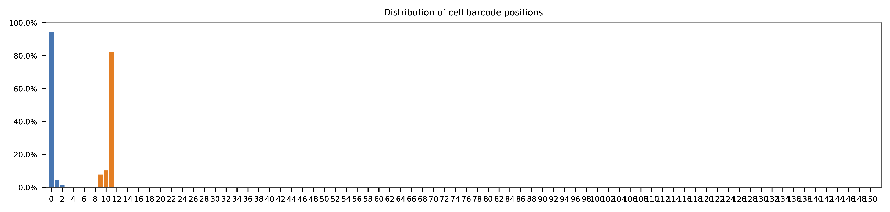
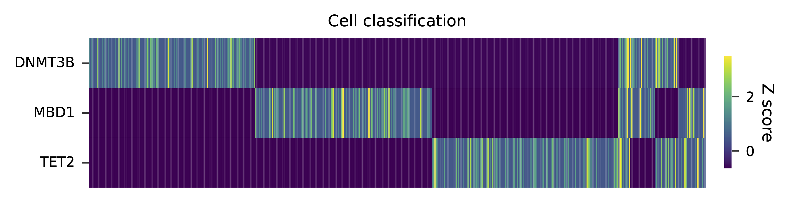

.. _tutorial_crispr_screening_PRJNA358686:

===============================================================================
CROP-Seq; 1:1:1 Mixture of DNMT3B, MBD1, and TET2 Knockout Cell Lines (HEK293T)
===============================================================================

Dataset: CROP-Seq; 1:1:1 Mixture of DNMT3B, MBD1, and TET2 Knockout Cell Lines (HEK293T)

Datlinger, P., Rendeiro, A.F., Schmidl, C., Krausgruber, T., Traxler, P., Klughammer, J., Schuster, L.C., Kuchler, A., Alpar, D., and Bock, C. (2017). `Pooled CRISPR screening with single-cell transcriptome readout`_. Nat. Methods *14*, 297–301.

.. _`Pooled CRISPR screening with single-cell transcriptome readout`: https://doi.org/10.1038/nmeth.4177

|

Preparation
===========

Download fastq files from `European Nucleotide Archive`_.

.. _`European Nucleotide Archive`: https://www.ebi.ac.uk/ena/browser/view/PRJNA521522?show=reads

.. code-block:: console

    $ curl -O ftp.sra.ebi.ac.uk/vol1/fastq/SRR516/009/SRR5163029/SRR5163029_1.fastq.gz

    $ curl -O ftp.sra.ebi.ac.uk/vol1/fastq/SRR516/009/SRR5163029/SRR5163029_2.fastq.gz

|

Clustering
==========

This dataset is single-cell RNA-seq on HEK293T cell lines mixed in equal proportions knocked out for DNMT3B, MBD1, and TET2. We need to re-process these raw reads to get cell-associated barcodes for downstream analysis. The platform of this dataset is Drop-Seq. The details about the original data processing can be found here_. Briefly, raw data were process with Drop-seq Tools v1.12 software. The first 12 bases on read 1 are cell barcodes, followed by 8 bases UMIs. Captured single cell transcripts are on read 2.

.. _here: https://www.ncbi.nlm.nih.gov/geo/query/acc.cgi?acc=GSM2450588

Inspect cell barcodes.

.. code-block:: console

    $ cat cell_barcodes.txt

    AACGGGCATGGG
    AACTGGGCATGG
    AAGACAGCGTGT
    AAGGGCGTACTC
    AATAAATACAAA
    AATAAATACAAC
    AATAAATACAAG
    AATAAATACAAT
    AATCAATCGCAC
    AATCAATCGCAG

Prepare feature barcodes.

gRNA sequences can be found in Supplementary Table 1.

.. code-block:: console

    $ cat feature_barcodes.tsv

    DNMT3B  CAGGATTGGGGGCGAGTCGG
    MBD1    ATAGGTGTCTGAGCGTCCAC
    TET2    CAGGACTCACACGACTATTC

|

Barcode extraction
==================

The transcripts derived from CROPseq-Guide-Puro and captured by Drop-Seq beads contain sgRNA sequences. There are no secondary libraries built on top of this single-cell RNA-Seq library for gRNA enrichment. The transcripts derived from CROPseq-Guide-Puro are captured by the ployA tails. Therefore, the locations of sgRNA on read 2 vary. We need to extract the sgRNA sequences from read 2.

``qc`` mode is used for gRNA extraction. Use ``-n`` to specify the number of reads to analyze, ``None`` means all the reads. Use ``-t`` to set the number of threads. By default, the diagnostic results and plots are generated in the ``qc`` directory (set by ``--output_directory``), and full length of read 1 and read 2 are searched against reference cell and feature barcodes, respectively. The per base content of both read pairs and the distribution of matched barcode positions are summarized. Use ``-r1_c`` and/or ``-r2_c`` to limit the search range for read 1 and read 2 respectively. Use ``-cb_n`` and/or ``-fb_n`` to set the mismatch tolerance for cell and feature barcode matching (default ``3``).

.. code-block:: console

    $ fba qc \
        -1 SRR5163029_1.fastq.gz \
        -2 SRR5163029_2.fastq.gz \
        -w cell_barcodes.txt \
        -f feature_barcodes.tsv \
        -cb_m 2 \
        -fb_m 2 \
        -cb_n 15 \
        -fb_n 15 \
        -r1_c 0,12 \
        -t $SLURM_CPUS_ON_NODE \
        --num_reads None

The first 12 bases are cell barcodes and the following 8 bases are UMIs. Based on the base content plot, the GC content of cell barcodes and UMIs are quite even.

.. image:: Pyplot_read1_per_base_seq_content.png
   :width: 1200px
   :align: center

|

As for read 2, based on the per base content, after the first 12 bases, the reads are A enriched.

.. image:: Pyplot_read2_per_base_seq_content.png
   :width: 1200px
   :align: center

|

.. image:: Pyplot_read2_barcodes_starting_ending.png
   :width: 1200px
   :align: center

The detailed ``qc`` results are stored in ``feature_barcoding_output.tsv.gz`` file. ``matching_pos`` columns indicate the matched positions on reads. ``matching_description`` columns indicate mismatches in substitutions:insertions:deletions format.

.. code-block:: console

    $ gzip -dc qc/feature_barcoding_output.tsv.gz | head

    read1_seq       cell_barcode    cb_matching_pos cb_matching_description read2_seq       feature_barcode fb_matching_pos fb_matching_description
    GATATCGCACCGgggagggtttttttttttttttttttttttttttttttttttttttttttttttttttttttttttttttttttttttttttttttttttttttttttttttttctttctctattcataccttttctctccatacccaa no_match        NA      NA      AATTTGATGTACACAACATTAAAAGTACTGACACCTGAAAAAAAAAAAAAAAAAAAAAAAAAAAAAAAAAAAAAAAAAAAAAAAAAAAAAAAAAAAAAAAAAAAAAAAAAAAAACACAAAAAAAAAATCACATTATAACACAACAAAAAAA NA      NA      NA
    TTTAGGATCGTTtgatgtattttttttttttttttttttttttttttttttttttttttttttttttttttttttttttttttttttttttttttttttttttttttttcttctttcttttttattctttacaacatcctaccataacata no_match        NA      NA      ATTAAAAATATTGTGGCAGGAAAAAAAAAAAAAAAAAAAAAAAAAAAAAAAAAAAAAAAAAAAAAAAAAAAAAAAAAAAAAAAAAAAAAAAAAAAAAAAAAAAACAAAAAAAAACAAAAAAAAATCAGCTATATAACCACTAATACTTCTA NA      NA      NA
    GTCGAAACTCTTaacgggatttttttttttttttttttttttttttttttttttttttttttttttttttttttttttttttttttttttttttttttttttttttttttttttttttttttttttttttttttttttttttttttttttt no_match        NA      NA      TTATAATGGTTACAAATAAAGCAATAGCATCACAAAAAAAAAAAAAAAAAAAAAAAAAAAAAAAAAAAAAAAAAAAAAAAAAAAAAAAAAAAAAAAAAAAAAAAAAAAAAAAAAAAAAAAAAAAAAAAAAAAAAAAAAAAAAAAAAAAAAA NA      NA      NA
    GTTTACGTGTTCatgggcgattttttttttttttttttttttttttttttaaaaaagttaaaagggggcccgtggggggacaaatagaggggcctagagttccaccccccatcccacaaaaaaaaccctcaccgcacagggcctcgcccct GTTTACGTGTTC    0:12    0:0:0   GGAGTACGGAGAATTCTATAAGAGCTTGACCAATGACTGGGAAGATCACTTGGCAGTGAAGCATTTTTCAGTTGAAGGACAGTTGGAATTCAGAGCCCTTCTATTTGTCCCACGACGTGCTCCTTTTGATCTGTTTGAAAAAAAAAAAAAA no_match        NA      NA
    CCGTCCTAGTTGgtgtatattttttttgtttttttttttttttcaccgggtcagagctgcccctaagtaccacgtcccgtcccacctttatcggacctcggccaccacaaattgcttatccagagtgcccccctccgcccatcccagactc CCGTCCTAGTTG    0:12    0:0:0   AATTAAGTCTCGTAAAGAACGAGAAGCTGAACTTGGACCTAGGGCAACCGACTTCACCAATGTTTACAGCGAGAATCTTGGTGACGACGTGGATGATGAGCGCCTTAAGGTTCTCTTTGGCAAGTTTGGGCCTGCCTTGAGTGTGCGACTT no_match        NA      NA
    TAGCAAGCCCTTttgagcacttttttttttttttttttttttttttttttttttttttttttttttttttttttttttttttttttttttttttttttttttttttttttttttttttttttttattttttcttttttttatcataaatat TAGCAAGCCCTT    0:12    0:0:0   CAAACGTTTTATACTAAATAAATATCAAACTACATTCTTCTGAAAAAAAAAAAAAAAAAAAAAAAAAAAAAAAAAAAAAAAAAAAAAAAAAAAAAAAAAAAAAAAAAAAAAAAAAAAAAAAAAAAAAAAGACAAAAAAAAACAAAAAAAAA no_match        NA      NA
    ATCCAAATCTAGgtatagggtttttttttttttttttttttttttttttttaattttttttttttttttttattttttctttttattgggtgtaactcctgcgtacaaaaacctaccctgggggggaaggggattttctcattatagctgg ATCCAAATCTAG    0:12    0:0:0   AAATCGACGGGGACAGGCTCGCCGACTTGCCCCTACTTTTCGATGGGCCATACCCAATAGGCAGATCAATGTTGGGGTGGGTGGTGATGGAGATGATATGGACATATTCATGGAGGAGATGAGAGAAATCAGAAGAAAACTTAGGGAGCTG no_match        NA      NA
    TTAACCTTAGCGgactctttttttttttttttttttttttggaaacttaaaatccccaaaaaactgtttattatacaagggagttttgagtcacggagggcttaccggtaggagttctggttgggggcgcgggcaccagggcctccaaact TTACACCATTAG    0:10    0:0:2   TCCGTGTCCGTGTAAAGGGTGGTGGTCACGTGGCCCAGATTTATGCTATCCGTCAGTCCATCTCCAAAGCCCTGGTGGCCTATTACCAGAACTATGTGGCTGAGGCTTCCAAGAAGGAGATCAAAGACATCCTCATCCAGTATGACCGGAC no_match        NA      NA
    ACGTGTCGTCCGgtgctattttttttttttttttttttttttttttttttttttttttttttattttttttttttttttctagttaacagtttgttacttcacaaaatgaaacagtaagagggtaaaaaaaaaatatttagaaaagaaaaa ACGTGATCGTCG    0:11    1:0:1   TTATCACATAGTGTTGTATTTGAAACATAGTTCATGGTTTTATCAAAGAACTGAAGATGAGAATACTGGTCATCTAACTTTGTAATTTGATTTGATTATACTGTAAAGTTTGACAGTCTCATTTTATCACTGCGTTTGTATCTATTACTAA no_match        NA      NA
    TTTCAGTATTGGggcgaattttttttttttttttttttttttttttttttttttttttttttttggctagtttttttgtggtttttgcttttggttctctcgtttgccctggagctcccaggtccctttcttgtcctaccataggtaaccc TTTCAGTATTGG    0:12    0:0:0   GGACGAAACACCGATAGGTGTCTGAGCGTCCACGTTTTAGAGCTAGAAATAGCAAGTTAAAATAAGGCTAGTCCGTTATCAACTTGAAAAAGTGGCACCGAGTCGGTGCTTTTTTAAGCTTGGCGTAACTAGATCTTGAGACACTGCTTTT MBD1_ATAGGTGTCTGAGCGTCCAC       13:33 0:0:0
    AATCACCTACCTtccatcagtttttttttttttttttttttttttttattactctatgttatctttttttttgctttttttgttggttctctttttttcccgagagctcccctgctcccatctgggttaaccagagagacccactacaagc AATCACCTACCT    0:12    0:0:0   GGACTCACACGACTATTCGTTTTAGAGCTAGAAATAGCAAGTTAAAATAAGGCTAGTCCGTTATCAACTTGAAAAAGTGGCACCGAGTCGGTGCTTTTTTAAGCTTGGCGTAACTAGATCTTGAGACCCTGCTTTTTGCTTGTACTGGGTC TET2_CAGGACTCACACGACTATTC       0:18  0:0:2
    GCCTGTCTCATCacatccttttttttttttttttttttttttttttttttttttttttttttgttttttttttttgtttttttgtgtgttttctttgtttggccaggagtctccggcccgcatttgtgttttctcgcgaagacccagtcaa CCGTGTCTCCTC    1:12    1:0:1   GACTATCATATGCTTACCGTAACTTGAAAGTATTTCGATTTCTTGGCTTTATATATCTTGTGGAAAGGACGAAACACCGCGGGTCTCACACGACTATTCGTTTTAGAGCTAGTTATCGCATGTTCAAATAAGGCTAGTCCGTTATCAACTT TET2_CAGGACTCACACGACTATTC       79:99 2:0:0
    CTAGGTACCACTagacagtttttttttttttttttttttttttttttttttttttttttttctctatgtgtgcttttttttggctttagtctgtgggtccctagttagccccggcgcccccacgcgcagaacgtgtcttaccacaagaacc CTAGGTACCACT    0:12    0:0:0   TTCTTGGGTAGTTTGCAGTTTTTAAAATTATGTTTTAAAATGGACTATCATATGCTTACCGTAACTTGAAAGTATTTCGATTTCTTGGCTTTATATATCTTGTGGAACGGACGAAACACCGATAGGTGTCTGAGCGTCCACGTTTTAGAGC MBD1_ATAGGTGTCTGAGCGTCCAC       121:1410:0:0
    TCTTCCACTACCgtcccgtcttttttttttttttttttttttttttttttttttttttctttatgtcagttttttttgtgctttagtattgggttcccttgtttgcccgagggctcccaggcccagatttgggctaaccaaagggaccccg TCTTCCACTACC    0:12    0:0:0   ACCGATAGGTGTCTGAGCGTCCACGTTTTAGAGCTAGAAATAGCAAGTTAAAATAAGGCTAGTCCGTTATCAACTTGAAAAAGTGGCACCGAGTCGGTGCTTTTTTAAGCTTGGCGTAACTAGATCTTGAGACACTGCTTTTTGCTTGTAC MBD1_ATAGGTGTCTGAGCGTCCAC       4:24  0:0:0
    GTGTCGCTCTGAcctatttttttttttttttttttttctttttacctttaacaatactgttctcatgttatatgctgttattaaatgtgccccccatgtctctagagatcctacccctgctgatcccgtcccaacaaaaaatactagtaca GTGTACCGCTCT    0:10    0:0:2   AAGGAAAAGACGAAACACCGATAGGAGTCTGAGCGTCCACAAATTAGAGCTAGAAATAGCAAGTTAAAATAAGGCTTGTCCGTTAGCAACTTGAAACACTGGCACCGAGTCGGTCCTTTTTTAAGCTTGGCGTAACTGGATCTTGAGCCTC MBD1_ATAGGTGTCTGAGCGTCCAC       20:40 1:0:0
    CTTAATTTGGTGggaagattttttttttttttttttttttttttttttaagtactttaagtaagctttttttaggctttagccgtgggttcccctgttagcccgggaggtccccgggcccaatctgggcctaacagagaggccccgtacaa CTTAATTTGGTG    0:12    0:0:0   CCGTAACTTGAAAGTATTTCGATTTCTTGGCTTTATATATCTTGTGGAAAGGACGAAACACCGCAGGACTCACACGACTCTTCGTTTTAGAGCTAGCAATAGCAAGTTAAAATAAGGCTAGTCCGTTATCAACTTGAAAAAGTGGCACCGT TET2_CAGGACTCACACGACTATTC       63:83 1:0:0
    GGCGGACAATACccctacgattttttttttttttttttttttttttttttttttttttttttttttttttttttttttttttttttttttttttttttttttttttttttttttttttttttttttttttttttttttttttttttttttt GGCGGACAATAC    0:12    0:0:0   CCGCAGGACTCACACGACTATTCGTTTTAGAGCTAGAAATAGCAAGTTAAAATAAGGCTAGTCCGTTATCAACTTGAAAAAGTGGCACCGAGTCGGTGCTTTTTTAAGCTTGGCGTAACTAGATCTTGAGACACTGCTTTTTGCTTGTTCT TET2_CAGGACTCACACGACTATTC       3:23  0:0:0
    TAAATGTTTAGGtgtccggattttttttttttttttttttttttttttttttttttttttttttttttttttttttctttttcttttttttttctgtttatcatgtggggttttgttttttccttagatttctcccactgtcgtcttgttt TAAATGTTTAGG    0:12    0:0:0   ATCATATGCTTACCGTAACTTGAAAGTATTTCGATTTCTTTGCTTTATATATCTTGTGGAAAGGACGAAACTCCGGTAGGTGTCTGAGCGTCCTCGTTTTTGAGCTTGAAATAGCCAGTTAAAATAAGGCTAGTCCGTTATCAACTTGACA MBD1_ATAGGTGTCTGAGCGTCCAC       75:95 2:0:0

15,363 of 227,621,653 read pairs have valid cell and feature barcodes. Note: This is not a gRNA enrichment library.

|

Matrix generation
=================

Only fragments with correct (passed the criteria) cell and feature barcodes are included. UMI removal is powered by UMI-tools (`Smith, T., et al. 2017. Genome Res. 27, 491–499.`_). Use ``-us`` to set the UMI starting position on read 1 (default ``16``). Use ``-ul`` to set the UMI length (default ``12``). Fragments with UMI length less than this value are discarded. UMI deduplication method is set by ``-ud`` (default ``directional``). Use ``-um`` to set UMI deduplication mismatch threshold (default ``1``).

.. _`Smith, T., et al. 2017. Genome Res. 27, 491–499.`: http://www.genome.org/cgi/doi/10.1101/gr.209601.116

The generated feature count matrix can be easily imported into well-established single cell analysis packages: Seruat_ and Scanpy_.

.. _Seruat: https://satijalab.org/seurat/

.. _Scanpy: https://scanpy.readthedocs.io/en/stable/

.. code-block:: console

    $ fba count \
        -i feature_barcoding_output.tsv.gz \
        -o matrix_featurecount.csv.gz \
        -us 12 \
        -ul 8 \
        -um 1 \
        -ud directional

Result summary.

7.6% (7,145,799 out of 93,795,979) of read pairs with valid cell and feature barcodes are unique fragments. 4.9% (7,143,943 out of 145,032,428) of total sequenced read pairs contribute to the final matrix.

Demultiplexing
==============

Gaussian mixture model
----------------------

The implementation of demultiplexing method ``2`` (set by ``-dm``) is inspired by the method described on `10x Genomics’ website`_. Use ``-p`` to set the probability threshold for demulitplexing (default ``0.9``).

.. _`10x Genomics’ website`: https://support.10xgenomics.com/single-cell-gene-expression/software/pipelines/latest/algorithms/crispr

.. code-block:: console

    $ fba demultiplex \
        -i matrix_featurecount.csv.gz \
        -dm 2 \
        -v

.. code-block:: console

    2021-10-04 14:14:15,659 - fba.__main__ - INFO - fba version: 0.0.x
    2021-10-04 14:14:15,659 - fba.__main__ - INFO - Initiating logging ...
    2021-10-04 14:14:15,659 - fba.__main__ - INFO - Python version: 3.8
    2021-10-04 14:14:15,659 - fba.__main__ - INFO - Using demultiplex subcommand ...
    2021-10-04 14:14:36,166 - fba.__main__ - INFO - Skipping arguments: "-q/--quantile", "-cm/--clustering_method"
    2021-10-04 14:14:36,166 - fba.demultiplex - INFO - Output directory: demultiplexed
    2021-10-04 14:14:36,166 - fba.demultiplex - INFO - Demultiplexing method: 2
    2021-10-04 14:14:36,166 - fba.demultiplex - INFO - UMI normalization method: clr
    2021-10-04 14:14:36,167 - fba.demultiplex - INFO - Visualization: On
    2021-10-04 14:14:36,167 - fba.demultiplex - INFO - Visualization method: tsne
    2021-10-04 14:14:36,167 - fba.demultiplex - INFO - Loading feature count matrix: matrix_featurecount.csv.gz ...
    2021-10-04 14:14:37,875 - fba.demultiplex - INFO - Number of cells: 11,758
    2021-10-04 14:14:37,875 - fba.demultiplex - INFO - Number of positive cells for a feature to be included: 200
    2021-10-04 14:14:37,920 - fba.demultiplex - INFO - Number of features: 2 / 2 (after filtering / original in the matrix)
    2021-10-04 14:14:37,920 - fba.demultiplex - INFO - Features: NON_TARGET-1 RAB1A-2
    2021-10-04 14:14:37,920 - fba.demultiplex - INFO - Total UMIs: 7,145,799 / 7,145,799
    2021-10-04 14:14:37,942 - fba.demultiplex - INFO - Median number of UMIs per cell: 477.0 / 477.0
    2021-10-04 14:14:37,942 - fba.demultiplex - INFO - Demultiplexing ...
    2021-10-04 14:14:38,418 - fba.demultiplex - INFO - Generating heatmap ...
    2021-10-04 14:14:42,078 - fba.demultiplex - INFO - Embedding ...
    2021-10-04 14:15:24,288 - fba.__main__ - INFO - Done.

Heatmap of the relative abundance of features (sgRNAs) across all cells. Each column represents a single cell.

t-SNE embedding of cells based on the abundance of features (sgRNAs, no transcriptome information used). Colors indicate the sgRNA status for each cell, as called by FBA.

.. image:: Pyplot_embedding_cells_demultiplexed_gm.png
   :alt: t-SNE embedding
   :width: 500px
   :align: center

UMI distribution and model fitting threshold:

.. image:: Pyplot_feature_umi_distribution_gm.png
   :alt: UMI distribution
   :width: 800px
   :align: center
