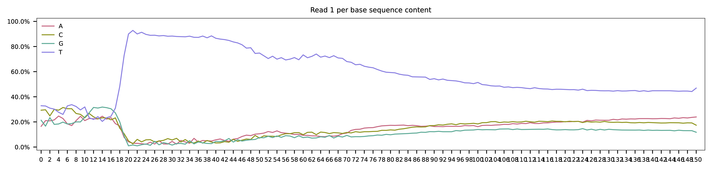
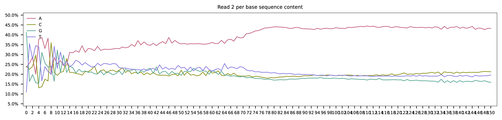
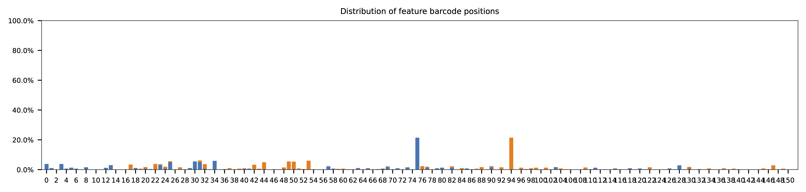
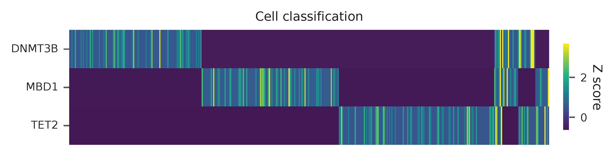
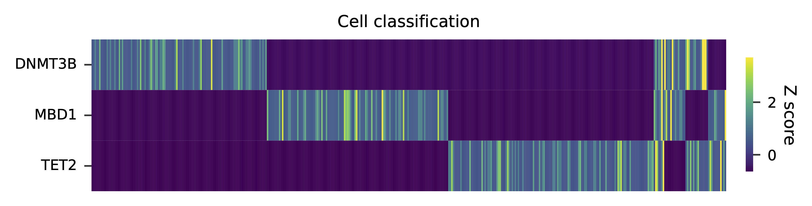
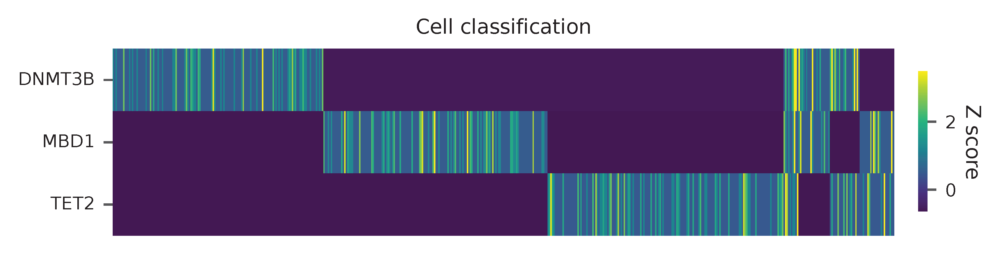
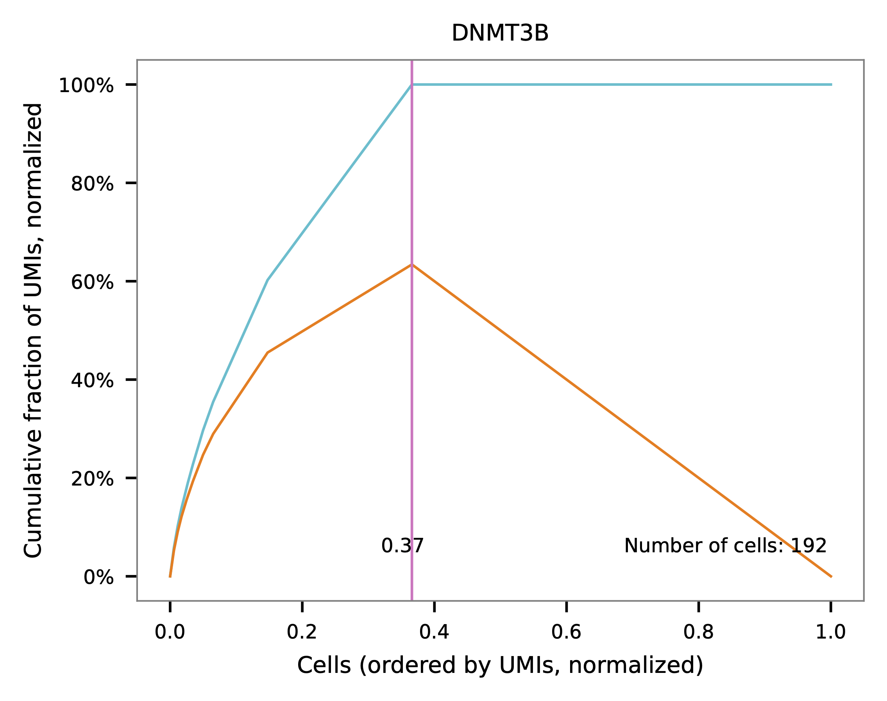
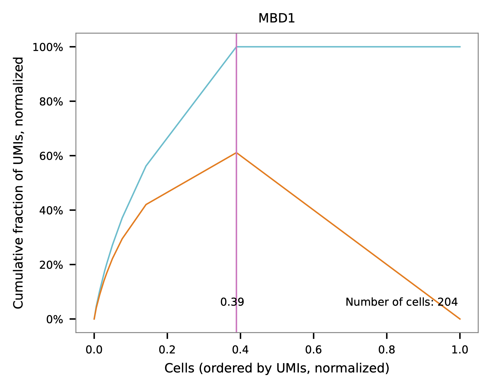
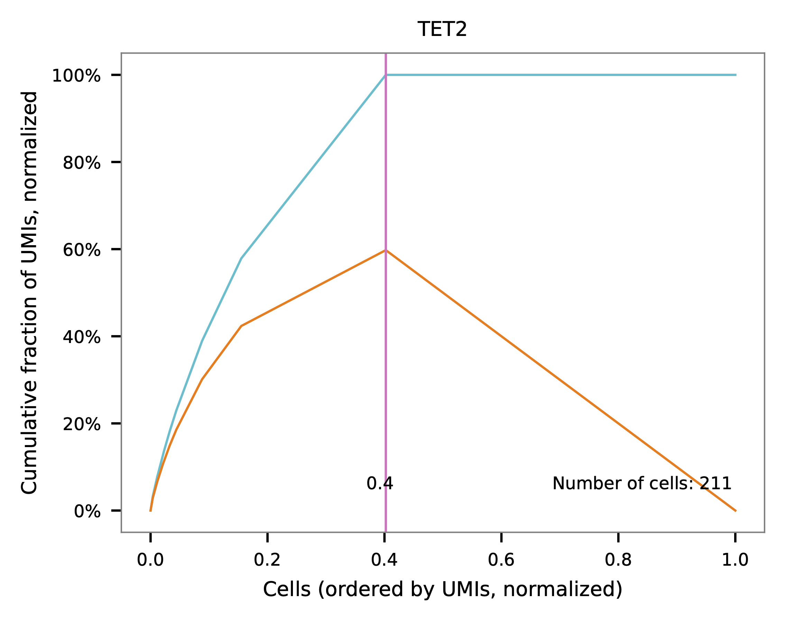

.. _tutorial_crispr_screening_prjna358686:

#################################################################################
 CROP-seq; 1:1:1 Mixture of DNMT3B, MBD1, and TET2 Knockout Cell Lines (HEK293T)
#################################################################################

**Dataset**: CROP-seq; 1:1:1 Mixture of DNMT3B, MBD1, and TET2 Knockout
Cell Lines (HEK293T)

Datlinger, P., Rendeiro, A.F., Schmidl, C., Krausgruber, T., Traxler,
P., Klughammer, J., Schuster, L.C., Kuchler, A., Alpar, D., and Bock, C.
(2017). `Pooled CRISPR screening with single-cell transcriptome
readout`_. *Nat. Methods* **14**, 297–301.

.. _pooled crispr screening with single-cell transcriptome readout: https://doi.org/10.1038/nmeth.4177

|

*************
 Preparation
*************

Download fastq files from `European Nucleotide Archive`_.

.. _european nucleotide archive: https://www.ebi.ac.uk/ena/browser/view/PRJNA521522?show=reads

.. code:: console

   $ curl -O ftp.sra.ebi.ac.uk/vol1/fastq/SRR516/009/SRR5163029/SRR5163029_1.fastq.gz

   $ curl -O ftp.sra.ebi.ac.uk/vol1/fastq/SRR516/009/SRR5163029/SRR5163029_2.fastq.gz

|

*********
 Mapping
*********

This dataset is single-cell RNA-seq on HEK293T cell lines mixed in equal
proportions knocked out for DNMT3B, MBD1, and TET2 (`Fig. 1h`_). The
platform of this dataset is Drop-seq. The details about the original
data processing can be found here_. Briefly, raw data were process with
Drop-seq Tools v1.12 software. The first 12 bases on read 1 are cell
barcodes, followed by 8 bases UMIs. Captured single cell transcripts are
on read 2.

.. _fig. 1h: https://www.nature.com/articles/nmeth.4177/figures/1

.. _here: https://www.ncbi.nlm.nih.gov/geo/query/acc.cgi?acc=GSM2450588

I re-processed these raw reads to get cell-associated barcodes for
downstream analysis. Briefly, raw reads were trimmed using `Trim
Galore!`_ and mapped to the human reference genome
refdata-gex-GRCh38-2020-A_ using STAR v2.7.8a. Plasmid
CROPseq-Guide-Puro_ sequence was not included in the reference.

.. _cropseq-guide-puro: https://www.addgene.org/86708/

.. _refdata-gex-grch38-2020-a: https://support.10xgenomics.com/single-cell-gene-expression/software/release-notes/build#GRCh38_2020A

.. _trim galore!: https://www.bioinformatics.babraham.ac.uk/projects/trim_galore

.. csv-table:: Mapping statistics
   :widths: 70, 20
   :header-rows: 0

    "Number of Read Pairs","227,621,653"
    "Number of Read Pairs, After Trimming","201,527,916"
    "Reads Mapped to Genome: Unique+Multiple","0.7654"
    "Reads Mapped to Genome: Unique","0.696169"
    "Estimated Number of Cells","1,199"
    "Fraction of Reads in Cells","0.479281"
    "Mean Reads per Cell","45,290"
    "Median Reads per Cell","16,329"
    "Mean UMI per Cell","2,391"
    "Median UMI per Cell","1,118"
    "Mean Genes per Cell","1,042"
    "Median Genes per Cell","716"
    "Total Genes Detected","16,068"

Inspect cell barcodes.

.. code:: console

   $ cat cell_barcodes.txt

   AACGGGCATGGG
   AACTGGGCATGG
   AAGACAGCGTGT
   AAGGGCGTACTC
   AATAAATACAAA
   AATAAATACAAC
   AATAAATACAAG
   AATAAATACAAT
   AATCAATCGCAA
   AATCAATCGCAC

Prepare feature barcodes. sgRNA sequences can be found in Supplementary
Table 1.

.. code:: console

   $ cat feature_barcodes.tsv

   DNMT3B  CAGGATTGGGGGCGAGTCGG
   MBD1    ATAGGTGTCTGAGCGTCCAC
   TET2    CAGGACTCACACGACTATTC

|

************
 Approach A
************

Since sgRNAs are captured through polyA tails together with other
transcripts, the locations of sgRNA on read 2 vary (This is not a sgRNA
enrichment library). To speed up processing, first we screen reads that
have the constant sequence (``GACGAAACACCG``) upstream of sgRNAs
(cutadapt_\, version 3.7).

.. _cutadapt: https://github.com/marcelm/cutadapt

.. code:: console

   $ cutadapt \
       --cores 0 \
       --front GACGAAACACCG \
       --length 25 \
       --minimum-length 25:25 \
       --trimmed-only \
       --output read_2_trimmed.fq.gz --paired-output read_1_trimmed.fq.gz \
       ../SRR5163029_2.fastq.gz ../SRR5163029_1.fastq.gz

Preview the filtering result: 1,429,437 out of 227,621,653 (0.6%) read
pairs are kept for sgRNA identification.

.. code:: console

   == Read fate breakdown ==
   Pairs that were too short:              25,972 (0.0%)
   Pairs discarded as untrimmed:      226,166,244 (99.4%)
   Pairs written (passing filters):     1,429,437 (0.6%)

|

QC
==

Sample the first 20,000 (set by ``-n``, default ``100,000``) read pairs
for quality control. Use ``-t`` to set the number of threads. By
default, the diagnostic results and plots are generated in the ``qc``
directory (set by ``--output_directory``), and full length of read 1 and
read 2 are searched against reference cell and feature barcodes,
respectively. The per base content of both read pairs and the
distribution of matched barcode positions are summarized. Use ``-r1_c``
and/or ``-r2_c`` to limit the search range. Use ``-cb_n`` and/or
``-fb_n`` to set the mismatch tolerance for cell and feature barcode
matching (default ``3``).

.. code:: console

   $ fba qc \
       -1 read_1_trimmed.fq.gz \
       -2 read_2_trimmed.fq.gz \
       -w cell_barcodes.txt \
       -f feature_barcodes.tsv \
       -r1_c 0,12

This library is built using Drop-seq platform. The first 12 bases are
cell barcodes and the following 8 bases are UMIs. Based on the base
content plot, the GC content of cell barcodes are quite even. The UMIs
are slightly T enriched.

As for read 2, the GC content of sgRNAs is quite even. The first 20
bases are sgRNA sequences.

|

The detailed ``qc`` results are stored in
``feature_barcoding_output.tsv.gz`` file. ``matching_pos`` columns
indicate the matched positions on reads. ``matching_description``
columns indicate mismatches in substitutions:insertions:deletions
format.

.. code:: console

   $ zcat feature_barcoding_output.tsv.gz | grep -v no_match | head

   read1_seq       cell_barcode    cb_matching_pos cb_matching_description read2_seq       feature_barcode fb_matching_pos fb_matching_description
   GCTGCATAGTCGggggggatttttt       TTCATAGCTCCG    2:12    1:0:2   CAGGACTCACACGACTATTCGTTTT       TET2_CAGGACTCACACGACTATTC       0:20    0:0:0
   GTTGCTCCTCACggtgatttttttt       GTTCCCTCCCAC    0:12    1:1:1   CAGGACTCACACGACTATTCGTTTT       TET2_CAGGACTCACACGACTATTC       0:20    0:0:0
   TAATGTTTAGGGagggcgctttttt       TAATGTTTAGGG    0:12    0:0:0   ATAGGTGTCTGAGCGTCCACGTTTT       MBD1_ATAGGTGTCTGAGCGTCCAC       0:20    0:0:0
   TCTTCCACTACCggtatgacttttt       TCTTCCACTACC    0:12    0:0:0   CAGGATTGGGGGCGAGTCGGGTTTT       DNMT3B_CAGGATTGGGGGCGAGTCGG     0:20    0:0:0
   GGAATGCCTTGAgtatacttttttt       GGAATGCCTTGA    0:12    0:0:0   CAGGACTCACACGACTATTCGTTTT       TET2_CAGGACTCACACGACTATTC       0:20    0:0:0
   GCGATCACAATGtaatagatttttt       GCGATCACAATG    0:12    0:0:0   CAGGATTGGGGGCGAGTCGGGTTTT       DNMT3B_CAGGATTGGGGGCGAGTCGG     0:20    0:0:0
   CGCCGTCGGACAcgaatcctttttt       CCGTAGCGGGCA    2:12    1:0:2   ATAGGTGTCTGAGCGTCCACGTTTT       MBD1_ATAGGTGTCTGAGCGTCCAC       0:20    0:0:0
   CCGTCCTAGTTGatcccagtttttt       CCGTCCTAGTTG    0:12    0:0:0   CAGGACTCACACGACTATTCGTTTT       TET2_CAGGACTCACACGACTATTC       0:20    0:0:0
   ATTGTTCCATCTgtcggcttttttt       ACTGTTTGATCT    0:12    3:0:0   ATAGGTGTCTGAGCGTCCACGTTTT       MBD1_ATAGGTGTCTGAGCGTCCAC       0:20    0:0:0

|

Barcode extraction
==================

Search ranges are set to ``0,12`` on read 1 and ``0,20`` on read 2. One
mismatch for cell and feature barcodes (``-cb_m``, ``-cf_m``) are
allowed.

.. code:: console

   $ fba extract \
       -1 read_1_trimmed.fq.gz \
       -2 read_2_trimmed.fq.gz \
       -w cell_barcodes.txt \
       -f feature_barcodes.tsv \
       -o feature_barcoding_output.tsv.gz \
       -r1_c 0,12 \
       -r2_c 0,20 \
       -cb_m 1 \
       -fb_m 1

Preview of result.

.. code:: console

   $ gzip -dc feature_barcoding_output.tsv.gz | head

   read1_seq       cell_barcode    cb_num_mismatches       read2_seq       feature_barcode fb_num_mismatches
   TAATGTTTAGGGagggcgctttttt       TAATGTTTAGGG    0       ATAGGTGTCTGAGCGTCCACgtttt       MBD1_ATAGGTGTCTGAGCGTCCAC       0
   TCTTCCACTACCggtatgacttttt       TCTTCCACTACC    0       CAGGATTGGGGGCGAGTCGGgtttt       DNMT3B_CAGGATTGGGGGCGAGTCGG     0
   GGAATGCCTTGAgtatacttttttt       GGAATGCCTTGA    0       CAGGACTCACACGACTATTCgtttt       TET2_CAGGACTCACACGACTATTC       0
   GCGATCACAATGtaatagatttttt       GCGATCACAATG    0       CAGGATTGGGGGCGAGTCGGgtttt       DNMT3B_CAGGATTGGGGGCGAGTCGG     0
   CCGTCCTAGTTGatcccagtttttt       CCGTCCTAGTTG    0       CAGGACTCACACGACTATTCgtttt       TET2_CAGGACTCACACGACTATTC       0
   ATTATATGTGAGcagactttttttt       ATTATATGTGAG    0       ATAGGTGTCTGAGCGTCCACgtttt       MBD1_ATAGGTGTCTGAGCGTCCAC       0
   TTTCAGTATTGGggcgaattttttt       TTTCAGTATTGG    0       ATAGGTGTCTGAGCGTCCACgtttt       MBD1_ATAGGTGTCTGAGCGTCCAC       0
   GTTCCCTCCCAAacatgagtttttt       GTTCCCTCCCAA    0       CAGGATTGGGGGCGAGTCGGgtttt       DNMT3B_CAGGATTGGGGGCGAGTCGG     0
   GCTCCGCTTTTAactcaagtttttt       GCTCCGCTTTTA    0       CAGGATTGGGGCCGAGTCGGgactt       DNMT3B_CAGGATTGGGGGCGAGTCGG     1

Result summary.

9,213 out of 1,429,437 read pairs have valid cell and feature barcodes.

.. code:: console

   2022-03-07 16:11:53,295 - fba.__main__ - INFO - fba version: 0.0.x
   2022-03-07 16:11:53,295 - fba.__main__ - INFO - Initiating logging ...
   2022-03-07 16:11:53,295 - fba.__main__ - INFO - Python version: 3.10
   2022-03-07 16:11:53,295 - fba.__main__ - INFO - Using extract subcommand ...
   2022-03-07 16:11:53,310 - fba.levenshtein - INFO - Number of reference cell barcodes: 1,199
   2022-03-07 16:11:53,310 - fba.levenshtein - INFO - Number of reference feature barcodes: 3
   2022-03-07 16:11:53,310 - fba.levenshtein - INFO - Read 1 coordinates to search: [0, 12)
   2022-03-07 16:11:53,310 - fba.levenshtein - INFO - Read 2 coordinates to search: [0, 20)
   2022-03-07 16:11:53,310 - fba.levenshtein - INFO - Cell barcode maximum number of mismatches: 1
   2022-03-07 16:11:53,310 - fba.levenshtein - INFO - Feature barcode maximum number of mismatches: 1
   2022-03-07 16:11:53,312 - fba.levenshtein - INFO - Read 1 maximum number of N allowed: 3
   2022-03-07 16:11:53,312 - fba.levenshtein - INFO - Read 2 maximum number of N allowed: 3
   2022-03-07 16:11:53,337 - fba.levenshtein - INFO - Matching ...
   2022-03-07 16:12:13,951 - fba.levenshtein - INFO - Number of read pairs processed: 1,429,437
   2022-03-07 16:12:13,952 - fba.levenshtein - INFO - Number of read pairs w/ valid barcodes: 9,213
   2022-03-07 16:12:13,954 - fba.__main__ - INFO - Done.

|

Matrix generation
=================

Only fragments with correct (passed the criteria) cell and feature
barcodes are included. UMI removal is powered by UMI-tools (`Smith, T.,
et al. 2017. Genome Res. 27, 491–499.`_). Use ``-us`` to set the UMI
starting position on read 1 (default ``16``). Use ``-ul`` to set the UMI
length (default ``12``). Fragments with UMI length less than this value
are discarded. UMI deduplication method is set by ``-ud`` (default
``directional``). Use ``-um`` to set UMI deduplication mismatch
threshold (default ``1``).

.. _smith, t., et al. 2017. genome res. 27, 491–499.: http://www.genome.org/cgi/doi/10.1101/gr.209601.116

The generated feature count matrix can be easily imported into
well-established single cell analysis packages: Seruat_ and Scanpy_.

.. _scanpy: https://scanpy.readthedocs.io/en/stable/

.. _seruat: https://satijalab.org/seurat/

.. code:: console

   $ fba count \
       -i feature_barcoding_output.tsv.gz \
       -o matrix_featurecount.csv.gz \
       -us 12 \
       -ul 8

Result summary.

.. code:: console

   2022-03-08 13:43:27,499 - fba.__main__ - INFO - fba version: 0.0.x
   2022-03-08 13:43:27,499 - fba.__main__ - INFO - Initiating logging ...
   2022-03-08 13:43:27,499 - fba.__main__ - INFO - Python version: 3.9
   2022-03-08 13:43:27,499 - fba.__main__ - INFO - Using count subcommand ...
   2022-03-08 13:43:28,183 - fba.count - INFO - UMI-tools version: 1.1.1
   2022-03-08 13:43:28,184 - fba.count - INFO - UMI starting position on read 1: 12
   2022-03-08 13:43:28,184 - fba.count - INFO - UMI length: 8
   2022-03-08 13:43:28,184 - fba.count - INFO - UMI-tools deduplication threshold: 1
   2022-03-08 13:43:28,184 - fba.count - INFO - UMI-tools deduplication method: directional
   2022-03-08 13:43:28,184 - fba.count - INFO - Header line: read1_seq cell_barcode cb_num_mismatches read2_seq feature_barcode fb_num_mismatches
   2022-03-08 13:43:28,194 - fba.count - INFO - Number of lines processed: 9,213
   2022-03-08 13:43:28,194 - fba.count - INFO - Number of cell barcodes detected: 420
   2022-03-08 13:43:28,194 - fba.count - INFO - Number of features detected: 3
   2022-03-08 13:43:28,194 - fba.count - INFO - UMI deduplicating ...
   2022-03-08 13:43:28,202 - fba.count - INFO - Total UMIs after deduplication: 1,089
   2022-03-08 13:43:28,202 - fba.count - INFO - Median number of UMIs per cell: 1.0
   2022-03-08 13:43:28,204 - fba.__main__ - INFO - Done.

|

Demultiplexing
==============

Gaussian mixture model
----------------------

The implementation of demultiplexing method ``2`` (set by ``-dm``) is
inspired by the method described on `10x Genomics’ website`_. Use ``-p``
to set the probability threshold for demulitplexing (default ``0.9``).
Use ``-nc`` to set the number of positive cells for a feature to be
included for demultiplexing (default ``200``).

.. _10x genomics’ website: https://support.10xgenomics.com/single-cell-gene-expression/software/pipelines/latest/algorithms/crispr

.. code:: console

   $ fba demultiplex \
       -i matrix_featurecount.csv.gz \
       -dm 2 \
       -v \
       -nc 0

.. code:: console

   2022-03-07 19:57:14,925 - fba.__main__ - INFO - fba version: 0.0.x
   2022-03-07 19:57:14,925 - fba.__main__ - INFO - Initiating logging ...
   2022-03-07 19:57:14,925 - fba.__main__ - INFO - Python version: 3.9
   2022-03-07 19:57:14,925 - fba.__main__ - INFO - Using demultiplex subcommand ...
   2022-03-07 19:57:17,564 - fba.__main__ - INFO - Skipping arguments: "-q/--quantile", "-cm/--clustering_method"
   2022-03-07 19:57:17,564 - fba.demultiplex - INFO - Output directory: demultiplexed_gm
   2022-03-07 19:57:17,564 - fba.demultiplex - INFO - Demultiplexing method: 2
   2022-03-07 19:57:17,564 - fba.demultiplex - INFO - UMI normalization method: clr
   2022-03-07 19:57:17,564 - fba.demultiplex - INFO - Visualization: On
   2022-03-07 19:57:17,564 - fba.demultiplex - INFO - Visualization method: tsne
   2022-03-07 19:57:17,564 - fba.demultiplex - INFO - Loading feature count matrix: matrix_featurecount.csv.gz ...
   2022-03-07 19:57:17,571 - fba.demultiplex - INFO - Number of cells: 420
   2022-03-07 19:57:17,571 - fba.demultiplex - INFO - Number of positive cells for a feature to be included: 0
   2022-03-07 19:57:17,572 - fba.demultiplex - INFO - Number of features: 3 / 3 (after filtering / original in the matrix)
   2022-03-07 19:57:17,572 - fba.demultiplex - INFO - Features: DNMT3B MBD1 TET2
   2022-03-07 19:57:17,572 - fba.demultiplex - INFO - Total UMIs: 1,081 / 1,081
   2022-03-07 19:57:17,573 - fba.demultiplex - INFO - Median number of UMIs per cell: 1.0 / 1.0
   2022-03-07 19:57:17,573 - fba.demultiplex - INFO - Demultiplexing ...
   2022-03-07 19:57:18,277 - fba.demultiplex - INFO - Generating heatmap ...
   2022-03-07 19:57:18,423 - fba.demultiplex - INFO - Embedding ...
   2022-03-07 19:57:21,922 - fba.__main__ - INFO - Done.

Heatmap of the relative abundance of features (sgRNAs) across all cells.
Each column represents a single cell.

Preview the demultiplexing result: the numbers of singlets and
multiplets.

.. code:: python

   In [1]: import pandas as pd

   In [2]: m = pd.read_csv("demultiplexed/matrix_cell_identity.csv.gz", index_col=0)

   In [3]: m.loc[:, m.sum(axis=0) == 1].sum(axis=1)
   Out[3]:
   DNMT3B    141
   MBD1      150
   TET2      158
   dtype: int64

   In [4]: sum(m.sum(axis=0) > 1)
   Out[4]: 74

|

Knee point
----------

Cells are demultiplexed based on the abundance of features (sgRNAs).
Demultiplexing method ``5`` is implemented to use the local maxima on
the difference curve to detemine the knee point on the UMI saturation
curve.

.. code:: console

   $ fba demultiplex \
       -i matrix_featurecount.csv.gz \
       -dm 5 \
       -v \
       -nc 0

.. code:: console

   2022-03-05 01:52:38,900 - fba.__main__ - INFO - fba version: 0.0.x
   2022-03-05 01:52:38,900 - fba.__main__ - INFO - Initiating logging ...
   2022-03-05 01:52:38,900 - fba.__main__ - INFO - Python version: 3.9
   2022-03-05 01:52:38,900 - fba.__main__ - INFO - Using demultiplex subcommand ...
   2022-03-05 01:52:41,396 - fba.__main__ - INFO - Skipping arguments: "-q/--quantile", "-cm/--clustering_method", "-p/--prob"
   2022-03-05 01:52:41,396 - fba.demultiplex - INFO - Output directory: demultiplexed
   2022-03-05 01:52:41,396 - fba.demultiplex - INFO - Demultiplexing method: 5
   2022-03-05 01:52:41,396 - fba.demultiplex - INFO - UMI normalization method: clr
   2022-03-05 01:52:41,396 - fba.demultiplex - INFO - Visualization: On
   2022-03-05 01:52:41,396 - fba.demultiplex - INFO - Visualization method: tsne
   2022-03-05 01:52:41,396 - fba.demultiplex - INFO - Loading feature count matrix: matrix_featurecount.csv.gz ...
   2022-03-05 01:52:41,403 - fba.demultiplex - INFO - Number of cells: 523
   2022-03-05 01:52:41,403 - fba.demultiplex - INFO - Number of positive cells for a feature to be included: 0
   2022-03-05 01:52:41,404 - fba.demultiplex - INFO - Number of features: 3 / 3 (after filtering / original in the matrix)
   2022-03-05 01:52:41,404 - fba.demultiplex - INFO - Features: DNMT3B MBD1 TET2
   2022-03-05 01:52:41,404 - fba.demultiplex - INFO - Total UMIs: 1,364 / 1,364
   2022-03-05 01:52:41,405 - fba.demultiplex - INFO - Median number of UMIs per cell: 1.0 / 1.0
   2022-03-05 01:52:41,405 - fba.demultiplex - INFO - Demultiplexing ...
   2022-03-05 01:52:41,810 - fba.demultiplex - INFO - Generating heatmap ...
   2022-03-05 01:52:41,979 - fba.demultiplex - INFO - Embedding ...
   2022-03-05 01:52:44,840 - fba.__main__ - INFO - Done.

Heatmap of the relative abundance of features (sgRNAs) across all cells.
Each column represents a single cell.

Preview the demultiplexing result: the numbers of singlets and
multiplets.

.. code:: python

   In [1]: import pandas as pd

   In [2]: m = pd.read_csv("demultiplexed/matrix_cell_identity.csv.gz", index_col=0)

   In [3]: m.loc[:, m.sum(axis=0) == 1].sum(axis=1)
   Out[3]:
   DNMT3B    141
   MBD1      150
   TET2      158
   dtype: int64

   In [4]: sum(m.sum(axis=0) > 1)
   Out[4]: 74

|

************
 Approach B
************

Instead of pre-filtering read 2 for the constant upstream region of
sgRNA, we search sgRNAs across the whole read 2. This mode is relatively
slow, it is recommended to split fastq files and run on different nodes
simultaneously to speed up.

Barcode extraction
==================

The transcripts derived from CROPseq-Guide-Puro_ and captured by
Drop-seq beads contain sgRNA sequences. There are no secondary libraries
built on top of this single-cell RNA-seq library for sgRNA enrichment.
The transcripts derived from CROPseq-Guide-Puro_ are captured by the
ployA tails. Therefore, the locations of sgRNA on read 2 vary. We need
to extract the sgRNA sequences from read 2.

``qc`` mode is used for sgRNA extraction. Use ``-n`` to specify the
number of reads to analyze, ``None`` means all the reads. Use ``-t`` to
set the number of threads. By default, the diagnostic results and plots
are generated in the ``qc`` directory (set by ``--output_directory``),
and full length of read 1 and read 2 are searched against reference cell
and feature barcodes, respectively. The per base content of both read
pairs and the distribution of matched barcode positions are summarized.
Use ``-r1_c`` and/or ``-r2_c`` to limit the search range for read 1 and
read 2 respectively. Use ``-cb_n`` and/or ``-fb_n`` to set the mismatch
tolerance for cell and feature barcode matching (default ``3``).

.. code:: console

   $ fba qc \
       -1 SRR5163029_1.fastq.gz \
       -2 SRR5163029_2.fastq.gz \
       -w cell_barcodes.txt \
       -f feature_barcodes.tsv \
       -cb_m 1 \
       -fb_m 1 \
       -cb_n 15 \
       -fb_n 15 \
       -r1_c 0,12 \
       -t $SLURM_CPUS_ON_NODE \
       --num_reads None

The detailed ``qc`` results are stored in
``feature_barcoding_output.tsv.gz`` file. ``matching_pos`` columns
indicate the matched positions on reads. ``matching_description``
columns indicate mismatches in substitutions:insertions:deletions
format.

.. code:: console

   $ gzip -dc qc/feature_barcoding_output.tsv.gz | head

   read1_seq       cell_barcode    cb_matching_pos cb_matching_description read2_seq       feature_barcode fb_matching_pos fb_matching_description
   TTTAGGATCGTTtgatgtattttttttttttttttttttttttttttttttttttttttttttttttttttttttttttttttttttttttttttttttttttttttttcttctttcttttttattctttacaacatcctaccataacata no_match        NA      NA      ATTAAAAATATTGTGGCAGGAAAAAAAAAAAAAAAAAAAAAAAAAAAAAAAAAAAAAAAAAAAAAAAAAAAAAAAAAAAAAAAAAAAAAAAAAAAAAAAAAAAACAAAAAAAAACAAAAAAAAATCAGCTATATAACCACTAATACTTCTA    NA      NA      NA
   GTCGAAACTCTTaacgggatttttttttttttttttttttttttttttttttttttttttttttttttttttttttttttttttttttttttttttttttttttttttttttttttttttttttttttttttttttttttttttttttttt no_match        NA      NA      TTATAATGGTTACAAATAAAGCAATAGCATCACAAAAAAAAAAAAAAAAAAAAAAAAAAAAAAAAAAAAAAAAAAAAAAAAAAAAAAAAAAAAAAAAAAAAAAAAAAAAAAAAAAAAAAAAAAAAAAAAAAAAAAAAAAAAAAAAAAAAAA    NA      NA      NA
   GTTTACGTGTTCatgggcgattttttttttttttttttttttttttttttaaaaaagttaaaagggggcccgtggggggacaaatagaggggcctagagttccaccccccatcccacaaaaaaaaccctcaccgcacagggcctcgcccct GTTTACGTGTTC    0:12    0:0:0   GGAGTACGGAGAATTCTATAAGAGCTTGACCAATGACTGGGAAGATCACTTGGCAGTGAAGCATTTTTCAGTTGAAGGACAGTTGGAATTCAGAGCCCTTCTATTTGTCCCACGACGTGCTCCTTTTGATCTGTTTGAAAAAAAAAAAAAA    no_match        NA      NA
   CCGTCCTAGTTGgtgtatattttttttgtttttttttttttttcaccgggtcagagctgcccctaagtaccacgtcccgtcccacctttatcggacctcggccaccacaaattgcttatccagagtgcccccctccgcccatcccagactc CCGTCCTAGTTG    0:12    0:0:0   AATTAAGTCTCGTAAAGAACGAGAAGCTGAACTTGGACCTAGGGCAACCGACTTCACCAATGTTTACAGCGAGAATCTTGGTGACGACGTGGATGATGAGCGCCTTAAGGTTCTCTTTGGCAAGTTTGGGCCTGCCTTGAGTGTGCGACTT    no_match        NA      NA
   TTTCAGTATTGGggcgaattttttttttttttttttttttttttttttttttttttttttttttggctagtttttttgtggtttttgcttttggttctctcgtttgccctggagctcccaggtccctttcttgtcctaccataggtaaccc TTTCAGTATTGG    0:12    0:0:0   GGACGAAACACCGATAGGTGTCTGAGCGTCCACGTTTTAGAGCTAGAAATAGCAAGTTAAAATAAGGCTAGTCCGTTATCAACTTGAAAAAGTGGCACCGAGTCGGTGCTTTTTTAAGCTTGGCGTAACTAGATCTTGAGACACTGCTTTT MBD1_ATAGGTGTCTGAGCGTCCAC       13:33 0:0:0
   CTAGGTACCACTagacagtttttttttttttttttttttttttttttttttttttttttttctctatgtgtgcttttttttggctttagtctgtgggtccctagttagccccggcgcccccacgcgcagaacgtgtcttaccacaagaacc CTAGGTACCACT    0:12    0:0:0   TTCTTGGGTAGTTTGCAGTTTTTAAAATTATGTTTTAAAATGGACTATCATATGCTTACCGTAACTTGAAAGTATTTCGATTTCTTGGCTTTATATATCTTGTGGAACGGACGAAACACCGATAGGTGTCTGAGCGTCCACGTTTTAGAGC MBD1_ATAGGTGTCTGAGCGTCCAC       121:1410:0:0
   TCTTCCACTACCgtcccgtcttttttttttttttttttttttttttttttttttttttctttatgtcagttttttttgtgctttagtattgggttcccttgtttgcccgagggctcccaggcccagatttgggctaaccaaagggaccccg TCTTCCACTACC    0:12    0:0:0   ACCGATAGGTGTCTGAGCGTCCACGTTTTAGAGCTAGAAATAGCAAGTTAAAATAAGGCTAGTCCGTTATCAACTTGAAAAAGTGGCACCGAGTCGGTGCTTTTTTAAGCTTGGCGTAACTAGATCTTGAGACACTGCTTTTTGCTTGTAC MBD1_ATAGGTGTCTGAGCGTCCAC       4:24  0:0:0
   CTTAATTTGGTGggaagattttttttttttttttttttttttttttttaagtactttaagtaagctttttttaggctttagccgtgggttcccctgttagcccgggaggtccccgggcccaatctgggcctaacagagaggccccgtacaa CTTAATTTGGTG    0:12    0:0:0   CCGTAACTTGAAAGTATTTCGATTTCTTGGCTTTATATATCTTGTGGAAAGGACGAAACACCGCAGGACTCACACGACTCTTCGTTTTAGAGCTAGCAATAGCAAGTTAAAATAAGGCTAGTCCGTTATCAACTTGAAAAAGTGGCACCGT TET2_CAGGACTCACACGACTATTC       63:83 1:0:0
   TCGTACATACGGtggtttttttttttttttttttttttttttttttttttttttttttttttttttgtttttttttttttttgtttttttttttgtgtcctttgttttcactggggctcccaggtccatatccggtgttaccagagaaacc TCGTACATACGG    0:12    0:0:0   ATCATATGCTTACCGTAACTTGAAAGTATTTCGATTTCTTGGCTTTATATATCTTGTGGAAAGGACGAAACACCGCAGGATTGGGGGCGAGTCGGGTTTTAGAGCTAGAAATAGCAAGTTAAAATAAGGCTAGTCCGTTATCAACTTGAAA DNMT3B_CAGGATTGGGGGCGAGTCGG     75:95 0:0:0

|

Matrix generation
=================

Only fragments with correct (passed the criteria) cell and feature
barcodes are included. UMI removal is powered by UMI-tools (`Smith, T.,
et al. 2017. Genome Res. 27, 491–499.`_). Use ``-us`` to set the UMI
starting position on read 1 (default ``16``). Use ``-ul`` to set the UMI
length (default ``12``). Fragments with UMI length less than this value
are discarded. UMI deduplication method is set by ``-ud`` (default
``directional``). Use ``-um`` to set UMI deduplication mismatch
threshold (default ``1``).

.. _smith, t., et al. 2017. genome res. 27, 491–499.: http://www.genome.org/cgi/doi/10.1101/gr.209601.116

The generated feature count matrix can be easily imported into
well-established single cell analysis packages: Seruat_ and Scanpy_.

.. _scanpy: https://scanpy.readthedocs.io/en/stable/

.. _seruat: https://satijalab.org/seurat/

.. code:: console

   $ fba count \
       -i feature_barcoding_output.tsv.gz \
       -o matrix_featurecount.csv.gz \
       -us 12 \
       -ul 8

Result summary.

11.76 % (1,364 out of 11,597) of read pairs with valid cell and feature
barcodes are unique fragments.

.. code:: console

   2022-03-04 23:18:27,501 - fba.__main__ - INFO - fba version: 0.0.x
   2022-03-04 23:18:27,501 - fba.__main__ - INFO - Initiating logging ...
   2022-03-04 23:18:27,501 - fba.__main__ - INFO - Python version: 3.10
   2022-03-04 23:18:27,501 - fba.__main__ - INFO - Using count subcommand ...
   2022-03-04 23:18:31,494 - fba.count - INFO - UMI-tools version: 1.1.2
   2022-03-04 23:18:31,495 - fba.count - INFO - UMI start position on read 1 auto-detected, overriding -us
   2022-03-04 23:18:31,495 - fba.count - INFO - UMI length: 8
   2022-03-04 23:18:31,496 - fba.count - INFO - UMI-tools deduplication threshold: 1
   2022-03-04 23:18:31,496 - fba.count - INFO - UMI-tools deduplication method: directional
   2022-03-04 23:18:31,496 - fba.count - INFO - Header line: read1_seq cell_barcode cb_matching_pos cb_matching_description read2_seq feature_barcode fb_matching_pos fb_matching_description
   2022-03-04 23:18:31,581 - fba.count - INFO - Number of lines processed: 11,597
   2022-03-04 23:18:31,581 - fba.count - INFO - Number of cell barcodes detected: 523
   2022-03-04 23:18:31,582 - fba.count - INFO - Number of features detected: 3
   2022-03-04 23:18:31,608 - fba.count - INFO - Total UMIs after deduplication: 1,364
   2022-03-04 23:18:31,609 - fba.count - INFO - Median number of UMIs per cell: 1.0
   2022-03-04 23:18:31,615 - fba.__main__ - INFO - Done.

|

Demultiplexing
==============

Gaussian mixture model
----------------------

The implementation of demultiplexing method ``2`` (set by ``-dm``) is
inspired by the method described on `10x Genomics’ website`_. Use ``-p``
to set the probability threshold for demulitplexing (default ``0.9``).
Use ``-nc`` to set the number of positive cells for a feature to be
included for demultiplexing (default ``200``).

.. _10x genomics’ website: https://support.10xgenomics.com/single-cell-gene-expression/software/pipelines/latest/algorithms/crispr

.. code:: console

   $ fba demultiplex \
       -i matrix_featurecount.csv.gz \
       -dm 2 \
       -v \
       -nc 0

.. code:: console

   2022-03-04 23:19:05,218 - fba.__main__ - INFO - fba version: 0.0.x
   2022-03-04 23:19:05,219 - fba.__main__ - INFO - Initiating logging ...
   2022-03-04 23:19:05,219 - fba.__main__ - INFO - Python version: 3.10
   2022-03-04 23:19:05,219 - fba.__main__ - INFO - Using demultiplex subcommand ...
   2022-03-04 23:19:15,199 - fba.__main__ - INFO - Skipping arguments: "-q/--quantile", "-cm/--clustering_method"
   2022-03-04 23:19:15,200 - fba.demultiplex - INFO - Output directory: demultiplexed
   2022-03-04 23:19:15,201 - fba.demultiplex - INFO - Demultiplexing method: 2
   2022-03-04 23:19:15,201 - fba.demultiplex - INFO - UMI normalization method: clr
   2022-03-04 23:19:15,201 - fba.demultiplex - INFO - Visualization: On
   2022-03-04 23:19:15,201 - fba.demultiplex - INFO - Visualization method: tsne
   2022-03-04 23:19:15,201 - fba.demultiplex - INFO - Loading feature count matrix: matrix_featurecount.csv.gz ...
   2022-03-04 23:19:15,219 - fba.demultiplex - INFO - Number of cells: 523
   2022-03-04 23:19:15,219 - fba.demultiplex - INFO - Number of positive cells for a feature to be included: 0
   2022-03-04 23:19:15,222 - fba.demultiplex - INFO - Number of features: 3 / 3 (after filtering / original in the matrix)
   2022-03-04 23:19:15,222 - fba.demultiplex - INFO - Features: DNMT3B MBD1 TET2
   2022-03-04 23:19:15,222 - fba.demultiplex - INFO - Total UMIs: 1,364 / 1,364
   2022-03-04 23:19:15,223 - fba.demultiplex - INFO - Median number of UMIs per cell: 1.0 / 1.0
   2022-03-04 23:19:15,223 - fba.demultiplex - INFO - Demultiplexing ...
   2022-03-04 23:19:17,319 - fba.demultiplex - INFO - Generating heatmap ...
   2022-03-04 23:19:17,784 - fba.demultiplex - INFO - Embedding ...
   2022-03-04 23:19:32,256 - fba.__main__ - INFO - Done.

Heatmap of the relative abundance of features (sgRNAs) across all cells.
Each column represents a single cell.

Preview the demultiplexing result: the numbers of singlets and
multiplets.

.. code:: python

   In [1]: import pandas as pd

   In [2]: m = pd.read_csv("demultiplexed/matrix_cell_identity.csv.gz", index_col=0)

   In [3]: m.loc[:, m.sum(axis=0) == 1].sum(axis=1)
   Out[3]:
   DNMT3B    141
   MBD1      150
   TET2      158
   dtype: int64

   In [4]: sum(m.sum(axis=0) > 1)
   Out[4]: 74

|

Knee point
----------

Cells are demultiplexed based on the abundance of features (sgRNAs).
Demultiplexing method ``5`` is implemented to use the local maxima on
the difference curve to detemine the knee point on the UMI saturation
curve.

.. code:: console

   $ fba demultiplex \
       -i matrix_featurecount.csv.gz \
       -dm 5 \
       -v \
       -nc 0

.. code:: console

   2022-03-05 01:52:38,900 - fba.__main__ - INFO - fba version: 0.0.x
   2022-03-05 01:52:38,900 - fba.__main__ - INFO - Initiating logging ...
   2022-03-05 01:52:38,900 - fba.__main__ - INFO - Python version: 3.9
   2022-03-05 01:52:38,900 - fba.__main__ - INFO - Using demultiplex subcommand ...
   2022-03-05 01:52:41,396 - fba.__main__ - INFO - Skipping arguments: "-q/--quantile", "-cm/--clustering_method", "-p/--prob"
   2022-03-05 01:52:41,396 - fba.demultiplex - INFO - Output directory: demultiplexed
   2022-03-05 01:52:41,396 - fba.demultiplex - INFO - Demultiplexing method: 5
   2022-03-05 01:52:41,396 - fba.demultiplex - INFO - UMI normalization method: clr
   2022-03-05 01:52:41,396 - fba.demultiplex - INFO - Visualization: On
   2022-03-05 01:52:41,396 - fba.demultiplex - INFO - Visualization method: tsne
   2022-03-05 01:52:41,396 - fba.demultiplex - INFO - Loading feature count matrix: matrix_featurecount.csv.gz ...
   2022-03-05 01:52:41,403 - fba.demultiplex - INFO - Number of cells: 523
   2022-03-05 01:52:41,403 - fba.demultiplex - INFO - Number of positive cells for a feature to be included: 0
   2022-03-05 01:52:41,404 - fba.demultiplex - INFO - Number of features: 3 / 3 (after filtering / original in the matrix)
   2022-03-05 01:52:41,404 - fba.demultiplex - INFO - Features: DNMT3B MBD1 TET2
   2022-03-05 01:52:41,404 - fba.demultiplex - INFO - Total UMIs: 1,364 / 1,364
   2022-03-05 01:52:41,405 - fba.demultiplex - INFO - Median number of UMIs per cell: 1.0 / 1.0
   2022-03-05 01:52:41,405 - fba.demultiplex - INFO - Demultiplexing ...
   2022-03-05 01:52:41,810 - fba.demultiplex - INFO - Generating heatmap ...
   2022-03-05 01:52:41,979 - fba.demultiplex - INFO - Embedding ...
   2022-03-05 01:52:44,840 - fba.__main__ - INFO - Done.

Heatmap of the relative abundance of features (sgRNAs) across all cells.
Each column represents a single cell.

Preview the demultiplexing result: the numbers of singlets and
multiplets.

.. code:: python

   In [1]: import pandas as pd

   In [2]: m = pd.read_csv("demultiplexed/matrix_cell_identity.csv.gz", index_col=0)

   In [3]: m.loc[:, m.sum(axis=0) == 1].sum(axis=1)
   Out[3]:
   DNMT3B    141
   MBD1      150
   TET2      158
   dtype: int64

   In [4]: sum(m.sum(axis=0) > 1)
   Out[4]: 74

UMI distribution and knee point detection:

|
