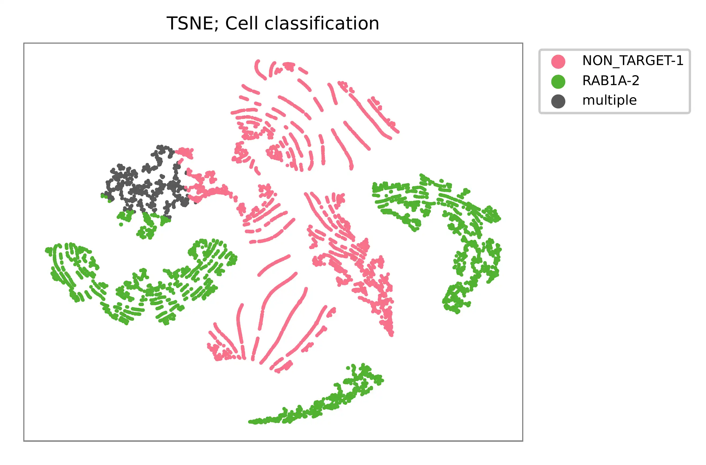

.. _tutorial_crispr_screening_sc3_v3_nextgem_di_crispr_10k:

####################################################################
 10k A375 Cells Transduced with (1) Non-Target and (1) Target sgRNA
####################################################################

**Dataset**: 10k A375 Cells Transduced with (1) Non-Target and (1)
Target sgRNA, Dual Indexed

The detailed description of this dataset can be found here_.

.. _here: https://support.10xgenomics.com/single-cell-gene-expression/datasets/4.0.0/SC3_v3_NextGem_DI_CRISPR_10K

|

*************
 Preparation
*************

Download fastq files.

.. code:: console

   $ wget https://cg.10xgenomics.com/samples/cell-exp/4.0.0/SC3_v3_NextGem_DI_CRISPR_10K/SC3_v3_NextGem_DI_CRISPR_10K_fastqs.tar

   $ tar xvf SC3_v3_NextGem_DI_PBMC_CSP_1K/SC3_v3_NextGem_DI_PBMC_CSP_1K_fastqs.tar

Combine reads of different lanes.

.. code:: console

   $ cat SC3_v3_NextGem_DI_CRISPR_10K_fastqs/SC3_v3_NextGem_DI_CRISPR_10K_crispr_fastqs/SC3_v3_NextGem_DI_CRISPR_10K_crispr_S1_L00?_R1_001.fastq.gz > SC3_v3_NextGem_DI_CRISPR_10K_crispr_S1_combined_R1_001.fastq.gz

   $ cat SC3_v3_NextGem_DI_CRISPR_10K_fastqs/SC3_v3_NextGem_DI_CRISPR_10K_crispr_fastqs/SC3_v3_NextGem_DI_CRISPR_10K_crispr_S1_L00?_R2_001.fastq.gz > SC3_v3_NextGem_DI_CRISPR_10K_crispr_S1_combined_R2_001.fastq.gz

Download cell barcode info. These are the cell-associated barcodes in
this single cell RNA-Seq library.

.. code:: console

   $ wget https://cf.10xgenomics.com/samples/cell-exp/4.0.0/SC3_v3_NextGem_DI_CRISPR_10K/SC3_v3_NextGem_DI_CRISPR_10K_filtered_feature_bc_matrix.tar.gz

   $ tar zxvf SC3_v3_NextGem_DI_CRISPR_10K_filtered_feature_bc_matrix.tar.gz

Inspect cell barcodes.

.. code:: console

   $ gzip -dc filtered_feature_bc_matrix/barcodes.tsv.gz | head

   AAACCCACACATAGCT-1
   AAACCCACATCATGAC-1
   AAACCCAGTCATCGGC-1
   AAACCCAGTCGCACAC-1
   AAACCCAGTGCAACGA-1
   AAACCCATCAAGCGTT-1
   AAACCCATCAGATGCT-1
   AAACCCATCATCTACT-1
   AAACCCATCCTTATGT-1
   AAACCCATCTCGGCTT-1

Prepare feature barcodes.

.. code:: console

   $ wget https://cf.10xgenomics.com/samples/cell-exp/4.0.0/SC3_v3_NextGem_DI_CRISPR_10K/SC3_v3_NextGem_DI_CRISPR_10K_feature_ref.csv

Inspect feature barcode info.

.. code:: console

   $ cat SC3_v3_NextGem_DI_CRISPR_10K_feature_ref.csv

   id,name,read,pattern,sequence,feature_type,target_gene_id,target_gene_name
   RAB1A-2,RAB1A-2,R2,(BC)GTTTAAGAGCTAAGCTGGAA,GCCGGCGAACCAGGAAATA,CRISPR Guide Capture,ENSG00000138069,RAB1A
   NON_TARGET-1,NON_TARGET-1,R2,(BC)GTTTAAGAGCTAAGCTGGAA,AACGTGCTGACGATGCGGGC,CRISPR Guide Capture,Non-Targeting,Non-Targeting

Clean up.

.. code:: console

   $ cut -d ',' -f1,5 SC3_v3_NextGem_DI_CRISPR_10K_feature_ref.csv | sed 's/,/\t/g' | tail -2 > SC3_v3_NextGem_DI_CRISPR_10K_feature_ref.tsv

   $ cat SC3_v3_NextGem_DI_CRISPR_10K_feature_ref.tsv

   RAB1A-2 GCCGGCGAACCAGGAAATA
   NON_TARGET-1    AACGTGCTGACGATGCGGGC

|

****
 QC
****

The first 20,000 read pairs are sampled (set by ``-n``, default
``100,000``) for quality control. The ``-t`` option can be used to set
the number of threads. By default, diagnostic results and plots are
generated in the ``qc`` directory (set by ``--output_directory``), and
the full length of read 1 and read 2 are searched against reference cell
and feature barcodes, respectively. The per base content of both read
pairs and the distribution of matched barcode positions are summarized.
Use ``-r1_c`` and/or ``-r2_c`` to limit the search range, and ``-cb_n``
and/or ``-fb_n`` to set the mismatch tolerance for cell and/or feature
barcode matching (default ``3``).

.. code:: console

   $ fba qc \
       -1 SC3_v3_NextGem_DI_CRISPR_10K_crispr_S1_combined_R1_001.fastq.gz \
       -2 SC3_v3_NextGem_DI_CRISPR_10K_crispr_S1_combined_R2_001.fastq.gz \
       -w filtered_feature_bc_matrix/barcodes.tsv.gz \
       -f SC3_v3_NextGem_DI_CRISPR_10K_feature_ref.tsv \
       -r1_c 0,16 \
       -n 20000

This library was constructed using the Chromium Next GEM Single Cell 3ʹ
Reagent Kits v3.1 (Dual Index) with Feature Barcode technology for
CRISPR Screening and sequenced on an Illumina NovaSeq 6000. The first 16
bases of read 1 represent cell barcodes, and the following 12 bases
represent UMIs. The base content plot indicates that the GC content of
cell barcodes is evenly distributed. However, there is a slight
T-enrichment in the UMIs.

.. image:: Pyplot_read1_barcodes_starting_ending.webp
   :width: 350px
   :align: center

.. image:: Pyplot_read1_per_base_seq_content.webp
   :width: 350px
   :align: center

Regarding read 2, the per base content analysis indicates that the first
31 bases are consistent and easily readable. These bases correspond to
the `Template Switch Oligo (TSO)`_ sequence used in library
construction. From base 32 onward, we have observed two distinct
genotypes in the sampled reads.

.. _template switch oligo (tso): https://assets.ctfassets.net/an68im79xiti/4HEC1M6tFbBJXXTv7jVVo1/a271ac8d5fa73180e603df21030f9e9a/CG000316_ChromiumNextGEMSingleCell3__v3.1_CRISPR_Screening_Dual_Index_RevA.pdf

.. image:: Pyplot_read2_per_base_seq_content.webp
   :width: 800px
   :align: center

.. image:: Pyplot_read2_barcodes_starting_ending.webp
   :width: 800px
   :align: center

The detailed ``qc`` results are stored in the
``feature_barcoding_output.tsv.gz`` file. The ``matching_pos`` columns
indicate the matched positions on reads, while the
``matching_description`` columns indicate mismatches in the format of
substitutions:insertions:deletions.

.. code:: console

   $ gzip -dc qc/feature_barcoding_output.tsv.gz | head

   read1_seq       cell_barcode    cb_matching_pos cb_matching_description read2_seq       feature_barcode fb_matching_pos fb_matching_description
   CNCCACACACGTGTTAatgagtactagc    CCTCACACACGTAGTT        0:15    2:0:1   AAGCAGTGGTATCAACGCAGAGTACATGGGATAGGTTTGGTCCTAGCCTTTCTATTAGCTCTTAGTAAGATTACACATGCAAGCATCCCC    no_match        NA      NA
   GNCGCGATCAGCATTActtttgtcaccc    GTCGCGAAGAGCATTA        0:16    3:0:0   AAGCAGTGGTATCAACGCAGAGTACATGGGGACTGTTGCTGGTGTGTACTTGCTAAGGTTTATGTCAGTTCAAGATTATAAGCCCCCCAG    no_match        NA      NA
   TNGGAAGGTAAGTGTAatcgagggaaca    TGGGAAGCAAAGTGTA        0:16    3:0:0   AAGCAGTGGTATCAACGCAGAGTACATGGGGGCCGGCGAACCAGGAAATAGTTTAAGAGCTAAGCTGGAAACAGCATAGCAAGTTTAAAT    RAB1A-2_GCCGGCGAACCAGGAAATAG    31:51   0:0:0
   CNCCCAAGTCGATAGGgagcgcaagcat    CCCAACTCACGATAGG        2:16    1:0:2   AAGCAGTGGTATCAACGCAGAGTACATGGGGGCCGGCGAACCAGGAAATAGTTTAAGAGCTAAGCTGGAAACAGCATAGCAAGTTTAAAT    RAB1A-2_GCCGGCGAACCAGGAAATAG    31:51   0:0:0
   CNCACTGCAAACGGTGggcgtaaatgag    CTCACTGGTAACGGTG        0:16    3:0:0   AAGCAGTGGTATCAACGCAGAGTACATGGGGGCCGGCGAACCAGGAAATAGTTTAAGAGCTAAGCTGGAAACAGCATAGCAAGTTTAAAT    RAB1A-2_GCCGGCGAACCAGGAAATAG    31:51   0:0:0
   ANCATCACAGGCGCTTgtcccactatat    AGCATCAGTGGCGCTT        0:16    3:0:0   AAGCAGTGGTATCAACGCAGAGTACATGGGGGCCGGCGAACCAGGAAATAGTTTAAGAGCTAAGCTGGAAACAGCATAGCAAGTTTAAAT    RAB1A-2_GCCGGCGAACCAGGAAATAG    31:51   0:0:0
   ANACGAACACTTTCATccaaaagaagtt    AAACGAAGTCTTTCAT        0:16    3:0:0   AAGCAGTGGTATCAACGCAGAGTACATGGGGGCCGGCGAACCAGGAAATAGTTTAAGAGCTAAGCTGGAAACAGCATAGCAAGTTTAAAT    RAB1A-2_GCCGGCGAACCAGGAAATAG    31:51   0:0:0
   ANCAACCAGTATCGTTgaaatcctggta    AACAACCTCTATCGTT        0:16    3:0:0   AAGCAGTGGTATCAACGCAGAGTACATGGGGAACGTGCTGACGATGCGGGCGTTTAAGAGCTAAGCTGGAAACAGCATAGCAAGTTTAAA    NON_TARGET-1_AACGTGCTGACGATGCGGGC       31:51   0:0:0
   GNAGCCCGTACCACATgggcccagtatg    GAAGCCCCAACCACAT        0:16    3:0:0   AAGCAGTGGTATCAACGCAGAGTACATGGGGGCCGGCGAACCAGGAAATAGTTTAAGAGCTAAGCTGGAAACAGCATAGCAAGTTTAAAT    RAB1A-2_GCCGGCGAACCAGGAAATAG    31:51   0:0:0

|

********************
 Barcode extraction
********************

Although the length of the RAB1A-1 and RAB1A-2 feature barcodes differ
by one base, they both start at the same position on read 2. To enable
accurate feature barcode identification, we will include an extra
downstream base (G) for the RAB1A-2 feature barcode to make their
lengths equal.

.. code:: console

   $ cat SC3_v3_NextGem_DI_CRISPR_10K_feature_ref_edited.tsv

   RAB1A-2 GCCGGCGAACCAGGAAATAG
   NON_TARGET-1    AACGTGCTGACGATGCGGGC

The search ranges for barcode matching are set to ``0,16`` on read 1 and
``31,51`` on read 2. We allow for two mismatches for both cell and
feature barcodes using the parameters ``-cb_m`` and ``-cf_m``.

.. code:: console

   $ fba extract \
       -1 SC3_v3_NextGem_DI_CRISPR_10K_crispr_S1_combined_R1_001.fastq.gz \
       -2 SC3_v3_NextGem_DI_CRISPR_10K_crispr_S1_combined_R2_001.fastq.gz \
       -w filtered_feature_bc_matrix/barcodes.tsv.gz \
       -f SC3_v3_NextGem_DI_CRISPR_10K_feature_ref_edited.tsv \
       -o feature_barcoding_output.tsv.gz \
       -r1_c 0,16 \
       -r2_c 31,51 \
       -cb_m 2 \
       -fb_m 2

Preview of result.

.. code:: console

   $ gzip -dc feature_barcoding_output.tsv.gz  | head

   read1_seq       cell_barcode    cb_num_mismatches       read2_seq       feature_barcode fb_num_mismatches
   GGCAGTCTCCGTTACTtatccagccttc    GGCAGTCTCGGTAACT        2       aagcagtggtatcaacgcagagtacatggggGCCGGCGAACCAGGAAATAGtttaagagctaagctggaaacagcatagcaagtttaaat    RAB1A-2_GCCGGCGAACCAGGAAATAG     0
   TTACGTTGTGAATCGGgtggggctcttc    TTACGTTCAGAATCGG        2       aagcagtggtatcaacgcagagtacatggggAACGTGCTGACGATGCGGGCgtttaagagctaagctggaaacagcatagcaagtttaaa    NON_TARGET-1_AACGTGCTGACGATGCGGGC        0
   TCGGGCAAGGATTGGTttctactcggaa    TCGGGCATCGATTGGT        2       aagcagtggtatcaacgcagagtacatgggaACGTGCTGACGATGCGGGCGtttaagagctaagctggaaacagcatagcaagtttaaat    NON_TARGET-1_AACGTGCTGACGATGCGGGC        2
   ACAACCACACATCTAGcggcatcatact    ACAACCAGTCATCTAG        2       aagcagtggtatcaacgcagagtacatggggCCGGCGAACCAGGAAATAGTttaagagctaagctggaaacagcatagcaagtttaaata    RAB1A-2_GCCGGCGAACCAGGAAATAG     2
   AGACTCAAGTGCTAGAacagaactggtg    AGACTCATCTGCTAGA        2       aagcagtggtatcaacgcagagtacatggggAACGTGCTGACGATGCGGGCgtttaagagctaagctggaaacagcatagcaagtttaaa    NON_TARGET-1_AACGTGCTGACGATGCGGGC        0
   GAGTTGTTCGAACATTctgcccgacgtc    GAGTTGTAGGAACATT        2       aagcagtggtatcaacgcagagtacatggggAACGTGCTGACGATGCGGGCgtttaagagctaagctggaaacagcatagcaagtttaaa    NON_TARGET-1_AACGTGCTGACGATGCGGGC        0
   AGACTCAGTGGCACAAtgtcagaattca    AGACTCACAGGCACAA        2       aagcagtggtatcaacgcagagtacatggggGCCGGCGAACCAGGAAATAGtttaagagctaagctggaaacagcatagcaagtttaaat    RAB1A-2_GCCGGCGAACCAGGAAATAG     0
   TGCACGGAGGATAACCcgtgcacgtaca    TGCACGGTCGATAACC        2       aagcagtggtatcaacgcagagtacatggggGCCGGCGAACCAGGAAATAGtttaagagctaagctggaaacagcatagcaagtttaaat    RAB1A-2_GCCGGCGAACCAGGAAATAG     0
   CGTAGTAGTAACACGGaagagggaactg    CGTAGTAGTAACGCGA        2       aagcagtggtatcaacgcagagtacatggggAACGTGCTGACGATGCGGGCgtttaagagctaagctggaaacagcatagcaagtttaaa    NON_TARGET-1_AACGTGCTGACGATGCGGGC        0

Result summary.

64.7% (93,795,979 out of 145,032,428) of total read pairs have valid
cell and feature barcodes. Majority of fragments in this library have
correct structure.

.. code:: console

   2021-02-15 01:51:59,262 - fba.__main__ - INFO - fba version: 0.0.7
   2021-02-15 01:51:59,262 - fba.__main__ - INFO - Initiating logging ...
   2021-02-15 01:51:59,262 - fba.__main__ - INFO - Python version: 3.7
   2021-02-15 01:51:59,262 - fba.__main__ - INFO - Using extract subcommand ...
   2021-02-15 01:51:59,276 - fba.levenshtein - INFO - Number of reference cell barcodes: 11,791
   2021-02-15 01:51:59,276 - fba.levenshtein - INFO - Number of reference feature barcodes: 2
   2021-02-15 01:51:59,276 - fba.levenshtein - INFO - Read 1 coordinates to search: [0, 16)
   2021-02-15 01:51:59,276 - fba.levenshtein - INFO - Read 2 coordinates to search: [31, 51)
   2021-02-15 01:51:59,276 - fba.levenshtein - INFO - Cell barcode maximum number of mismatches: 2
   2021-02-15 01:51:59,276 - fba.levenshtein - INFO - Feature barcode maximum number of mismatches: 2
   2021-02-15 01:51:59,276 - fba.levenshtein - INFO - Read 1 maximum number of N allowed: 3
   2021-02-15 01:51:59,276 - fba.levenshtein - INFO - Read 2 maximum number of N allowed: 3
   2021-02-15 01:52:02,510 - fba.levenshtein - INFO - Matching ...
   2021-02-15 02:20:39,807 - fba.levenshtein - INFO - Read pairs processed: 10,000,000
   2021-02-15 02:49:04,142 - fba.levenshtein - INFO - Read pairs processed: 20,000,000
   2021-02-15 03:17:27,422 - fba.levenshtein - INFO - Read pairs processed: 30,000,000
   2021-02-15 03:45:54,615 - fba.levenshtein - INFO - Read pairs processed: 40,000,000
   2021-02-15 04:14:23,049 - fba.levenshtein - INFO - Read pairs processed: 50,000,000
   2021-02-15 04:42:49,377 - fba.levenshtein - INFO - Read pairs processed: 60,000,000
   2021-02-15 05:11:15,736 - fba.levenshtein - INFO - Read pairs processed: 70,000,000
   2021-02-15 05:39:43,011 - fba.levenshtein - INFO - Read pairs processed: 80,000,000
   2021-02-15 06:08:09,940 - fba.levenshtein - INFO - Read pairs processed: 90,000,000
   2021-02-15 06:36:39,658 - fba.levenshtein - INFO - Read pairs processed: 100,000,000
   2021-02-15 07:05:08,115 - fba.levenshtein - INFO - Read pairs processed: 110,000,000
   2021-02-15 07:33:32,101 - fba.levenshtein - INFO - Read pairs processed: 120,000,000
   2021-02-15 08:02:01,233 - fba.levenshtein - INFO - Read pairs processed: 130,000,000
   2021-02-15 08:30:29,660 - fba.levenshtein - INFO - Read pairs processed: 140,000,000
   2021-02-15 08:44:47,038 - fba.levenshtein - INFO - Number of read pairs processed: 145,032,428
   2021-02-15 08:44:47,038 - fba.levenshtein - INFO - Number of read pairs w/ valid barcodes: 93,795,979
   2021-02-15 08:44:47,153 - fba.__main__ - INFO - Done.

|

*******************
 Matrix generation
*******************

Only fragments with correctly matched cell and feature barcodes are
included, while fragments with UMI lengths less than the specified value
are discarded. UMI removal is performed using UMI-tools (`Smith, T., et
al. 2017. Genome Res. 27, 491–499.`_), with the starting position on
read 1 set by ``-us`` (default ``16``) and the length set by ``-ul``
(default ``12``). The UMI deduplication method can be set using ``-ud``
(default ``directional``), and the UMI deduplication mismatch threshold
can be specified using ``-um`` (default ``1``).

.. _smith, t., et al. 2017. genome res. 27, 491–499.: http://www.genome.org/cgi/doi/10.1101/gr.209601.116

The generated feature count matrix can be easily imported into
well-established single cell analysis packages: Seurat_ and Scanpy_.

.. _scanpy: https://scanpy.readthedocs.io/en/stable/

.. _seurat: https://satijalab.org/seurat/

.. code:: console

   $ fba count \
       -i feature_barcoding_output.tsv.gz \
       -o matrix_featurecount.csv.gz \
       -us 16 \
       -ul 12 \
       -um 1 \
       -ud directional

Result summary.

7.6% (7,145,799 out of 93,795,979) of read pairs with valid cell and
feature barcodes are unique fragments. 4.9% (7,143,943 out of
145,032,428) of total sequenced read pairs contribute to the final
matrix.

.. code:: console

   2020-10-20 04:47:32,738 - fba.__main__ - INFO - fba version: 0.0.7
   2020-10-20 04:47:32,738 - fba.__main__ - INFO - Initiating logging ...
   2020-10-20 04:47:32,738 - fba.__main__ - INFO - Python version: 3.7
   2020-10-20 04:47:32,738 - fba.__main__ - INFO - Using count subcommand ...
   2020-10-20 04:47:32,738 - fba.count - INFO - UMI-tools version: 1.0.1
   2020-10-20 04:47:32,795 - fba.count - INFO - UMI starting position on read 1: 16
   2020-10-20 04:47:32,795 - fba.count - INFO - UMI length: 12
   2020-10-20 04:47:32,795 - fba.count - INFO - UMI-tools deduplication threshold: 1
   2020-10-20 04:47:32,795 - fba.count - INFO - UMI-tools deduplication method: directional
   2020-10-20 04:47:32,795 - fba.count - INFO - Header line: read1_seq cell_barcode cb_num_mismatches read2_seq feature_barcode fb_num_mismatches
   2020-10-20 04:51:50,886 - fba.count - INFO - Number of lines processed: 93,795,979
   2020-10-20 04:51:50,893 - fba.count - INFO - Number of cell barcodes detected: 11,758
   2020-10-20 04:51:50,894 - fba.count - INFO - Number of features detected: 2
   2020-10-20 05:00:42,298 - fba.count - INFO - Total UMIs after deduplication: 7,145,799
   2020-10-20 05:00:42,320 - fba.count - INFO - Median number of UMIs per cell: 477.0
   2020-10-20 05:00:42,434 - fba.__main__ - INFO - Done.

|

****************
 Demultiplexing
****************

Negative binomial distribution
==============================

Cells are demultiplexed based on the feature count matrix using
demultiplexing method ``1`` (set by ``-dm``), which is implemented based
on the method described by `Stoeckius, M., et al. (2018)`_ with some
modifications. The output directory for demultiplexing is set by
``--output_directory`` (default ``demultiplexed``). A cell identity
matrix is generated, where 0 indicates negative and 1 indicates
positive. To adjust the quantile threshold for demultiplexing, use
``-q`` (default ``0.9999``). To generate visualization plots, set
``-v``.

.. _stoeckius, m., et al. (2018): https://doi.org/10.1186/s13059-018-1603-1

.. code:: console

   $ fba demultiplex \
       -i matrix_featurecount.csv.gz \
       --output_directory demultiplexed \
       -dm 1 \
       -q 0.75 \
       -v

Heatmap of the relative abundance of features (sgRNAs) across all cells.
Each column represents a single cell.

.. image:: Pyplot_heatmap_cells_demultiplexed.png
   :alt: Heatmap
   :width: 700px
   :align: center

t-SNE embedding of cells based on the abundance of features (sgRNAs, no
transcriptome information used). Colors indicate the sgRNA status for
each cell, as called by FBA.

|

Gaussian mixture model
======================

The implementation of demultiplexing method ``2`` (set by ``-dm``) is
inspired by the method described on the `10x Genomics' website`_. To set
the probability threshold for demultiplexing, use ``-p`` (default
``0.9``).

.. _10x genomics' website: https://support.10xgenomics.com/single-cell-gene-expression/software/pipelines/latest/algorithms/crispr

.. code:: console

   $ fba demultiplex \
       -i matrix_featurecount.csv.gz \
       -dm 2 \
       -v

.. code:: console

   2021-10-04 14:14:15,659 - fba.__main__ - INFO - fba version: 0.0.x
   2021-10-04 14:14:15,659 - fba.__main__ - INFO - Initiating logging ...
   2021-10-04 14:14:15,659 - fba.__main__ - INFO - Python version: 3.8
   2021-10-04 14:14:15,659 - fba.__main__ - INFO - Using demultiplex subcommand ...
   2021-10-04 14:14:36,166 - fba.__main__ - INFO - Skipping arguments: "-q/--quantile", "-cm/--clustering_method"
   2021-10-04 14:14:36,166 - fba.demultiplex - INFO - Output directory: demultiplexed
   2021-10-04 14:14:36,166 - fba.demultiplex - INFO - Demultiplexing method: 2
   2021-10-04 14:14:36,166 - fba.demultiplex - INFO - UMI normalization method: clr
   2021-10-04 14:14:36,167 - fba.demultiplex - INFO - Visualization: On
   2021-10-04 14:14:36,167 - fba.demultiplex - INFO - Visualization method: tsne
   2021-10-04 14:14:36,167 - fba.demultiplex - INFO - Loading feature count matrix: matrix_featurecount.csv.gz ...
   2021-10-04 14:14:37,875 - fba.demultiplex - INFO - Number of cells: 11,758
   2021-10-04 14:14:37,875 - fba.demultiplex - INFO - Number of positive cells for a feature to be included: 200
   2021-10-04 14:14:37,920 - fba.demultiplex - INFO - Number of features: 2 / 2 (after filtering / original in the matrix)
   2021-10-04 14:14:37,920 - fba.demultiplex - INFO - Features: NON_TARGET-1 RAB1A-2
   2021-10-04 14:14:37,920 - fba.demultiplex - INFO - Total UMIs: 7,145,799 / 7,145,799
   2021-10-04 14:14:37,942 - fba.demultiplex - INFO - Median number of UMIs per cell: 477.0 / 477.0
   2021-10-04 14:14:37,942 - fba.demultiplex - INFO - Demultiplexing ...
   2021-10-04 14:14:38,418 - fba.demultiplex - INFO - Generating heatmap ...
   2021-10-04 14:14:42,078 - fba.demultiplex - INFO - Embedding ...
   2021-10-04 14:15:24,288 - fba.__main__ - INFO - Done.

Heatmap of the relative abundance of features (sgRNAs) across all cells.
Each column represents a single cell.

t-SNE embedding of cells based on the abundance of features (sgRNAs, no
transcriptome information used). Colors indicate the sgRNA status for
each cell, as called by FBA.

UMI distribution and model fitting threshold:

.. image:: Pyplot_feature_umi_distribution_gm_NON_TARGET-1_0.9.webp
   :alt: UMI distribution
   :width: 800px
   :align: center

.. image:: Pyplot_feature_umi_distribution_gm_RAB1A-2_0.9.webp
   :alt: UMI distribution
   :width: 800px
   :align: center

|

Poisson-Gaussian mixture model
==============================

The implementation of demultiplexing method ``3`` (set by ``-dm``) is
inspired by `Replogle, M., et al. (2021)`_. The probability threshold
for demultiplexing can be set using ``-p`` (default ``0.5``).

.. _replogle, m., et al. (2021): https://www.biorxiv.org/content/10.1101/2021.12.16.473013

.. code:: console

   $ fba demultiplex \
       -i matrix_featurecount.csv.gz \
       -dm 3 \
       -v

.. code:: console

   2021-12-20 00:13:17,443 - fba.__main__ - INFO - fba version: 0.0.x
   2021-12-20 00:13:17,443 - fba.__main__ - INFO - Initiating logging ...
   2021-12-20 00:13:17,443 - fba.__main__ - INFO - Python version: 3.9
   2021-12-20 00:13:17,443 - fba.__main__ - INFO - Using demultiplex subcommand ...
   2021-12-20 00:13:19,774 - fba.__main__ - INFO - Skipping arguments: "-q/--quantile", "-cm/--clustering_method"
   2021-12-20 00:13:19,774 - fba.demultiplex - INFO - Output directory: demultiplexed
   2021-12-20 00:13:19,774 - fba.demultiplex - INFO - Demultiplexing method: 3
   2021-12-20 00:13:19,774 - fba.demultiplex - INFO - UMI normalization method: clr
   2021-12-20 00:13:19,774 - fba.demultiplex - INFO - Visualization: On
   2021-12-20 00:13:19,774 - fba.demultiplex - INFO - Visualization method: tsne
   2021-12-20 00:13:19,774 - fba.demultiplex - INFO - Loading feature count matrix: matrix_featurecount.csv.gz ...
   2021-12-20 00:13:20,479 - fba.demultiplex - INFO - Number of cells: 11,758
   2021-12-20 00:13:20,479 - fba.demultiplex - INFO - Number of positive cells for a feature to be included: 200
   2021-12-20 00:13:20,497 - fba.demultiplex - INFO - Number of features: 2 / 2 (after filtering / original in the matrix)
   2021-12-20 00:13:20,497 - fba.demultiplex - INFO - Features: NON_TARGET-1 RAB1A-2
   2021-12-20 00:13:20,497 - fba.demultiplex - INFO - Total UMIs: 7,145,799 / 7,145,799
   2021-12-20 00:13:20,506 - fba.demultiplex - INFO - Median number of UMIs per cell: 477.0 / 477.0
   2021-12-20 00:13:20,506 - fba.demultiplex - INFO - Demultiplexing ...
   2021-12-20 00:13:21,930 - fba.demultiplex - INFO - Generating heatmap ...
   2021-12-20 00:13:23,070 - fba.demultiplex - INFO - Embedding ...
   2021-12-20 00:13:41,271 - fba.__main__ - INFO - Done.

Heatmap of the relative abundance of features (sgRNAs) across all cells.
Each column represents a single cell.

.. image:: Pyplot_heatmap_cells_demultiplexed_pgm.png
   :alt: Heatmap
   :width: 700px
   :align: center

t-SNE embedding of cells based on the abundance of features (sgRNAs, no
transcriptome information used). Colors indicate the sgRNA status for
each cell, as called by FBA.

.. image:: Pyplot_embedding_cells_demultiplexed_pgm.webp
   :alt: t-SNE embedding
   :width: 500px
   :align: center

UMI distribution and model fitting threshold:

.. image:: Pyplot_feature_umi_distribution_pgm_RAB1A-2_0.5.webp
   :alt: UMI distribution
   :width: 800px
   :align: center

|

Kernel density estimation
=========================

CRISPR perturbations are demultiplexed based on the abundance of
features using demultiplexing method ``4``, which is implemented with
modifications to the method described in `McGinnis, C., et al. (2019)`_.

.. _mcginnis, c., et al. (2019): https://doi.org/10.1038/s41592-019-0433-8

.. code:: console

   $ fba demultiplex \
       -i matrix_featurecount.csv.gz \
       -dm 4 \
       -v

.. code:: console

   2021-12-26 18:11:16,685 - fba.__main__ - INFO - fba version: 0.0.x
   2021-12-26 18:11:16,685 - fba.__main__ - INFO - Initiating logging ...
   2021-12-26 18:11:16,686 - fba.__main__ - INFO - Python version: 3.9
   2021-12-26 18:11:16,686 - fba.__main__ - INFO - Using demultiplex subcommand ...
   2021-12-26 18:11:19,633 - fba.__main__ - INFO - Skipping arguments: "-q/--quantile", "-cm/--clustering_method", "-p/--prob"
   2021-12-26 18:11:19,633 - fba.demultiplex - INFO - Output directory: demultiplexed
   2021-12-26 18:11:19,633 - fba.demultiplex - INFO - Demultiplexing method: 4
   2021-12-26 18:11:19,633 - fba.demultiplex - INFO - UMI normalization method: clr
   2021-12-26 18:11:19,633 - fba.demultiplex - INFO - Visualization: On
   2021-12-26 18:11:19,633 - fba.demultiplex - INFO - Visualization method: tsne
   2021-12-26 18:11:19,633 - fba.demultiplex - INFO - Loading feature count matrix: matrix_featurecount.csv.gz ...
   2021-12-26 18:11:19,745 - fba.demultiplex - INFO - Number of cells: 11,758
   2021-12-26 18:11:19,745 - fba.demultiplex - INFO - Number of positive cells for a feature to be included: 200
   2021-12-26 18:11:19,762 - fba.demultiplex - INFO - Number of features: 2 / 2 (after filtering / original in the matrix)
   2021-12-26 18:11:19,762 - fba.demultiplex - INFO - Features: NON_TARGET-1 RAB1A-2
   2021-12-26 18:11:19,762 - fba.demultiplex - INFO - Total UMIs: 7,145,799 / 7,145,799
   2021-12-26 18:11:19,771 - fba.demultiplex - INFO - Median number of UMIs per cell: 477.0 / 477.0
   2021-12-26 18:11:19,771 - fba.demultiplex - INFO - Demultiplexing ...
   2021-12-26 18:11:22,049 - fba.demultiplex - INFO - Quantile cutoff: 18
   2021-12-26 18:11:23,703 - fba.demultiplex - INFO - Generating heatmap ...
   2021-12-26 18:11:24,911 - fba.demultiplex - INFO - Embedding ...
   2021-12-26 18:11:44,219 - fba.__main__ - INFO - Done.

Heatmap of the relative abundance of features (sgRNAs) across all cells.
Each column represents a single cell.

.. image:: Pyplot_heatmap_cells_demultiplexed_kde.png
   :alt: Heatmap
   :width: 700px
   :align: center

t-SNE embedding of cells based on the abundance of features (sgRNAs, no
transcriptome information used). Colors indicate the sgRNA status for
each cell, as called by FBA.

UMI distribution and model fitting threshold:

.. image:: Pyplot_feature_umi_distribution_kde_NON_TARGET-1_18.webp
   :alt: UMI distribution
   :width: 800px
   :align: center

|

Knee point
==========

Method 1
--------

Cells are demultiplexed based on the abundance of features, specifically
sgRNAs. Demultiplexing method ``5-2019`` is our previous implementation,
which aims to identify perturbations in the cells by detecting an
inflection point on the feature UMI saturation curve (`Xie, S., et al.
2019`_).

.. _xie, s., et al. 2019: https://doi.org/10.1016/j.celrep.2019.10.073

.. code:: console

   $ fba demultiplex \
       -i matrix_featurecount.csv.gz \
       -dm 5-2019 \
       -v

.. code:: console

   2022-01-02 13:57:51,792 - fba.__main__ - INFO - fba version: 0.0.x
   2022-01-02 13:57:51,792 - fba.__main__ - INFO - Initiating logging ...
   2022-01-02 13:57:51,792 - fba.__main__ - INFO - Python version: 3.9
   2022-01-02 13:57:51,792 - fba.__main__ - INFO - Using demultiplex subcommand ...
   2022-01-02 13:57:54,328 - fba.__main__ - INFO - Skipping arguments: "-q/--quantile", "-cm/--clustering_method", "-p/--prob"
   2022-01-02 13:57:54,329 - fba.demultiplex - INFO - Output directory: demultiplexed
   2022-01-02 13:57:54,329 - fba.demultiplex - INFO - Demultiplexing method: 5-2019
   2022-01-02 13:57:54,329 - fba.demultiplex - INFO - UMI normalization method: clr
   2022-01-02 13:57:54,329 - fba.demultiplex - INFO - Visualization: On
   2022-01-02 13:57:54,329 - fba.demultiplex - INFO - Visualization method: tsne
   2022-01-02 13:57:54,329 - fba.demultiplex - INFO - Loading feature count matrix: raw/m2_2020-10-20/matrix_featurecount.csv.gz ...
   2022-01-02 13:57:54,444 - fba.demultiplex - INFO - Number of cells: 11,758
   2022-01-02 13:57:54,444 - fba.demultiplex - INFO - Number of positive cells for a feature to be included: 200
   2022-01-02 13:57:54,464 - fba.demultiplex - INFO - Number of features: 2 / 2 (after filtering / original in the matrix)
   2022-01-02 13:57:54,464 - fba.demultiplex - INFO - Features: NON_TARGET-1 RAB1A-2
   2022-01-02 13:57:54,464 - fba.demultiplex - INFO - Total UMIs: 7,145,799 / 7,145,799
   2022-01-02 13:57:54,474 - fba.demultiplex - INFO - Median number of UMIs per cell: 477.0 / 477.0
   2022-01-02 13:57:54,474 - fba.demultiplex - INFO - Demultiplexing ...
   2022-01-02 13:57:55,509 - fba.demultiplex - INFO - Generating heatmap ...
   2022-01-02 13:57:56,717 - fba.demultiplex - INFO - Embedding ...
   2022-01-02 13:58:12,014 - fba.__main__ - INFO - Done.

Heatmap of the relative abundance of features (sgRNAs) across all cells.
Each column represents a single cell.

t-SNE embedding of cells based on the abundance of features (sgRNAs, no
transcriptome information used). Colors indicate the sgRNA status for
each cell, as called by FBA.

UMI distribution and model fitting threshold:

.. image:: Pyplot_feature_umi_distribution_knee-2019_NON_TARGET-1.webp
   :alt: UMI distribution
   :width: 400px
   :align: center

|

Method 2
--------

Cells are demultiplexed based on the abundance of features, specifically
sgRNAs. Demultiplexing method ``5`` is implemented to use the local
maxima on the difference curve to detemine the knee point on the UMI
saturation curve.

.. code:: console

   $ fba demultiplex \
       -i matrix_featurecount.csv.gz \
       -dm 5 \
       -v

.. code:: console

   2021-12-29 22:55:34,303 - fba.__main__ - INFO - fba version: 0.0.x
   2021-12-29 22:55:34,303 - fba.__main__ - INFO - Initiating logging ...
   2021-12-29 22:55:34,303 - fba.__main__ - INFO - Python version: 3.9
   2021-12-29 22:55:34,303 - fba.__main__ - INFO - Using demultiplex subcommand ...
   2021-12-29 22:55:36,774 - fba.__main__ - INFO - Skipping arguments: "-q/--quantile", "-cm/--clustering_method", "-p/--prob"
   2021-12-29 22:55:36,774 - fba.demultiplex - INFO - Output directory: demultiplexed
   2021-12-29 22:55:36,774 - fba.demultiplex - INFO - Demultiplexing method: 5
   2021-12-29 22:55:36,774 - fba.demultiplex - INFO - UMI normalization method: clr
   2021-12-29 22:55:36,774 - fba.demultiplex - INFO - Visualization: On
   2021-12-29 22:55:36,774 - fba.demultiplex - INFO - Visualization method: tsne
   2021-12-29 22:55:36,774 - fba.demultiplex - INFO - Loading feature count matrix: matrix_featurecount.csv.gz ...
   2021-12-29 22:55:36,886 - fba.demultiplex - INFO - Number of cells: 11,758
   2021-12-29 22:55:36,886 - fba.demultiplex - INFO - Number of positive cells for a feature to be included: 200
   2021-12-29 22:55:36,904 - fba.demultiplex - INFO - Number of features: 2 / 2 (after filtering / original in the matrix)
   2021-12-29 22:55:36,904 - fba.demultiplex - INFO - Features: NON_TARGET-1 RAB1A-2
   2021-12-29 22:55:36,904 - fba.demultiplex - INFO - Total UMIs: 7,145,799 / 7,145,799
   2021-12-29 22:55:36,913 - fba.demultiplex - INFO - Median number of UMIs per cell: 477.0 / 477.0
   2021-12-29 22:55:36,913 - fba.demultiplex - INFO - Demultiplexing ...
   2021-12-29 22:55:37,415 - fba.demultiplex - INFO - Generating heatmap ...
   2021-12-29 22:55:38,576 - fba.demultiplex - INFO - Embedding ...
   2021-12-29 22:55:57,485 - fba.__main__ - INFO - Done.

Heatmap of the relative abundance of features (sgRNAs) across all cells.
Each column represents a single cell.

t-SNE embedding of cells based on the abundance of features (sgRNAs, no
transcriptome information used). Colors indicate the sgRNA status for
each cell, as called by FBA.

.. image:: Pyplot_embedding_cells_demultiplexed_knee.webp
   :alt: t-SNE embedding
   :width: 500px
   :align: center

UMI distribution and model fitting threshold:

.. image:: Pyplot_feature_umi_distribution_knee_NON_TARGET-1.webp
   :alt: UMI distribution
   :width: 400px
   :align: center

.. image:: Pyplot_feature_umi_distribution_knee_RAB1A-2.webp
   :alt: UMI distribution
   :width: 400px
   :align: center

|
