.. _tutorial_eccite-seq_prjna521522:

####################################################################
 6k Single-cell Multimodal Readout of NIH-3T3, MyLa, Sez4 and PBMCs
####################################################################

**Dataset**: ECCITE-seq

Mimitou, E.P., Cheng, A., Montalbano, A., Hao, S., Stoeckius, M., Legut,
M., Roush, T., Herrera, A., Papalexi, E., Ouyang, Z., et al. (2019).
`Multiplexed detection of proteins, transcriptomes, clonotypes and
CRISPR perturbations in single cells
<https://doi.org/10.1038/s41592-019-0392-0>`_. *Nat. Methods* **16**,
409–412.

|

*************
 Preparation
*************

Download fastq files from `European Nucleotide Archive`_.

.. _european nucleotide archive: https://www.ebi.ac.uk/ena/browser/view/PRJNA521522?show=reads

Hashtag (Cell hashing):

.. code:: console

   $ curl -O ftp://ftp.sra.ebi.ac.uk/vol1/fastq/SRR855/007/SRR8550947/SRR8550947_1.fastq.gz

   $ curl -O ftp://ftp.sra.ebi.ac.uk/vol1/fastq/SRR855/007/SRR8550947/SRR8550947_2.fastq.gz

Protein-tag (CITE-seq):

.. code:: console

   $ curl -O ftp://ftp.sra.ebi.ac.uk/vol1/fastq/SRR855/006/SRR8550946/SRR8550946_1.fastq.gz

   $ curl -O ftp://ftp.sra.ebi.ac.uk/vol1/fastq/SRR855/006/SRR8550946/SRR8550946_2.fastq.gz

Guide-tag (sgRNAs):

.. code:: console

   $ curl -O ftp://ftp.sra.ebi.ac.uk/vol1/fastq/SRR855/008/SRR8550948/SRR8550948_1.fastq.gz

   $ curl -O ftp://ftp.sra.ebi.ac.uk/vol1/fastq/SRR855/008/SRR8550948/SRR8550948_2.fastq.gz

|

Download pre-processed transcriptome matrix from `Gene Expression
Omnibus`_. We will need the cell-associated barcodes, which are
determined by the transcriptomes.

.. _gene expression omnibus: https://www.ncbi.nlm.nih.gov/geo/query/acc.cgi?acc=GSM3596084

.. code:: console

   $ wget https://ftp.ncbi.nlm.nih.gov/geo/samples/GSM3596nnn/GSM3596084/suppl/GSM3596084_mx-cDNA.txt.gz

Inspect cell barcodes:

.. code:: console

   $ gzip -dc GSM3596084_mx-cDNA.txt.gz | head -1 | sed 's/"//g' | sed 's/ /\n/g' | sort | grep -B1 1

   CAGATCACACGTAAGG
   CAGATCACACGTAAGG.1
   --
   CGCTATCAGCCGCCTA
   CGCTATCAGCCGCCTA.1
   --
   TTTGCGCCAGTTCATG
   TTTGCGCCAGTTCATG.1

It seems there are 3 colliding barcodes. We will use the first ones.

.. code:: console

   $ gzip -dc GSM3596084_mx-cDNA.txt.gz | head -1 | sed 's/"//g' | sed 's/ /\n/g' | sort | grep -v 1 > cell_barcodes.txt

   $ head cell_barcodes.txt

   AAACCTGAGTGGTAGC
   AAACCTGAGTGTTTGC
   AAACCTGAGTTAGGTA
   AAACCTGCAAGTTGTC
   AAACCTGCAATTCCTT
   AAACCTGCACAGACTT
   AAACCTGCACATCCGG
   AAACCTGCACGGTAAG
   AAACCTGCAGACACTT
   AAACCTGCATCCGCGA

|

*********
 Hashtag
*********

Preparation
===========

Prepare feature barcodes (hashtag-oligo sequences, from `Supplementary
Table 4 and 5
<https://www.nature.com/articles/s41592-019-0392-0#MOESM1>`_, legend of
`Supplementary Figure 1
<https://www.nature.com/articles/s41592-019-0392-0#MOESM1>`_):

   NIH-3T3 cells were split into 7 tubes and stained with 7 barcoded
   hashing antibodies (Hashtag-A to Hashtag-G), followed by washing and
   pooling. MyLa, Sez4 and PBMCs were stained with Hashtag_1, Hashtag_2
   and Hashtag_3 respectively.

.. code:: console

   $ cat feature_barcodes_hashtag.tsv

   Hashtag_1       ACATGTTACCGT
   Hashtag_2       AGCTTACTATCC
   Hashtag_3       TATCACATCGGT
   Hashtag_A       AGGACCATCCAA
   Hashtag_B       TCGATAATGCGA
   Hashtag_C       GAGGCTGAGCTA
   Hashtag_D       GTGTGACGTATT
   Hashtag_E       ACTGTCTAACGG
   Hashtag_F       CACATAATGACG
   Hashtag_G       TAACGACGTGGT

QC
==

Sample the first 100,000 (set by ``-n``) read pairs for quality control.
Use ``-t`` to set the number of threads. The diagnostic results and
plots are generated in the ``qc`` directory (set by
``--output_directory``, default ``qc``). By default, full length of read
1 and read 2 are searched against reference cell and feature barcodes,
respectively. The per base content of both read pairs and the
distribution of matched barcode positions are summarized. Use ``-r1_c``
and/or ``-r2_c`` to limit the search range. Use ``-cb_n`` and/or
``-fb_n`` to set the mismatch tolerance for cell and feature barcode
matching (default ``3``).

.. code:: console

   $ fba qc \
       -1 SRR8550947_1.fastq.gz \
       -2 SRR8550947_2.fastq.gz \
       -w cell_barcodes.txt \
       -f feature_barcodes_hashtag.tsv \
       --output_directory qc

.. code:: console

   2022-01-08 16:32:43,465 - fba.__main__ - INFO - fba version: 0.0.x
   2022-01-08 16:32:43,465 - fba.__main__ - INFO - Initiating logging ...
   2022-01-08 16:32:43,465 - fba.__main__ - INFO - Python version: 3.7
   2022-01-08 16:32:43,465 - fba.__main__ - INFO - Using qc subcommand ...
   2022-01-08 16:32:44,108 - fba.qc - INFO - Summarizing per base read content ...
   2022-01-08 16:32:44,108 - fba.qc - INFO - Number of read pairs to analyze: 100,000
   2022-01-08 16:32:44,108 - fba.qc - INFO - Output directory: qc
   2022-01-08 16:32:44,429 - fba.qc - INFO - Number of reads processed: 100,000
   2022-01-08 16:32:47,187 - fba.regex - INFO - regex version: 2.5.91
   2022-01-08 16:32:47,192 - fba.regex - INFO - Number of reference cell barcodes: 6,871
   2022-01-08 16:32:47,192 - fba.regex - INFO - Number of reference feature barcodes: 10
   2022-01-08 16:32:47,192 - fba.regex - INFO - Cell barcode maximum number of mismatches: 3
   2022-01-08 16:32:47,192 - fba.regex - INFO - Feature barcode maximum number of mismatches: 3
   2022-01-08 16:32:47,192 - fba.regex - INFO - Read 1 maximum number of N allowed: inf
   2022-01-08 16:32:47,192 - fba.regex - INFO - Read 2 maximum number of N allowed: inf
   2022-01-08 16:32:47,192 - fba.regex - INFO - Number of read pairs to analyze: 100,000
   2022-01-08 16:32:48,448 - fba.regex - INFO - Number of threads: 72
   2022-01-08 16:32:48,448 - fba.regex - INFO - Chunk size: 50,000
   2022-01-08 16:32:48,449 - fba.regex - INFO - Matching ...
   2022-01-08 16:33:55,391 - fba.regex - INFO - Read pairs processed: 50,000
   2022-01-08 16:35:02,689 - fba.regex - INFO - Read pairs processed: 100,000
   2022-01-08 16:35:04,179 - fba.qc - INFO - Summarizing barcode coordinates ...
   2022-01-08 16:35:04,179 - fba.qc - INFO - Output directory: qc
   2022-01-08 16:35:05,431 - fba.__main__ - INFO - Done.

For read 1, the first 16 bases are cell barcodes and the following 10
bases are UMIs (Read 1 length is 26). Based on the base content plot,
the GC content of cell barcodes are quite even. The UMIs are slightly T
enriched.

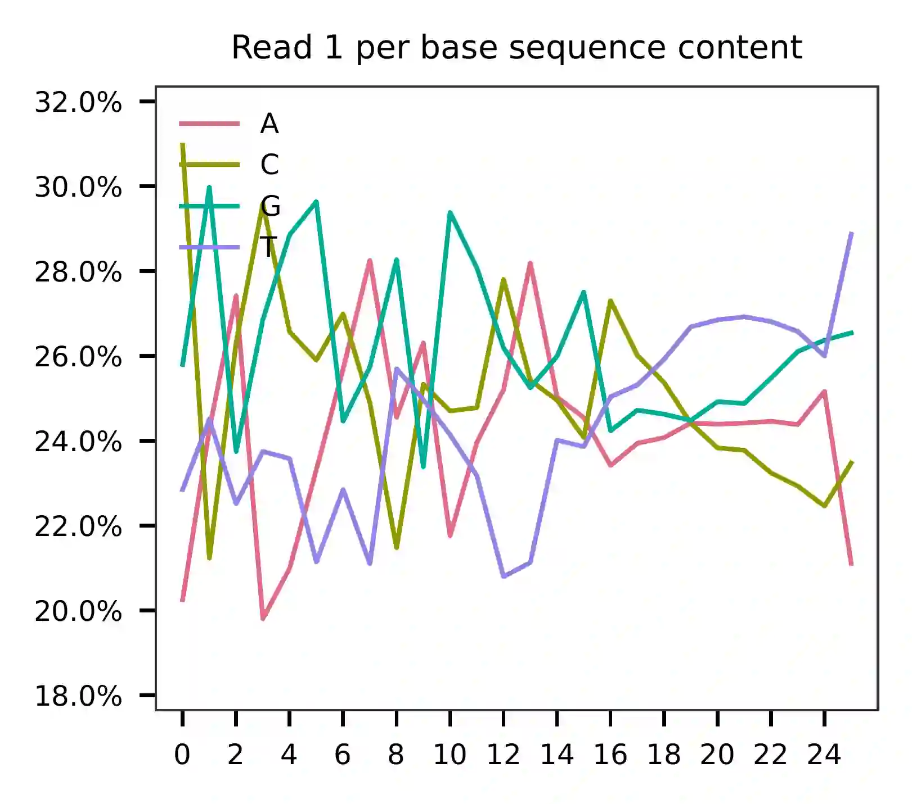

As for read 2, based on the per base content, it suggests that bases
0-12 are actually our feature barcodes (See the distribution of matched
barcode positions on read 2).

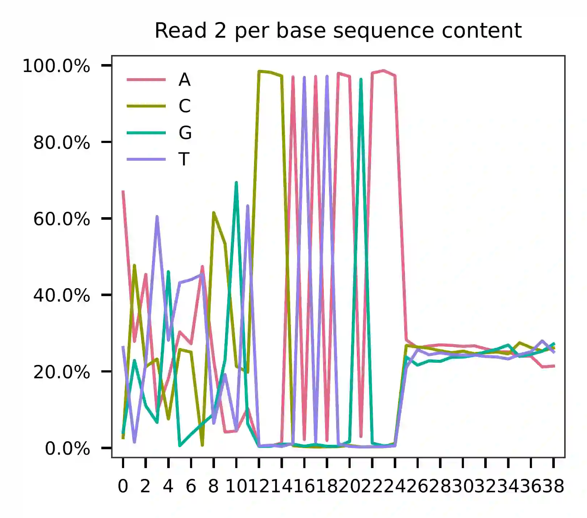

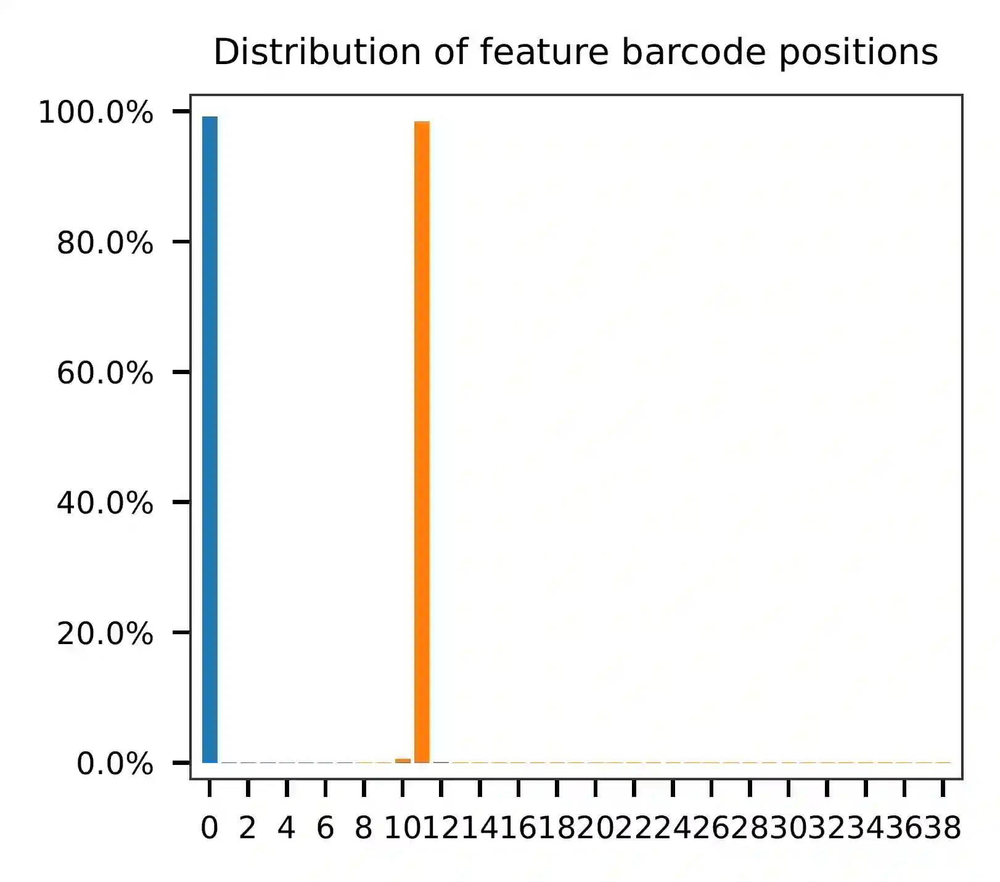

The detailed qc results are stored in
``feature_barcoding_output.tsv.gz`` file. ``matching_pos`` columns
indicate the matched positions on reads. ``matching_description``
columns indicate mismatches in ``substitutions:insertions:deletions``
format.

.. code:: console

   $ gzip -dc qc/feature_barcoding_output.tsv.gz | head

   read1_seq       cell_barcode    cb_matching_pos cb_matching_description read2_seq       feature_barcode fb_matching_pos fb_matching_description
   NGACGGCGTGTGACGAACGCGCGCCT      GACGCGTGTGCGAAAC        1:18    0:2:1   ACATGTTACCGTCCCATATAAGAAAAGGCGCGCGTTCGT Hashtag_1_ACATGTTACCGT  0:12    0:0:0
   NCTACACCACGGTAGAGACCTAGGTC      CACCACTGTGAGTGAC        4:19    2:0:1   AGGACCATCCAACCCATATAAGAAAGACCTAGGTCTCTA Hashtag_A_AGGACCATCCAA  0:12    0:0:0
   GCAAACTAGATGGCGTCGACGCTTAG      GCAAACTAGATGGCGT        0:16    0:0:0   AGCTTACTATCCCCCATATAGAAGCTAAGCGTCGACGCC Hashtag_2_AGCTTACTATCC  0:12    0:0:0
   CCTTCGAAGTGCCATTCTTTCACTGG      CCTTCGAAGTGCCATT        0:16    0:0:0   TATCACATCGGTCCCATATAAGAAACCAGTGAAAGAATG Hashtag_3_TATCACATCGGT  0:12    0:0:0
   NGATCTGGTATGAAACGATCAGGTCA      AGATCTGGTATGAAAC        0:16    1:0:0   AGCTTACTATCCCCCATATAAGAAATGACCTGATCGTTT Hashtag_2_AGCTTACTATCC  0:12    0:0:0
   NTCGGGATCTGTGCAAATCGGGTAGT      CTCGGGATCTGTGCAA        0:16    1:0:0   AGCTTACTATCCCCCATATAAGAAACTACCCGATTTGCA Hashtag_2_AGCTTACTATCC  0:12    0:0:0
   GCGCGATGTACTTAGCTGCGTAGGTG      GCGCGATGTACTTAGC        0:16    0:0:0   TATCACATCGGTCCCATATAAGAAACACCTACGCAGCTA Hashtag_3_TATCACATCGGT  0:12    0:0:0
   AACCGCGCACACAGAGCGTTTGGCCG      AACCGCGCACACAGAG        0:16    0:0:0   ACATGTTACCGTCCCATATAAGAAACGGCCAAACGCTCT Hashtag_1_ACATGTTACCGT  0:12    0:0:0
   NAATGAACATGCGCACACGATAGTTT      no_match        NA      NA      TATCACATCGGTCCCATATAAGAAAAAACTATCGTGTGC NA      NA      NA

Barcode extraction
==================

The lengths of cell and feature barcodes are all identical (16 and 12,
respectively). And based on the ``qc`` results, the distributions of
starting and ending positions of cell and feature barcodes are very
uniform. Search ranges are set to ``0,16`` on read 1 and ``0,12`` on
read 2. One mismatch for cell and feature barcodes (``-cb_m``,
``-cf_m``) are allowed. And by default, three ambiguous nucleotides (Ns)
for read 1 and read 2 (``-cb_n``, ``-cf_n``) are allowed.

.. code:: console

   $ fba extract \
       -1 SRR8550947_1.fastq.gz \
       -2 SRR8550947_2.fastq.gz \
       -w cell_barcodes.txt \
       -f feature_barcodes_hashtag.tsv \
       -o feature_barcoding_output.tsv.gz \
       -r1_c 0,16 \
       -r2_c 0,12 \
       -cb_m 1 \
       -fb_m 1 \
       -cb_n 3 \
       -fb_n 3

Preview of result.

.. code:: console

   $ gzip -dc feature_barcoding_output.tsv.gz | head

   read1_seq       cell_barcode    cb_num_mismatches       read2_seq       feature_barcode fb_num_mismatches
   NGACGGCGTGTGACGAacgcgcgcct      TGACGGCGTGTGACGA        1       ACATGTTACCGTcccatataagaaaaggcgcgcgttcgt Hashtag_1_ACATGTTACCGT  0
   NCTACACCACGGTAGAgacctaggtc      CCTACACCACGGTAGA        1       AGGACCATCCAAcccatataagaaagacctaggtctcta Hashtag_A_AGGACCATCCAA  0
   GCAAACTAGATGGCGTcgacgcttag      GCAAACTAGATGGCGT        0       AGCTTACTATCCcccatatagaagctaagcgtcgacgcc Hashtag_2_AGCTTACTATCC  0
   CCTTCGAAGTGCCATTctttcactgg      CCTTCGAAGTGCCATT        0       TATCACATCGGTcccatataagaaaccagtgaaagaatg Hashtag_3_TATCACATCGGT  0
   NGATCTGGTATGAAACgatcaggtca      AGATCTGGTATGAAAC        1       AGCTTACTATCCcccatataagaaatgacctgatcgttt Hashtag_2_AGCTTACTATCC  0
   NTCGGGATCTGTGCAAatcgggtagt      CTCGGGATCTGTGCAA        1       AGCTTACTATCCcccatataagaaactacccgatttgca Hashtag_2_AGCTTACTATCC  0
   GCGCGATGTACTTAGCtgcgtaggtg      GCGCGATGTACTTAGC        0       TATCACATCGGTcccatataagaaacacctacgcagcta Hashtag_3_TATCACATCGGT  0
   AACCGCGCACACAGAGcgtttggccg      AACCGCGCACACAGAG        0       ACATGTTACCGTcccatataagaaacggccaaacgctct Hashtag_1_ACATGTTACCGT  0
   TCAGATGAGAATGTTGgtggggcttc      TCAGATGAGAATGTTG        0       TATCACATCGGTcccatataagaaagaagccccaccaac Hashtag_3_TATCACATCGGT  0

Result summary.

57.0% (4,897,995 out of 8,591,807) of total read pairs have valid cell
and feature barcodes.

.. code:: console

   2022-01-08 16:35:05,778 - fba.__main__ - INFO - fba version: 0.0.x
   2022-01-08 16:35:05,778 - fba.__main__ - INFO - Initiating logging ...
   2022-01-08 16:35:05,778 - fba.__main__ - INFO - Python version: 3.7
   2022-01-08 16:35:05,778 - fba.__main__ - INFO - Using extract subcommand ...
   2022-01-08 16:35:05,791 - fba.levenshtein - INFO - Number of reference cell barcodes: 6,871
   2022-01-08 16:35:05,791 - fba.levenshtein - INFO - Number of reference feature barcodes: 10
   2022-01-08 16:35:05,791 - fba.levenshtein - INFO - Read 1 coordinates to search: [0, 16)
   2022-01-08 16:35:05,791 - fba.levenshtein - INFO - Read 2 coordinates to search: [0, 12)
   2022-01-08 16:35:05,791 - fba.levenshtein - INFO - Cell barcode maximum number of mismatches: 1
   2022-01-08 16:35:05,792 - fba.levenshtein - INFO - Feature barcode maximum number of mismatches: 1
   2022-01-08 16:35:05,792 - fba.levenshtein - INFO - Read 1 maximum number of N allowed: 3
   2022-01-08 16:35:05,792 - fba.levenshtein - INFO - Read 2 maximum number of N allowed: 3
   2022-01-08 16:35:05,984 - fba.levenshtein - INFO - Matching ...
   2022-01-08 16:38:39,570 - fba.levenshtein - INFO - Number of read pairs processed: 8,591,807
   2022-01-08 16:38:39,572 - fba.levenshtein - INFO - Number of read pairs w/ valid barcodes: 4,897,995
   2022-01-08 16:38:39,582 - fba.__main__ - INFO - Done.

Matrix generation
=================

Only fragments with valid (passed the criteria) cell and feature
barcodes are included. UMI deduplication is powered by UMI-tools
(`Smith, T., et al. 2017. Genome Res. 27, 491–499.`_). Use ``-us`` to
set the UMI starting position on read 1 (default ``16``). Use ``-ul`` to
set the UMI length (default ``12``). Fragments with UMI length less than
this value are discarded. Use ``-um`` to set mismatch threshold (default
``1``). UMI deduplication method is set by ``-ud`` (default
``directional``).

.. _smith, t., et al. 2017. genome res. 27, 491–499.: http://www.genome.org/cgi/doi/10.1101/gr.209601.116

The generated feature count matrix can be easily imported into
well-established single cell analysis packages: Seruat_ and Scanpy_.

.. _scanpy: https://scanpy.readthedocs.io/en/stable

.. _seruat: https://satijalab.org/seurat/

.. code:: console

   $ fba count \
       -i feature_barcoding_output.tsv.gz \
       -o matrix_featurecount.csv.gz \
       -us 16 \
       -ul 10 \
       -um 1 \
       -ud directional

Result summary.

31.3% (1,531,088 out of 4,897,995) of read pairs with valid cell and
feature barcodes are unique fragments. 17.8% (1,531,088 out of
8,591,807) of total sequenced read pairs contribute to the final matrix
with an average of 55 UMIs per cell.

.. code:: console

   2022-01-08 16:41:49,871 - fba.__main__ - INFO - fba version: 0.0.x
   2022-01-08 16:41:49,871 - fba.__main__ - INFO - Initiating logging ...
   2022-01-08 16:41:49,871 - fba.__main__ - INFO - Python version: 3.7
   2022-01-08 16:41:49,871 - fba.__main__ - INFO - Using demultiplex subcommand ...
   2022-01-08 16:42:01,202 - fba.__main__ - INFO - Skipping arguments: "-p/--prob"
   2022-01-08 16:42:01,203 - fba.demultiplex - INFO - Output directory: demultiplexed
   2022-01-08 16:42:01,203 - fba.demultiplex - INFO - Demultiplexing method: 1
   2022-01-08 16:42:01,203 - fba.demultiplex - INFO - UMI normalization method: clr
   2022-01-08 16:42:01,203 - fba.demultiplex - INFO - Visualization: On
   2022-01-08 16:42:01,203 - fba.demultiplex - INFO - Visualization method: tsne
   2022-01-08 16:42:01,203 - fba.demultiplex - INFO - Loading feature count matrix: matrix_featurecount.csv.gz ...
   2022-01-08 16:42:01,479 - fba.demultiplex - INFO - Number of cells: 6,871
   2022-01-08 16:42:01,479 - fba.demultiplex - INFO - Number of positive cells for a feature to be included: 200
   2022-01-08 16:42:01,498 - fba.demultiplex - INFO - Number of features: 10 / 10 (after filtering / original in the matrix)
   2022-01-08 16:42:01,498 - fba.demultiplex - INFO - Features: Hashtag_1 Hashtag_2 Hashtag_3 Hashtag_A Hashtag_B Hashtag_C Hashtag_D Hashtag_E Hashtag_F Hashtag_G
   2022-01-08 16:42:01,499 - fba.demultiplex - INFO - Total UMIs: 1,531,088 / 1,531,088
   2022-01-08 16:42:01,507 - fba.demultiplex - INFO - Median number of UMIs per cell: 55.0 / 55.0
   2022-01-08 16:42:01,507 - fba.demultiplex - INFO - Demultiplexing ...
   2022-01-08 16:44:11,296 - fba.demultiplex - INFO - Generating heatmap ...
   2022-01-08 16:44:17,314 - fba.demultiplex - INFO - Embedding ...
   2022-01-08 16:44:28,444 - fba.__main__ - INFO - Done.

Demultiplexing
==============

Cells are classified based on the abundance of features (hashtags, no
transcriptome information used). Demultiplexing method ``1`` (set by
``-dm``) is implemented based on the method described in `Stoeckius, M.,
et al. (2018) <https://doi.org/10.1186/s13059-018-1603-1>`_ with some
modifications. A cell identity matrix is generated in the output
directory (set by ``--output_directory``, default ``demultiplexed``): 0
means negative, 1 means positive. Use ``-q`` to set the quantile
threshold for demulitplexing (Default ``0.9999``). Set ``-v`` to create
visualization plots.

.. code:: console

   $ fba demultiplex \
       -i matrix_featurecount.csv.gz \
       --output_directory demultiplexed \
       -dm 1 \
       -v

.. code:: console

   2022-01-08 16:41:49,871 - fba.__main__ - INFO - fba version: 0.0.x
   2022-01-08 16:41:49,871 - fba.__main__ - INFO - Initiating logging ...
   2022-01-08 16:41:49,871 - fba.__main__ - INFO - Python version: 3.7
   2022-01-08 16:41:49,871 - fba.__main__ - INFO - Using demultiplex subcommand ...
   2022-01-08 16:42:01,202 - fba.__main__ - INFO - Skipping arguments: "-p/--prob"
   2022-01-08 16:42:01,203 - fba.demultiplex - INFO - Output directory: demultiplexed
   2022-01-08 16:42:01,203 - fba.demultiplex - INFO - Demultiplexing method: 1
   2022-01-08 16:42:01,203 - fba.demultiplex - INFO - UMI normalization method: clr
   2022-01-08 16:42:01,203 - fba.demultiplex - INFO - Visualization: On
   2022-01-08 16:42:01,203 - fba.demultiplex - INFO - Visualization method: tsne
   2022-01-08 16:42:01,203 - fba.demultiplex - INFO - Loading feature count matrix: matrix_featurecount.csv.gz ...
   2022-01-08 16:42:01,479 - fba.demultiplex - INFO - Number of cells: 6,871
   2022-01-08 16:42:01,479 - fba.demultiplex - INFO - Number of positive cells for a feature to be included: 200
   2022-01-08 16:42:01,498 - fba.demultiplex - INFO - Number of features: 10 / 10 (after filtering / original in the matrix)
   2022-01-08 16:42:01,498 - fba.demultiplex - INFO - Features: Hashtag_1 Hashtag_2 Hashtag_3 Hashtag_A Hashtag_B Hashtag_C Hashtag_D Hashtag_E Hashtag_F Hashtag_G
   2022-01-08 16:42:01,499 - fba.demultiplex - INFO - Total UMIs: 1,531,088 / 1,531,088
   2022-01-08 16:42:01,507 - fba.demultiplex - INFO - Median number of UMIs per cell: 55.0 / 55.0
   2022-01-08 16:42:01,507 - fba.demultiplex - INFO - Demultiplexing ...
   2022-01-08 16:44:11,296 - fba.demultiplex - INFO - Generating heatmap ...
   2022-01-08 16:44:17,314 - fba.demultiplex - INFO - Embedding ...
   2022-01-08 16:44:28,444 - fba.__main__ - INFO - Done.

Heatmap of the relative abundance of features (hashtags) across all
cells. Each column represents a single cell.

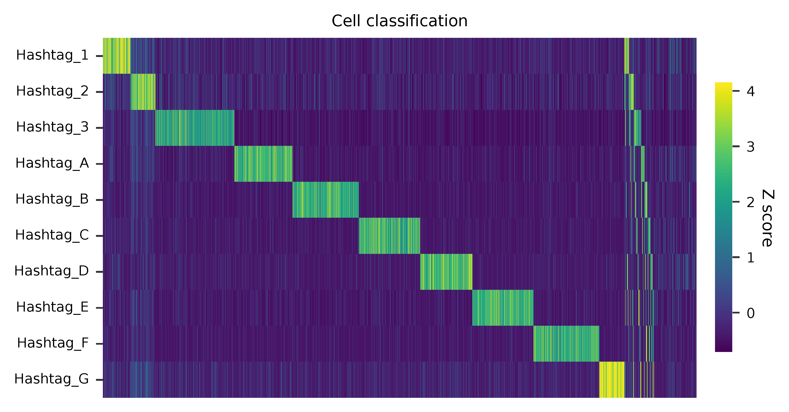

t-SNE embedding of cells based on the abundance of features (hashtags,
no transcriptome information used). Colors indicate the hashtag status
for each cell, as called by FBA.

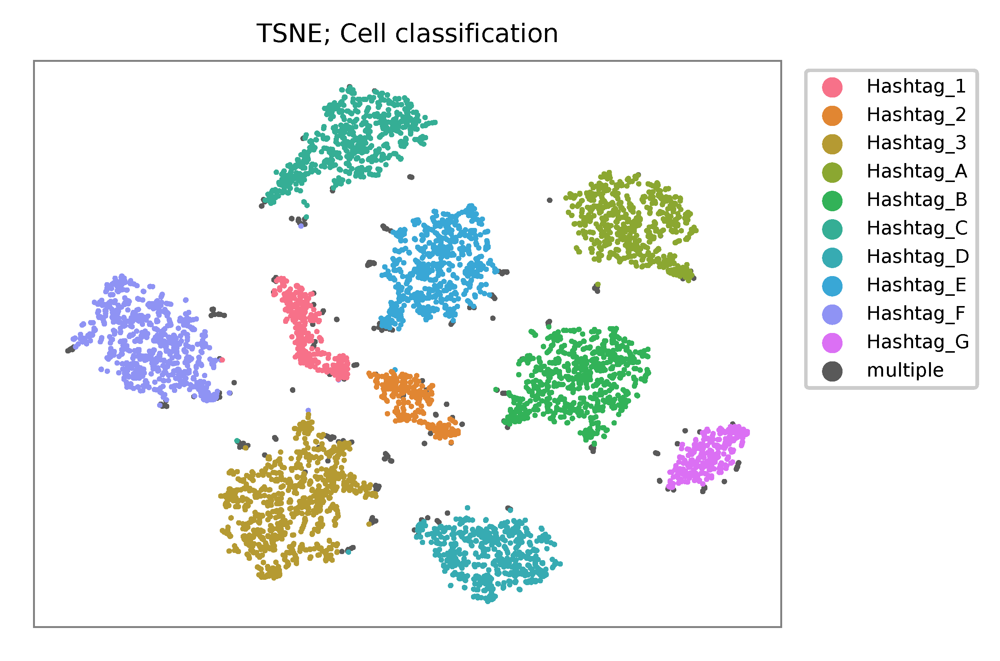

Preview the demultiplexing result: the numbers of singlets, multiplets
and negative cells. In summary, the numbers of MyLa, Sez4, PBMCs and
NIH-3T3 cells demultiplexed are 324, 283, 914 and 4,518 respectively.

.. code:: python

   In [1]: import pandas as pd

   In [2]: m = pd.read_csv("demultiplexed/matrix_cell_identity.csv.gz", index_col=0)

   In [3]: m.loc[:, m.sum(axis=0) == 1].sum(axis=1)
   Out[3]:
   Hashtag_1    324
   Hashtag_2    283
   Hashtag_3    914
   Hashtag_A    673
   Hashtag_B    771
   Hashtag_C    709
   Hashtag_D    603
   Hashtag_E    707
   Hashtag_F    764
   Hashtag_G    291
   dtype: int64

   In [4]: sum(m.sum(axis=0) > 1)
   Out[4]: 341

   In [5]: sum(m.sum(axis=0) == 0)
   Out[5]: 491

|

*************
 Protein-tag
*************

Preparation
===========

Prepare feature barcodes (protein-tag sequences, from `Supplementary
Table 3`_, legend of `Supplementary Figure 1`_):

   All cells were stained with a mix of anti-human CD29 and anti-mouse
   CD29 antibodies.

.. _supplementary table 3: https://www.nature.com/articles/s41592-019-0392-0#MOESM1

.. code:: console

   $ cat feature_barcodes_CD29.tsv

   hCD29   AATAGCGGAGCC
   mCD29   CGAAGACCAAGA

QC
==

.. code:: console

   $ fba qc \
       -1 SRR8550946_1.fastq.gz \
       -2 SRR8550946_2.fastq.gz \
       -w cell_barcodes.txt \
       -f feature_barcodes_CD29.tsv \
       --output_directory qc

.. code:: console

   2022-01-08 12:29:00,323 - fba.__main__ - INFO - fba version: 0.0.x
   2022-01-08 12:29:00,323 - fba.__main__ - INFO - Initiating logging ...
   2022-01-08 12:29:00,323 - fba.__main__ - INFO - Python version: 3.7
   2022-01-08 12:29:00,323 - fba.__main__ - INFO - Using qc subcommand ...
   2022-01-08 12:29:00,896 - fba.qc - INFO - Summarizing per base read content ...
   2022-01-08 12:29:00,896 - fba.qc - INFO - Number of read pairs to analyze: 100,000
   2022-01-08 12:29:00,896 - fba.qc - INFO - Output directory: qc
   2022-01-08 12:29:01,119 - fba.qc - INFO - Number of reads processed: 100,000
   2022-01-08 12:29:03,848 - fba.regex - INFO - regex version: 2.5.91
   2022-01-08 12:29:03,852 - fba.regex - INFO - Number of reference cell barcodes: 6,871
   2022-01-08 12:29:03,852 - fba.regex - INFO - Number of reference feature barcodes: 2
   2022-01-08 12:29:03,852 - fba.regex - INFO - Cell barcode maximum number of mismatches: 3
   2022-01-08 12:29:03,852 - fba.regex - INFO - Feature barcode maximum number of mismatches: 3
   2022-01-08 12:29:03,852 - fba.regex - INFO - Read 1 maximum number of N allowed: inf
   2022-01-08 12:29:03,852 - fba.regex - INFO - Read 2 maximum number of N allowed: inf
   2022-01-08 12:29:03,852 - fba.regex - INFO - Number of read pairs to analyze: 100,000
   2022-01-08 12:29:05,062 - fba.regex - INFO - Number of threads: 72
   2022-01-08 12:29:05,062 - fba.regex - INFO - Chunk size: 50,000
   2022-01-08 12:29:05,062 - fba.regex - INFO - Matching ...
   2022-01-08 12:31:07,626 - fba.regex - INFO - Read pairs processed: 50,000
   2022-01-08 12:33:11,971 - fba.regex - INFO - Read pairs processed: 100,000
   2022-01-08 12:33:13,341 - fba.qc - INFO - Summarizing barcode coordinates ...
   2022-01-08 12:33:13,341 - fba.qc - INFO - Output directory: qc
   2022-01-08 12:33:14,203 - fba.__main__ - INFO - Done.

As for read 2, based on the per base content, it suggests that bases
0-12 are actually our feature barcodes (See the distribution of matched
barcode positions on read 2).

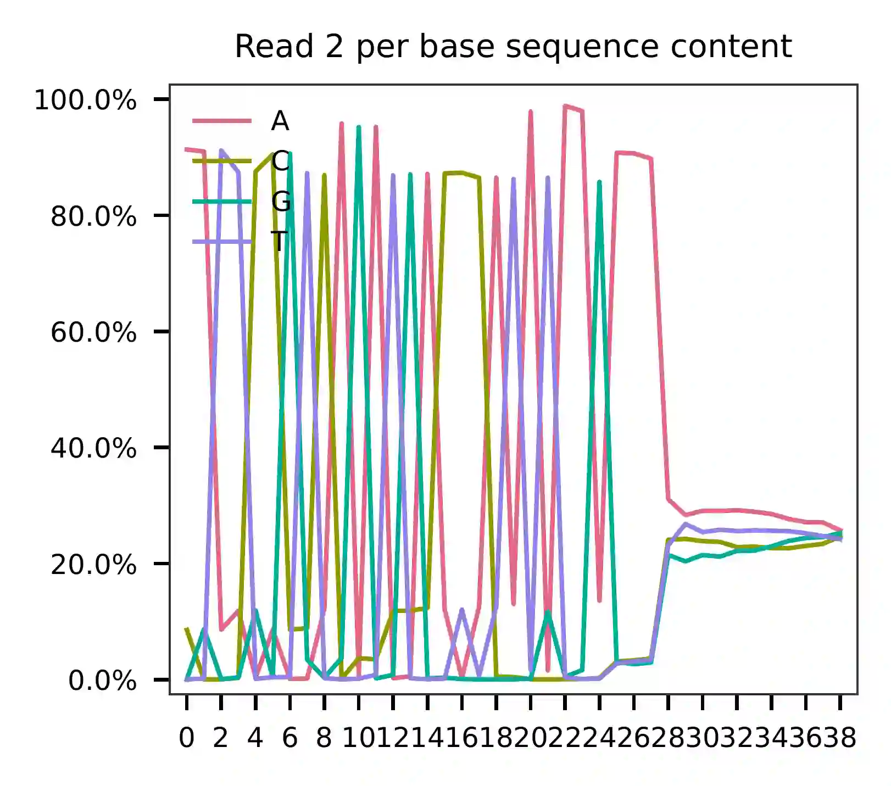

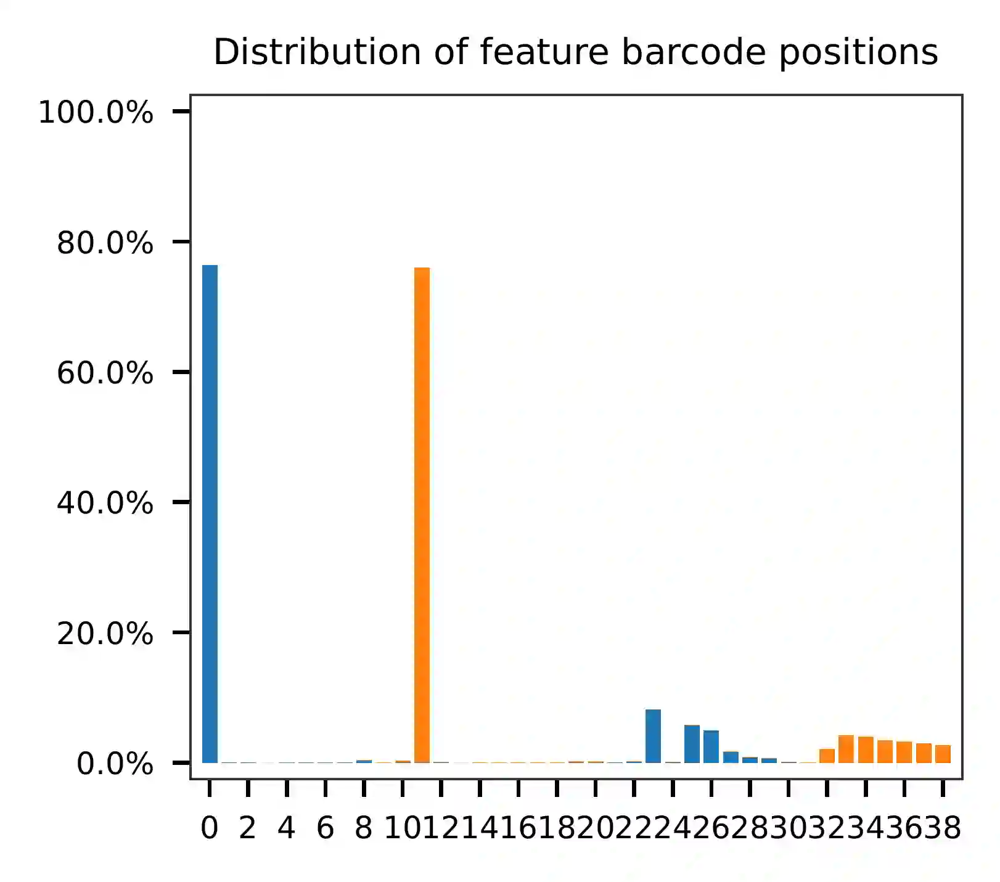

The detailed qc results are stored in
``feature_barcoding_output.tsv.gz`` file. ``matching_pos`` columns
indicate the matched positions on reads. ``matching_description``
columns indicate mismatches in ``substitutions:insertions:deletions``
format.

.. code:: console

   $ gzip -dc feature_barcoding_output.tsv.gz | head -20

   read1_seq       cell_barcode    cb_matching_pos cb_matching_description read2_seq       feature_barcode fb_matching_pos fb_matching_description
   NAGCCGATCACGCGGTCTGGTGGGCA      CAGCCGATCACGCGGT        0:16    1:0:0   AATTCCGTCAGATGACCCATATAAGAAATGCCCACCAGA no_match        NA      NA
   NACACAAGTCTCCCTAGGCCTGTGAC      CAAGATCTCCCTTGTG        4:18    1:0:2   AATTCCGTCAGATGACCCATATAAGAAAGTCACAGGCCT no_match        NA      NA
   TGTATTCAGGAGTCTGAATTGTAATA      CTCGAGGAGATCTGAA        4:18    1:0:2   AATTCCGTCAGATGACCCATATAAGAAATATTACAATTC no_match        NA      NA
   NCGTCAAGTGCCTGGTGCTCCTGTAT      ACGTCAAGTGCCTGGT        0:16    1:0:0   CGAAGACCAAGACCCATATAAGAAAATACAGGAGCACCA mCD29_CGAAGACCAAGA      0:12    0:0:0
   CTAGAGTAGATCGATACGCGGATGGT      CTAGAGTAGATCTGAA        0:15    1:0:1   CGAAGACCAAGACCCATATAAGAAAACCATCCGCGTATC mCD29_CGAAGACCAAGA      0:12    0:0:0
   NATCGGGGTCGAACAGGGAGCGTCAG      AACCGCGAGCGTCAAG        11:26   2:0:1   AATTCCGTCAGATGACCCATATAAGAAACTGACGCTCCC no_match        NA      NA
   AAAGCAAAGACAAGCCAGTATTTACG      ACACCAAGTCCAGTAT        7:21    1:0:2   AATTCCGTCAGATGACCCATATAAGAAACGTAAATACTG no_match        NA      NA
   AAGCCGCGTCTCAACAACAGACTACG      AAGCCGCGTCTCAACA        0:16    0:0:0   AATTCCGTCAGATGACCCATATAAGAAACGTAGTCTGTT no_match        NA      NA
   ACGGAGAAGCGCCTCACTCTATCTTC      ATCCGAAAGCGCCTCA        0:16    1:1:1   AATTCCGTCAGATGACCCATATAAGAAAGAAGATAGAGT no_match        NA      NA
   TCGTACCCACCATCCTACACCGGCAC      CGGAGTCCACCATCCT        1:16    2:0:1   AATTCCGTCAGATGACCCATATAAGAAAAGTGCCGGTGT no_match        NA      NA
   ACAGCTACAGTATGCTTAAAAACAGG      ACAGCTAAGTACTTGC        0:15    0:1:2   AATTCCGTCAGATGACCCATATAAGAAACCTGTTTTTAA no_match        NA      NA
   NTAAGACGTCTAAACCGAGCTGGCAC      CAGCAGCGTCTAAACC        2:16    1:0:2   AATTCCGTCAGATGACCCATATAAGAAAGTGCCAGCTCG no_match        NA      NA
   TCTCTAATCCAGTATGCCTCTCTTGA      AATCCAGTCCGCATCT        5:21    3:0:0   AATTCCGTCAGATGACCCATATAAGAAATCAAGAGAGGC mCD29_CGAAGACCAAGA      23:34   2:0:1
   GACAGAGTCGCATGATTAAAAATCAA      ACAGCTATCGCATGAT        1:16    2:0:1   AATTCCGTCAGATGACCCATATAAGAAATTGATTTTTAA no_match        NA      NA
   NTGAGGGTCTCCAACCGCTTTCTAAT      GATCGCGTCTCCAACC        2:16    1:0:2   AATTCCGTCAGATGACCCATATAAGAAAATTAGAAAGCG no_match        NA      NA
   NAGCTGGTCGCCAAATACGTATAACT      GCCAAATTCGATAGAA        9:24    2:0:1   AATTCCGTCAGATGACCCATATAAGAAAAGTTATACGTA no_match        NA      NA
   GTGCGGTAGTGTTGAAGGTTTATAAT      AGTAGTCAGAAGGTTT        7:21    1:0:2   AATTCCGTCAGATGACCCATATAAGAAAATTATAAACCT no_match        NA      NA
   NGAGCACGTGCCTGTGCTACTAGTAC      ACGCCAGGTGCCTGTG        2:16    1:0:2   AATTCCGTCAGATGACCCATATAAGAAAGTACTAGTAGC no_match        NA      NA
   CGGGTCAAGACACTAAAAAACCTGCT      ACACTGACAAACTGCT        9:26    2:1:0   AATTCCGTCAGATGACCCATATAAGAAAAGCAGGTTTTT no_match        NA      NA

Barcode extraction
==================

.. code:: console

   $ fba extract \
       -1 SRR8550946_1.fastq.gz \
       -2 SRR8550946_2.fastq.gz \
       -w cell_barcodes.txt \
       -f feature_barcodes_CD29.tsv \
       -o feature_barcoding_output.tsv.gz \
       -r1_c 0,16 \
       -r2_c 0,12 \
       -cb_m 2

Preview of result.

.. code:: console

   $ gzip -dc feature_barcoding_output.tsv.gz | head

   read1_seq       cell_barcode    cb_num_mismatches       read2_seq       feature_barcode fb_num_mismatches
   NCGTCAAGTGCCTGGTgctcctgtat      ACGTCAAGTGCCTGGT        1       CGAAGACCAAGAcccatataagaaaatacaggagcacca mCD29_CGAAGACCAAGA      0
   CTAGAGTAGATCGATAcgcggatggt      CTAGAGTAGATCTGAA        2       CGAAGACCAAGAcccatataagaaaaccatccgcgtatc mCD29_CGAAGACCAAGA      0
   GGAAAGCCAATCCGATatcccgtatc      GGAAAGCCAATCCGAT        0       CGAAGACCAAGAcccatataagaaagatacgggatatcg mCD29_CGAAGACCAAGA      0
   GCAAACTCAAACAACAaaccttaagg      GCAAACTCAAACAACA        0       CGAAGACCAAGAcccatataagaaaccttaaggtttgtt mCD29_CGAAGACCAAGA      0
   GTTACAGGTCTCCACTaatagaaggg      GTTACAGGTCTCCACT        0       AATAGCGGAGCCcccatataagaaacccttctattagtg hCD29_AATAGCGGAGCC      0
   CGGACACAGGGCTTCCaaagttttag      CGGACACAGGGCTTCC        0       AATAGCGGAGCCcccatataagaaactaaaactttggaa hCD29_AATAGCGGAGCC      0
   TACGGATTCACCACCTcaccctcttg      TACGGATTCACCACCT        0       CGAAGACCAAGAcccatataagaaacaagagggtgaggt mCD29_CGAAGACCAAGA      0
   GCTTCCAGTTCCCTTGcagacaagag      GCTTCCAGTTCCCTTG        0       CGAAGACCAAGAcccatataagaaactcttgtctgcaag mCD29_CGAAGACCAAGA      0
   CTGCCTAGTGAAATCAatggggaggc      CTGCCTAGTGAAATCA        0       CGAAGACCAAGAcccatataagaaagcctccccattgat mCD29_CGAAGACCAAGA      0

Result summary.

5.9% (256,759 out of 4,372,604) of total read pairs have valid cell and
feature barcodes.

.. code:: console

   2022-01-08 12:33:14,547 - fba.__main__ - INFO - fba version: 0.0.x
   2022-01-08 12:33:14,547 - fba.__main__ - INFO - Initiating logging ...
   2022-01-08 12:33:14,547 - fba.__main__ - INFO - Python version: 3.7
   2022-01-08 12:33:14,547 - fba.__main__ - INFO - Using extract subcommand ...
   2022-01-08 12:33:14,561 - fba.levenshtein - INFO - Number of reference cell barcodes: 6,871
   2022-01-08 12:33:14,561 - fba.levenshtein - INFO - Number of reference feature barcodes: 2
   2022-01-08 12:33:14,561 - fba.levenshtein - INFO - Read 1 coordinates to search: [0, 16)
   2022-01-08 12:33:14,561 - fba.levenshtein - INFO - Read 2 coordinates to search: [0, 12)
   2022-01-08 12:33:14,561 - fba.levenshtein - INFO - Cell barcode maximum number of mismatches: 2
   2022-01-08 12:33:14,561 - fba.levenshtein - INFO - Feature barcode maximum number of mismatches: 1
   2022-01-08 12:33:14,561 - fba.levenshtein - INFO - Read 1 maximum number of N allowed: 3
   2022-01-08 12:33:14,561 - fba.levenshtein - INFO - Read 2 maximum number of N allowed: 3
   2022-01-08 12:33:15,856 - fba.levenshtein - INFO - Matching ...
   2022-01-08 12:37:37,930 - fba.levenshtein - INFO - Number of read pairs processed: 4,372,604
   2022-01-08 12:37:37,931 - fba.levenshtein - INFO - Number of read pairs w/ valid barcodes: 256,759
   2022-01-08 12:37:37,985 - fba.__main__ - INFO - Done.

Matrix generation
=================

.. code:: console

   $ fba count \
       -i feature_barcoding_output.tsv.gz \
       -o matrix_featurecount.csv.gz \
       -us 16 \
       -ul 10 \
       -um 1 \
       -ud directional

Result summary.

96.2% (246,996 out of 256,759) of read pairs with valid cell and feature
barcodes are unique fragments. 5.6% (246,996 out of 4,372,604) of total
sequenced read pairs contribute to the final matrix with an average of
29 UMIs per cell.

.. code:: console

   2022-01-08 12:37:38,233 - fba.__main__ - INFO - fba version: 0.0.x
   2022-01-08 12:37:38,233 - fba.__main__ - INFO - Initiating logging ...
   2022-01-08 12:37:38,233 - fba.__main__ - INFO - Python version: 3.7
   2022-01-08 12:37:38,233 - fba.__main__ - INFO - Using count subcommand ...
   2022-01-08 12:37:39,087 - fba.count - INFO - UMI-tools version: 1.1.1
   2022-01-08 12:37:39,090 - fba.count - INFO - UMI starting position on read 1: 16
   2022-01-08 12:37:39,090 - fba.count - INFO - UMI length: 10
   2022-01-08 12:37:39,090 - fba.count - INFO - UMI-tools deduplication threshold: 1
   2022-01-08 12:37:39,090 - fba.count - INFO - UMI-tools deduplication method: directional
   2022-01-08 12:37:39,090 - fba.count - INFO - Header line: read1_seq cell_barcode cb_num_mismatches read2_seq feature_barcode fb_num_mismatches
   2022-01-08 12:37:39,587 - fba.count - INFO - Number of lines processed: 256,759
   2022-01-08 12:37:39,590 - fba.count - INFO - Number of cell barcodes detected: 6,871
   2022-01-08 12:37:39,590 - fba.count - INFO - Number of features detected: 2
   2022-01-08 12:37:40,917 - fba.count - INFO - Total UMIs after deduplication: 246,996
   2022-01-08 12:37:40,926 - fba.count - INFO - Median number of UMIs per cell: 29.0
   2022-01-08 12:37:40,983 - fba.__main__ - INFO - Done.

t-SNE embedding of cells based on the abundance of features (hashtags,
no transcriptome information used). Colors indicate the hashtag status
for each cell, as called by FBA, and the abundance of protein tags. This
is a re-creation of `Fig. 1c`_ in `Mimitou, E.P., et al. (2019)`_ (The
embedding is based on hashtags, not the transcriptomes).

.. _fig. 1c: https://www.nature.com/articles/s41592-019-0392-0/figures/1

.. _mimitou, e.p., et al. (2019): https://doi.org/10.1038/s41592-019-0392-0

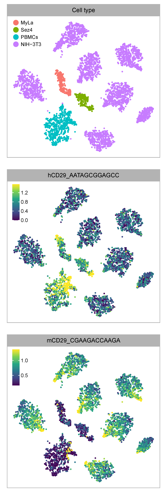

|

***********
 Guide-tag
***********

Preparation
===========

Prepare feature barcodes (guide-tag sequences, from `Supplementary Table
2`_, `Supplementary Figure 1`_\c).

.. _supplementary table 2: https://www.nature.com/articles/s41592-019-0392-0#MOESM1

.. code:: console

   $ cat feature_barcodes_guide-tag.tsv

   mNT1    CGCGGAGCCGAATACCTCG
   mNT2    CGTCGAACCTCCGTGAAAG
   mNT3    ATCGAGCCGAACTGCAACT
   mNT4    AAGGCGTTCGCCTTACACG
   mNT5    GACATTTAGTACCCGGAGT
   mNT6    CTCGTTCCCTAACGGCGCG
   mNT7    CCCGTAGACGGTCGAACAA
   mNT8    CCATATCGCACCCGATGGG
   mNT9    TTACTAGCAGGTGACGCCC
   mNT10   AATACGTTGCGAGTAGAAG

QC
==

.. code:: console

   $ fba qc \
       -1 SRR8550948_1.fastq.gz \
       -2 SRR8550948_2.fastq.gz \
       -w cell_barcodes.txt \
       -f feature_barcodes_guide-tag.tsv \
       --output_directory qc

.. code:: console

   2022-01-08 14:39:46,616 - fba.__main__ - INFO - fba version: 0.0.x
   2022-01-08 14:39:46,616 - fba.__main__ - INFO - Initiating logging ...
   2022-01-08 14:39:46,617 - fba.__main__ - INFO - Python version: 3.7
   2022-01-08 14:39:46,617 - fba.__main__ - INFO - Using qc subcommand ...
   2022-01-08 14:39:47,209 - fba.qc - INFO - Summarizing per base read content ...
   2022-01-08 14:39:47,209 - fba.qc - INFO - Number of read pairs to analyze: 100,000
   2022-01-08 14:39:47,209 - fba.qc - INFO - Output directory: qc
   2022-01-08 14:39:47,428 - fba.qc - INFO - Number of reads processed: 100,000
   2022-01-08 14:39:50,099 - fba.regex - INFO - regex version: 2.5.91
   2022-01-08 14:39:50,103 - fba.regex - INFO - Number of reference cell barcodes: 6,871
   2022-01-08 14:39:50,103 - fba.regex - INFO - Number of reference feature barcodes: 10
   2022-01-08 14:39:50,103 - fba.regex - INFO - Cell barcode maximum number of mismatches: 3
   2022-01-08 14:39:50,103 - fba.regex - INFO - Feature barcode maximum number of mismatches: 3
   2022-01-08 14:39:50,103 - fba.regex - INFO - Read 1 maximum number of N allowed: inf
   2022-01-08 14:39:50,103 - fba.regex - INFO - Read 2 maximum number of N allowed: inf
   2022-01-08 14:39:50,103 - fba.regex - INFO - Number of read pairs to analyze: 100,000
   2022-01-08 14:39:51,295 - fba.regex - INFO - Number of threads: 72
   2022-01-08 14:39:51,296 - fba.regex - INFO - Chunk size: 50,000
   2022-01-08 14:39:51,296 - fba.regex - INFO - Matching ...
   2022-01-08 14:40:49,770 - fba.regex - INFO - Read pairs processed: 50,000
   2022-01-08 14:41:50,088 - fba.regex - INFO - Read pairs processed: 100,000
   2022-01-08 14:41:51,366 - fba.qc - INFO - Summarizing barcode coordinates ...
   2022-01-08 14:41:51,366 - fba.qc - INFO - Output directory: qc
   2022-01-08 14:41:52,542 - fba.__main__ - INFO - Done.

As for read 2, based on the per base content, it suggests that bases
15-34 are actually our feature barcodes (See the distribution of matched
barcode positions on read 2).

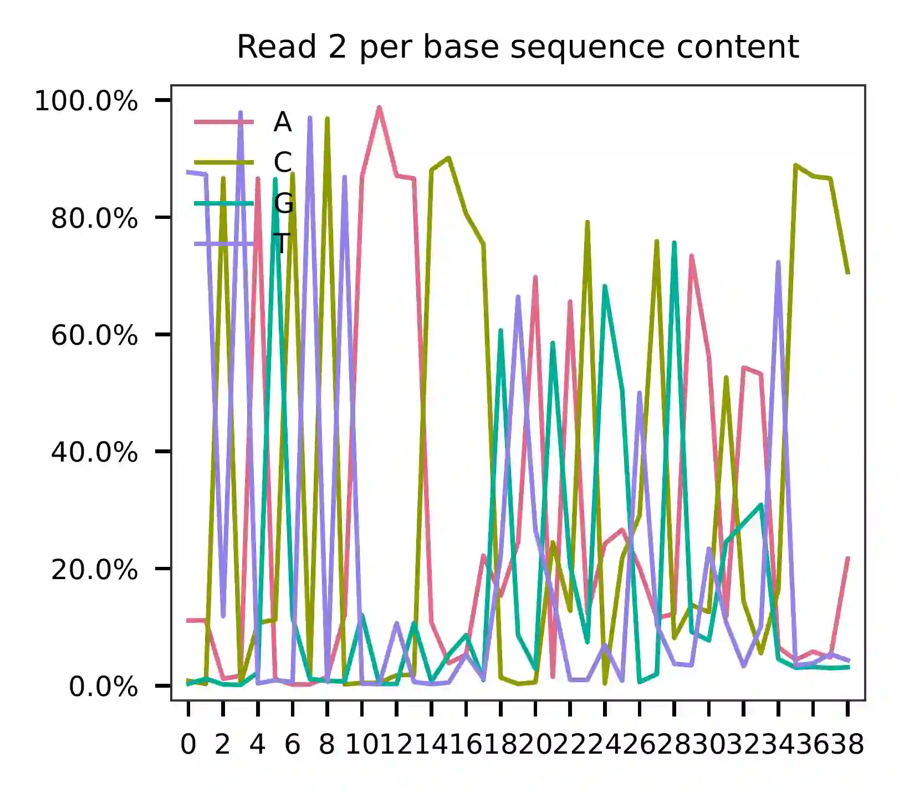

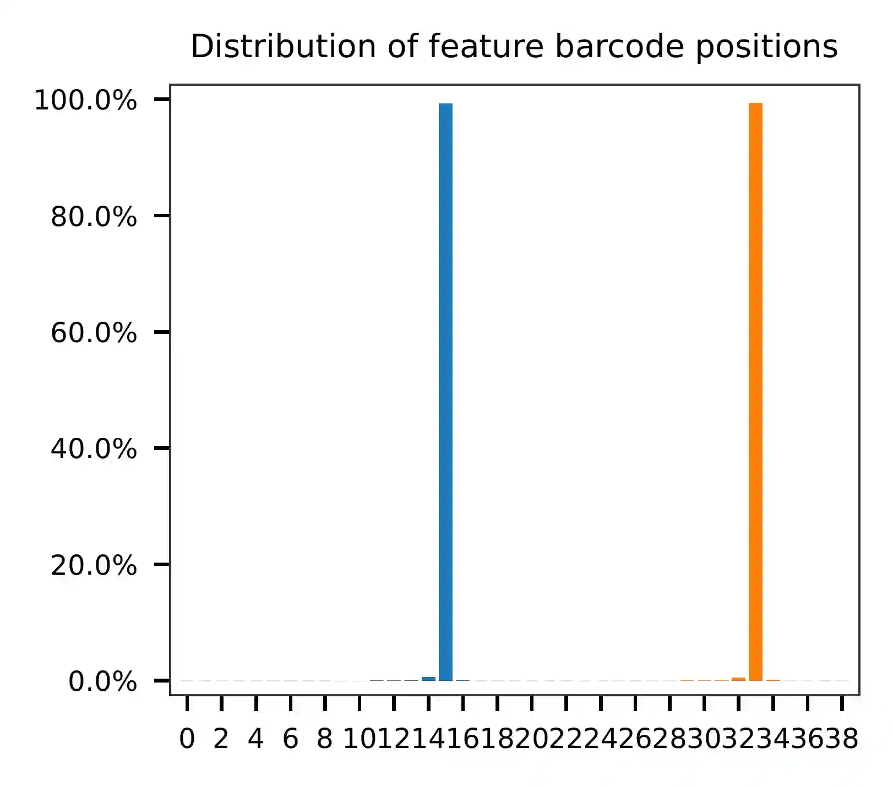

The detailed qc results are stored in
``feature_barcoding_output.tsv.gz`` file. ``matching_pos`` columns
indicate the matched positions on reads. ``matching_description``
columns indicate mismatches in ``substitutions:insertions:deletions``
format.

.. code:: console

   $ gzip -dc feature_barcoding_output.tsv.gz | head

   read1_seq       cell_barcode    cb_matching_pos cb_matching_description read2_seq       feature_barcode fb_matching_pos fb_matching_description
   NTAAGAGGTCTGCAATCTATATGCAA      AGCGGTCCATGCAATC        3:17    1:0:2   TTCTAGCTCTAAAACCCCGTAGACGGTCGAACAATCCCC mNT7_CCCGTAGACGGTCGAACAA        15:34   0:0:0
   ATCCACCGTCATATCGACATGCCACA      ATCCACCGTCATATCG        0:16    0:0:0   TTCTAGCTCTAAAACCCCGTAGACGGTCGAACAATCCCC mNT7_CCCGTAGACGGTCGAACAA        15:34   0:0:0
   TGCCAAACACTGAAGGATGTCGCCAC      ACACTGAAGGATGTAT        6:22    2:0:0   TTCTAGCTCTAAAACGACATTTAGTACCCGGAGTCCCCA mNT5_GACATTTAGTACCCGGAGT        15:34   0:0:0
   NTCGAAGAGGGTATCGTGAAGTGCTT      AGGGATGGTGAAGGCT        7:25    1:2:0   TTCTAGCTCTAAAACCCATATCGCACCCGATGGGTCCCC mNT8_CCATATCGCACCCGATGGG        15:34   0:0:0
   CCTTACGAGTGGACGTGCAGTCAGGT      CCTTACGAGTGGACGT        0:16    0:0:0   TTCTAGCTCTAAAACCTCGTTCCCTAACGGCGCGGCCCA mNT6_CTCGTTCCCTAACGGCGCG        15:34   0:0:0
   GGTACAGGATCGCAAACGCGCAAATT      ACACTGATCGCAAACT        3:18    2:0:1   AATTCCGTCAGATGACCCATATAAGAAATTTGCGCGTTT no_match        NA      NA
   NAAATGATCCAAACTGTAAGGGAAGC      AAACCTGTCCAAACTG        1:16    0:1:2   TTCTAGCTCTAAAACGACATTTAGTACCCGGAGTCCCCA mNT5_GACATTTAGTACCCGGAGT        15:34   0:0:0
   NCACATAAGGAGTTGCGCAACCGCGA      CACATAGAGTTCGCGC        1:18    0:2:1   TTCTAGCTCTAAAACCCATATCGCACCCGATGGGTCCCC mNT8_CCATATCGCACCCGATGGG        15:34   0:0:0
   AGGGTGAAGCGCTTATTAATCGAAGG      AGGGTGAAGCGATGAC        0:16    3:0:0   AATTCCGTCAGATGACCCATATAAGAAACCTTCGATTAA no_match        NA      NA

Barcode extraction
==================

.. code:: console

   $ fba extract \
       -1 SRR8550948_1.fastq.gz \
       -2 SRR8550948_2.fastq.gz \
       -w cell_barcodes.txt \
       -f feature_barcodes_guide-tag.tsv \
       -o feature_barcoding_output.tsv.gz \
       -r1_c 0,16 \
       -r2_c 15,34 \
       -cb_m 2

Result summary.

63.4% (24,425,023 out of 38,537,829) of total read pairs have valid cell
and feature barcodes.

.. code:: console

   2022-01-08 14:41:52,877 - fba.__main__ - INFO - fba version: 0.0.x
   2022-01-08 14:41:52,877 - fba.__main__ - INFO - Initiating logging ...
   2022-01-08 14:41:52,877 - fba.__main__ - INFO - Python version: 3.7
   2022-01-08 14:41:52,877 - fba.__main__ - INFO - Using extract subcommand ...
   2022-01-08 14:41:52,894 - fba.levenshtein - INFO - Number of reference cell barcodes: 6,871
   2022-01-08 14:41:52,895 - fba.levenshtein - INFO - Number of reference feature barcodes: 10
   2022-01-08 14:41:52,895 - fba.levenshtein - INFO - Read 1 coordinates to search: [0, 16)
   2022-01-08 14:41:52,895 - fba.levenshtein - INFO - Read 2 coordinates to search: [15, 34)
   2022-01-08 14:41:52,895 - fba.levenshtein - INFO - Cell barcode maximum number of mismatches: 2
   2022-01-08 14:41:52,895 - fba.levenshtein - INFO - Feature barcode maximum number of mismatches: 1
   2022-01-08 14:41:52,895 - fba.levenshtein - INFO - Read 1 maximum number of N allowed: 3
   2022-01-08 14:41:52,895 - fba.levenshtein - INFO - Read 2 maximum number of N allowed: 3
   2022-01-08 14:41:54,222 - fba.levenshtein - INFO - Matching ...
   2022-01-08 14:54:23,469 - fba.levenshtein - INFO - Read pairs processed: 10,000,000
   2022-01-08 15:06:57,696 - fba.levenshtein - INFO - Read pairs processed: 20,000,000
   2022-01-08 15:19:24,990 - fba.levenshtein - INFO - Read pairs processed: 30,000,000
   2022-01-08 15:30:09,131 - fba.levenshtein - INFO - Number of read pairs processed: 38,537,829
   2022-01-08 15:30:09,131 - fba.levenshtein - INFO - Number of read pairs w/ valid barcodes: 24,425,023
   2022-01-08 15:30:09,188 - fba.__main__ - INFO - Done.

Matrix generation
=================

.. code:: console

   $ fba count \
       -i feature_barcoding_output.tsv.gz \
       -o matrix_featurecount.csv.gz \
       -us 16 \
       -ul 10 \
       -um 1 \
       -ud directional

Result summary.

4.3% (1,050,888 out of 24,425,023) of read pairs with valid cell and
feature barcodes are unique fragments. 2.7% (1,050,888 out of
38,537,829) of total sequenced read pairs contribute to the final matrix
with an average of 102 UMIs per cell.

.. code:: console

   2022-01-08 15:30:09,447 - fba.__main__ - INFO - fba version: 0.0.x
   2022-01-08 15:30:09,447 - fba.__main__ - INFO - Initiating logging ...
   2022-01-08 15:30:09,447 - fba.__main__ - INFO - Python version: 3.7
   2022-01-08 15:30:09,447 - fba.__main__ - INFO - Using count subcommand ...
   2022-01-08 15:30:10,313 - fba.count - INFO - UMI-tools version: 1.1.1
   2022-01-08 15:30:10,316 - fba.count - INFO - UMI starting position on read 1: 16
   2022-01-08 15:30:10,316 - fba.count - INFO - UMI length: 10
   2022-01-08 15:30:10,316 - fba.count - INFO - UMI-tools deduplication threshold: 1
   2022-01-08 15:30:10,316 - fba.count - INFO - UMI-tools deduplication method: directional
   2022-01-08 15:30:10,316 - fba.count - INFO - Header line: read1_seq cell_barcode cb_num_mismatches read2_seq feature_barcode fb_num_mismatches
   2022-01-08 15:30:53,780 - fba.count - INFO - Number of lines processed: 24,425,023
   2022-01-08 15:30:53,785 - fba.count - INFO - Number of cell barcodes detected: 6,867
   2022-01-08 15:30:53,785 - fba.count - INFO - Number of features detected: 10
   2022-01-08 15:31:18,853 - fba.count - INFO - Total UMIs after deduplication: 1,050,888
   2022-01-08 15:31:18,862 - fba.count - INFO - Median number of UMIs per cell: 102.0
   2022-01-08 15:31:19,003 - fba.__main__ - INFO - Done.

t-SNE embedding of cells based on the abundance of features (hashtags,
no transcriptome information used). Colors indicate the guide tag
abundance for each cell, as caculated by FBA. This is a re-creation of
`Fig. 1c`_ (iv) in `Mimitou, E.P., et al. (2019)`_ (The embedding is
based on hashtags, not the transcriptomes).

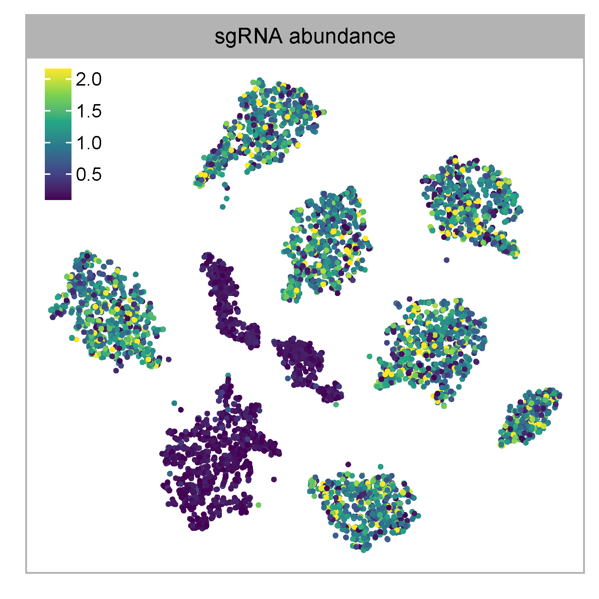

|
