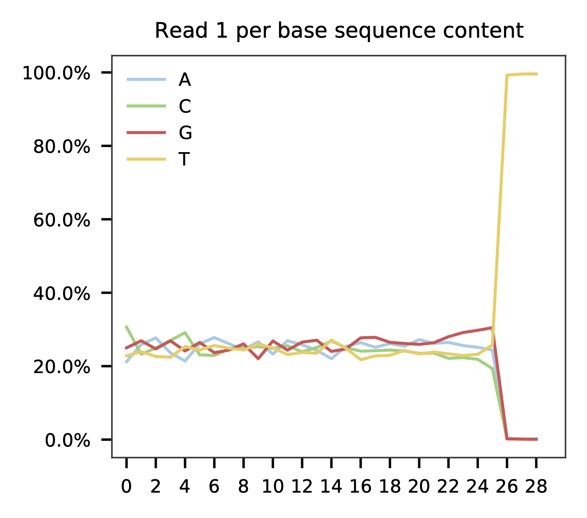
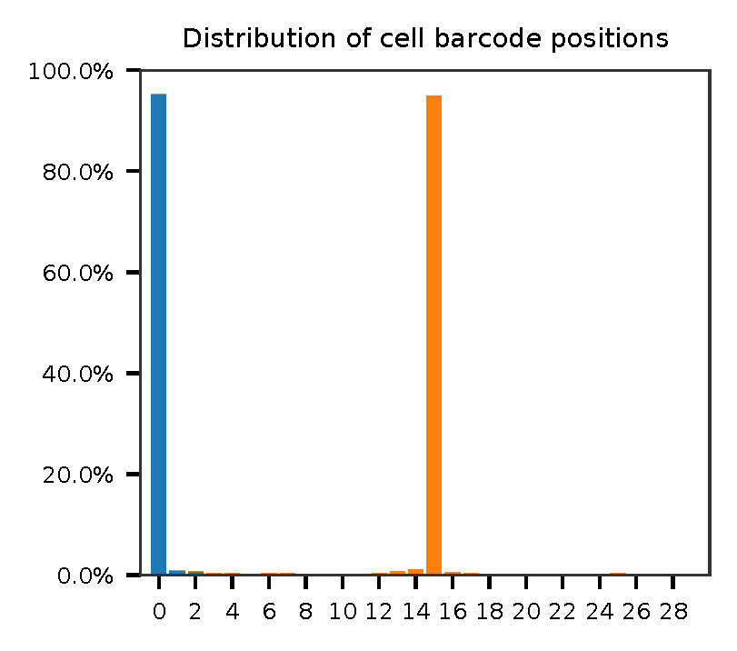
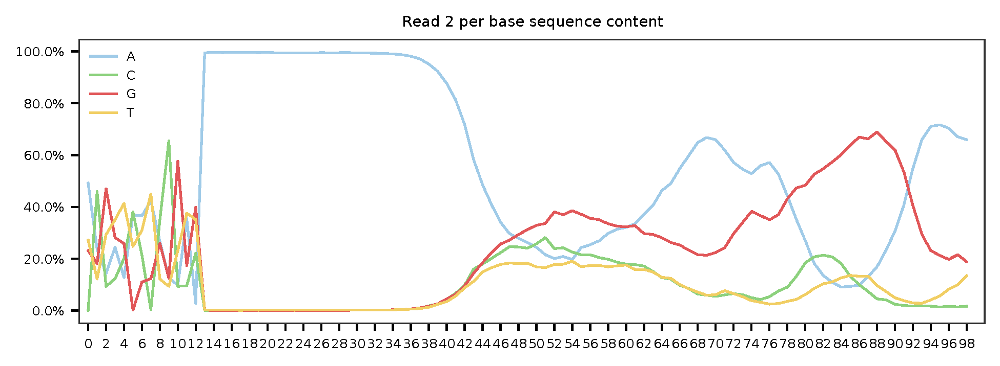
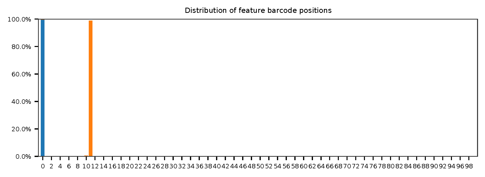
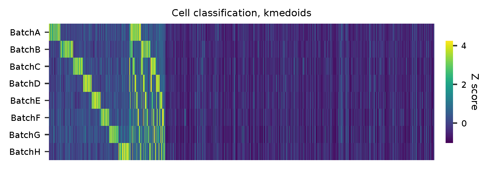
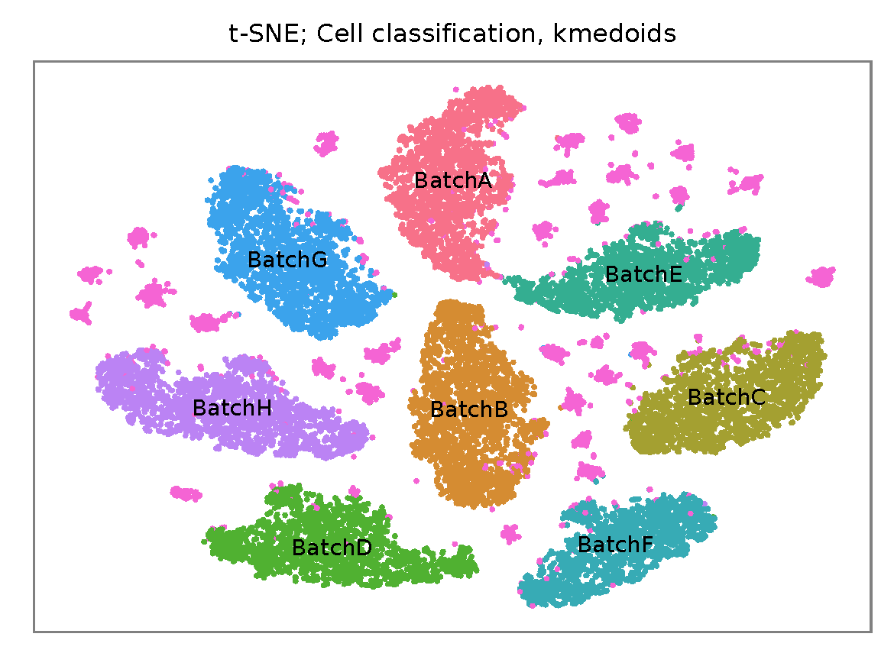

# fba tutorial

Dataset: Cell hashing

Stoeckius, M., Zheng, S., Houck-Loomis, B., Hao, S., Yeung, B.Z., Mauck, W.M., 3rd, Smibert, P., and Satija, R. (2018). [Cell Hashing with barcoded antibodies enables multiplexing and doublet detection for single cell genomics](https://doi.org/10.1186/s13059-018-1603-1). Genome Biol. 19, 224.

<br>

## Preparation

Download fastq files ([NCBI GEO](https://www.ncbi.nlm.nih.gov/geo/query/acc.cgi?acc=GSM2895283)).

```shell
$ wget ftp.sra.ebi.ac.uk/vol1/fastq/SRR828/007/SRR8281307/SRR8281307_1.fastq.gz
$ wget ftp.sra.ebi.ac.uk/vol1/fastq/SRR828/007/SRR8281307/SRR8281307_2.fastq.gz
```

Download cell barcode info. These are the cell-associated barcodes in this single cell RNA-Seq library.

```shell
$ curl -O https://ftp.ncbi.nlm.nih.gov/geo/samples/GSM2895nnn/GSM2895283/suppl/GSM2895283_Hashtag-HTO-count.csv.gz

$ gzip -dc GSM2895283_Hashtag-HTO-count.csv.gz | head -1 | sed 's/,/\n/g' | grep -v '^$' > cell_barcodes.txt
```

Inspect cell barcodes.

```shell
$ head cell_barcodes.txt

GGCGACTAGAGGACGG
CATCAAGGTCTTGTCC
AAACCTGAGTGATCGG
TGAGGGAGTACTTAGC
CCTAAAGAGATGTGGC
AGACGTTTCAGCCTAA
TGGGAAGCAACACCCG
CGATTGATCTTCGGTC
CATCGAAGTGATGCCC
TCAGATGCACGAGAGT
```

Prepare feature barcodes.

```shell
$ gzip -dc GSM2895283_Hashtag-HTO-count.csv.gz | cut -d ',' -f1 | grep Batch | gsed 's/-/\t/g' > feature_barcodes.tsv
```

Inspect feature barcodes.

```shell
$ cat feature_barcodes.tsv

BatchA  AGGACCATCCAA
BatchB  ACATGTTACCGT
BatchC  AGCTTACTATCC
BatchD  TCGATAATGCGA
BatchE  GAGGCTGAGCTA
BatchF  GTGTGACGTATT
BatchG  ACTGTCTAACGG
BatchH  TATCACATCGGT
```

<br>

## QC

Sample the first 10,000 (set by `-n`) read pairs for quality control. Use `-t` to set the number of threads. The diagnostic results and plots are generated in the `qc` directory (`--output_directory`). By default, full length of read 1 and read 2 are searched against known cell and feature barcodes, respectively. The per base content of both read pairs and the distribution of matched barcode positions are summarized. Use `-r1_coords` and/or `-r2_coords` to limit the search range.

```shell
$ fba qc \
    -1 SRR8281307_1.fastq.gz \
    -2 SRR8281307_2.fastq.gz \
    -w cell_barcodes.txt \
    -f feature_barcodes.tsv \
    --output_directory 'qc' \
    -t 10 \
    -n 10000
```

This library is constructed using Chromium Single Cell 3' v2 reagent kit. The first 16 bases are cell barcodes and the following 10 bases are UMIs. Based on the base content plot, the GC content of cell barcodes and UMIs are quite even. Ploy-A/T tail starts at base 26.

<p align='center'>
    
</p>

<p align='center'>
    
</p>

As for read 2, based on per base content, it suggests that bases 0-11 are relatively GC balanced for the reads we have sampled. Staring from base 12, it is poly-A tail. Bases 0-11 are hashtag oligo barcodes. Most of the reads have the correct structure.

<p align='center'>
    
</p>

<p align='center'>
    
</p>

The detailed qc results are stored in `feature_barcoding_output.tsv.gz` file. `matching_pos` columns indicate the matched positions on reads. `matching_description` columns indicate mismatches in substitutions:insertions:deletions format. This is actually the output of regex method in `extract` subcommand.

```shell
$ gzip -dc qc/feature_barcoding_output.tsv.gz | head

read1_seq       cell_barcode    cb_matching_pos cb_matching_description read2_seq       feature_barcode fb_matching_pos fb_matching_description
NTCCGAACATATGAGAGCAATAGTCGTTT   CGAACATGTAAGAGAG        3:17    1:0:2   NCATGTTACCGTGAAAAAAAAAAAAAAAAAAAAAAAAAAAAAAAAACAGCAATTGTCACTTATAGGAGGAGAAGAAGGGAAGGGGGGGGGGGGGGGAAA    BatchB_ACATGTTACCGT     0:12    1:0:0
NAACGGATCCACGAATGAAGGACGCCTTT   TACGGTATCCACGAAT        1:16    1:0:1   NNGNNAATGCGAGAAAAAAAAAAAAAAAAAAAAAAAAAAAAGGGGCGCTCTCTTCGGGGGGGCGGGGAGAGCGAAGGAGGGGGGGGGGGGGGGAAGGAG    no_match        NA      NA
NGGCCAGTCTTCAACTGTTAACACTATTT   GTCCTCAAGCTGTCTA        6:20    1:0:2   NNNNNNNNNNNNNAAANNAAAAAAAAAAAAAAAAAAAAAAAAAAAAAAGGTTTAAAAAGTGAAAGAGGGACAAAACGGGAAAAACGGGGGTGGGGAAAA    no_match        NA      NA
NATCCAGCAATACGCTTTCCACGACATTT   ATCCACCCATACGCTA        1:17    3:0:0   NNNNNNNNNNNNNAAANNAAAAAAAAAAAAAAAAAAAAAGTGGGGGGAAAGCGGTTTTGGGAGATAAAACGAAAAAGCGGCGGGGGGGGAAAAAGGTGA    no_match        NA      NA
NTGCGATAGACACTAAGAGGAGTTCATTT   CGCGGTAAGACACTAA        1:16    2:0:1   NCGATAATGCGACAAAAAAAAAAAAAAAAAAAAAAAAAAAAAAAAAAAACCCCCTTTGTTTTTATCGTAAAGATGGGAAGGGGGCGGTGGAGGGAAAAA    BatchD_TCGATAATGCGA     0:12    1:0:0
NTGATCCAGAAGGTGAGGGAGGCTGATTT   AGATTGCGTGAGGGAG        7:21    1:0:2   NNNNNNNNNNNNNNAANNAAAAAAAAAAAAAAAAAATCACCCCCCCCCCCCTTTTGGTTCAAAAACGGAAAAAGCGCCGCGGGGGGAAAGAGTGTAAAT    no_match        NA      NA
NTGGGTCAGGCCGAATTGAAGGGATGTTT   GAAATGAAGTGAAGTT        12:28   3:0:0   NNNNNNCTATCCAAAANNAAAAAAAAAAAAAAAAAAAAAAAAAAAAAAACCCCTTCAATTGGCCCAGACCCAACACTCGAAGGGCCGGCTGGCAGCAAA    no_match        NA      NA
NGAGAAGTCTCGATGAATCTAGCCGCTTT   CGATTGAAGCTAGCCC        10:25   2:0:1   NNNNNNNNNCTNCAAANNAAAAAAAAAAAAAAATAAAAAAAACGGGCTGATCCCAAGCAGACGTCACAAAGAAGCGAGAGAGTGGGATTGAGAAAAAGA    no_match        NA      NA
NCACGGAGTTCCCTTGCCAATGTAGTTTT   AGGGAGTTCGTTTGCC        2:18    3:0:0   NGCTTACTATCCTAAAAAAAAAAAAAAAAAAAAAAAAAAAAAAAAATATGGGGGGGGGGAATCGGGGGGGAGGGGAAAGGGGGGGTGGGGGAAAAAAGA    BatchC_AGCTTACTATCC     0:12    1:0:0
```

<br>

## Barcode extraction

The length of cell and feature barcodes (hashtags) are all identical (16 and 12, respectively). And based on qc results, the distributions of staring and ending positions of cell and feature barcodes are very uniform. To speed up, search method is set to `polyleven`, search ranges are set to `0,16` on read 1 and `0,12` on read 2. Two mismatches for cell and feature barcodes (`-cb_m`, `-cf_m`) are allowed. Three ambiguous nucleotides (Ns) for read 1 and read2 (`-cb_n`, `-cf_n`) are allowed.

```shell
$ fba extract \
    -1 SRR8281307_1.fastq.gz \
    -2 SRR8281307_2.fastq.gz \
    -w cell_barcodes.txt \
    -f feature_barcodes.tsv \
    -o feature_barcoding_output.tsv.gz \
    -cb_m 2 \
    -fb_m 2 \
    -r1_coords 0,16 \
    -r2_coords 0,12 \
    -m polyleven \
    -t $SLURM_CPUS_ON_NODE
```

Preview of result.

```shell
gzip -dc feature_barcoding_output.tsv.gz | head

read1_seq       cell_barcode    cb_num_mismatches       read2_seq       feature_barcode fb_num_mismatches
NTCCGAACATATGAGAgcaatagtcgttt   ATCCGAACATATGAGA        1       NCATGTTACCGTgaaaaaaaaaaaaaaaaaaaaaaaaaaaaaaaaacagcaattgtcacttataggaggagaagaagggaagggggggggggggggaaa    BatchB_ACATGTTACCGT     1
NTGCGATAGACACTAAgaggagttcattt   GTGCGGTAGACACTAA        2       NCGATAATGCGAcaaaaaaaaaaaaaaaaaaaaaaaaaaaaaaaaaaaaccccctttgtttttatcgtaaagatgggaagggggcggtggagggaaaaa    BatchD_TCGATAATGCGA     1
NCACGGAGTTCCCTTGccaatgtagtttt   CCACGGAGTTCCCTTG        1       NGCTTACTATCCtaaaaaaaaaaaaaaaaaaaaaaaaaaaaaaaaatatggggggggggaatcgggggggaggggaaagggggggtgggggaaaaaaga    BatchC_AGCTTACTATCC     1
NGGGATGCAGCTTAACcgggcatcgcttt   AGGGATGCAGCTTAAC        1       NCATGTTACCGTcaaaaaaaaaaaaaaaaaaaaaaaaaaaaaatgaaatggaagtaggggtgtccctagtctgtagaagcggcgactggggaaatgtat    BatchB_ACATGTTACCGT     1
NTTGTCACATACGCTAcgagcctgcattt   TTTGTCACATACGCTA        1       NATCACATCGGTtaaaaaaaaaaaaaaaaaaaaaaaaaaaagaaggccggggggggggggaaaaaaaaaaaaaaaaagggcggggtggggagagagtga    BatchH_TATCACATCGGT     1
NGCTCTCGTTCCACGGaggttatcggttt   AGCTCTCGTTCCACGG        1       NCTGTCTAACGGgaaaaaaaaaaaaaaaaaaaaaaaaaaaaaaaaaaacccccggggaggggaaaaaaagcaggaaaagcgccatgggggaaaaaaaaa    BatchG_ACTGTCTAACGG     1
GAGTCCGTCCTAGGGCtcacaagctgttt   GACTGCGTCCTAGGGC        2       ACTGTCTAACGGcaaaaaaaaaaaaaaaaaaaaaaaaaaaaaaaaaaagttggggggccctgggggggcttaattgaggaaggggtgcggagtgggaaa    BatchG_ACTGTCTAACGG     0
GATCTAGCAATGTTGCcaaccattttttt   GATCTAGCAATGTTGC        0       AGGACCATCCAAgaaaaaaaaaaaaaaaaaaaaaaaaaaaaaaaaaaaaaaagatggaggaacttggttagaacagaaggaggaggggtggggggggaa    BatchA_AGGACCATCCAA     0
NTTGCGCCATGGTCATagtaacaagattt   TTTGCGCCATGGTCAT        1       NCATGTTACCGTcaaaaaaaaaaaaaaaaaaaaaaaaaaaaatctttttcttttgccctgggcgaaaaagatgggaggagggggggggggggaaagggt    BatchB_ACATGTTACCGT     1
```

<br>

## Matrix generation

Only fragments with correct (passed the criteria) cell and feature barcodes are included. UMI removal is powered by UMI-tools ([Smith, T., et al. 2017. Genome Res. 27, 491–499.](http://www.genome.org/cgi/doi/10.1101/gr.209601.116)). Use `-us` to set the UMI starting position on read 1. Use `-ul` to set the UMI length. Fragments with UMI length less than this value are discarded. UMI deduplication method is set by `-ud`.

The generated feature count matrix can be easily imported into well-established single cell analysis packages: [Seruat](https://satijalab.org/seurat/) and [Scanpy](https://scanpy.readthedocs.io/en/stable/).


```shell
$ fba count \
    -i feature_barcoding_output.tsv.gz \
    -o matrix_featurecount.csv.gz \
    -ul 10 \
    -us 16 \
    -um 1 \
    -ud directional
```

Result summary.

```shell
2020-09-17 12:13:27,692 - fba.count - INFO - UMI-tools version: 1.0.1
2020-09-17 12:13:27,692 - fba.count - INFO - UMI-tools deduplication method: directional
2020-09-17 12:13:27,692 - fba.count - INFO - UMI-tools deduplication threshold: 1
2020-09-17 12:13:27,693 - fba.count - INFO - UMI length: 10
2020-09-17 12:13:27,736 - fba.count - INFO - UMI starting position on read 1: 16
2020-09-17 12:17:24,691 - fba.count - INFO - Number of lines processed: 72,281,743
2020-09-17 12:17:24,850 - fba.count - INFO - Number of cell barcodes detected: 64,815
2020-09-17 12:17:24,851 - fba.count - INFO - Number of features detected: 8
2020-09-17 12:31:34,527 - fba.count - INFO - Total UMIs after deduplication: 18,490,434
2020-09-17 12:31:34,640 - fba.count - INFO - Median number of UMIs per cell: 65.0
```

<br>

## Demultiplexing

Cells are classified based on feature count matrix. The method used is described in [Stoeckius et al. 2018](https://doi.org/10.1186/s13059-018-1603-1) with small modifications.

```shell
$ fba demultiplex \
    -i matrix_featurecount.csv.gz \
    --output_directory demultiplexed \
    -m 1
```


Heatmap of relative expressions of features across all cells.
<p align='center'>
    
</p>


t-SNE embedding based on the expressions of features.
<p align='center'>
    
</p>
