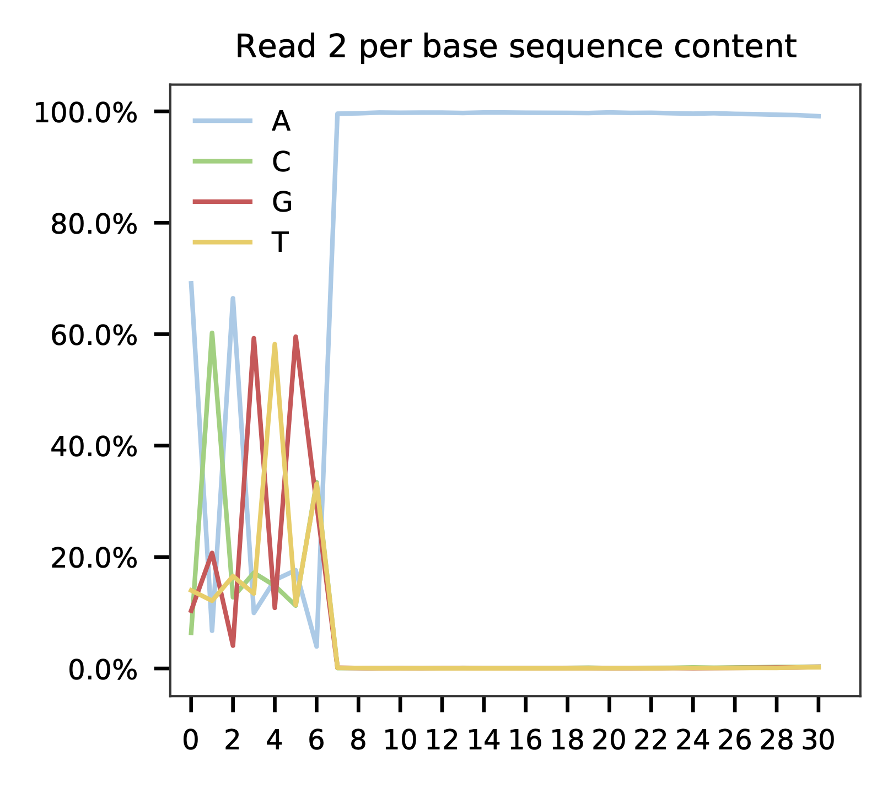
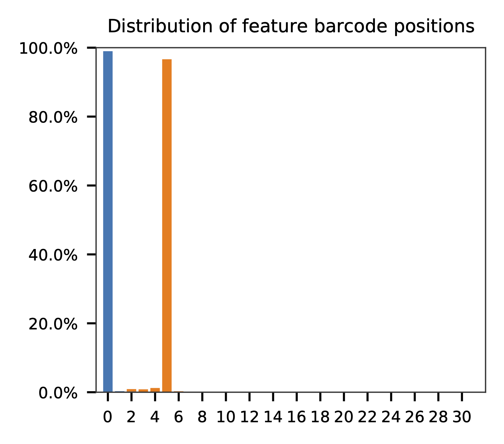

# fba tutorial

Dataset: CITE-Seq

Stoeckius, M., Hafemeister, C., Stephenson, W., Houck-Loomis, B., Chattopadhyay, P.K., Swerdlow, H., Satija, R., and Smibert, P. (2017). [Simultaneous epitope and transcriptome measurement in single cells](https://doi.org/10.1038/nmeth.4380). Nat. Methods 14, 865–868.

<br>

## Preparation

Download fastq files.

```shell
$ curl -O ftp.sra.ebi.ac.uk/vol1/fastq/SRR580/000/SRR5808750/SRR5808750_1.fastq.gz
$ curl -O ftp.sra.ebi.ac.uk/vol1/fastq/SRR580/000/SRR5808750/SRR5808750_2.fastq.gz
```

Download cell barcode info. These are the cell-associated barcodes in this single cell RNA-Seq library.


```shell
$ wget https://ftp.ncbi.nlm.nih.gov/geo/series/GSE100nnn/GSE100866/suppl/GSE100866_CBMC_8K_13AB_10X-ADT_umi.csv.gz

$ gzip -dc GSE100866_CBMC_8K_13AB_10X-ADT_umi.csv.gz | head -1 | sed 's/,/\n/g' | awk 'NF' > cell_barcodes.txt
```

Inspect cell barcodes.

```shell
$ head cell_barcodes.txt

CTGTTTACACCGCTAG
CTCTACGGTGTGGCTC
AGCAGCCAGGCTCATT
GAATAAGAGATCCCAT
GTGCATAGTCATGCAT
TACACGACACATCCGG
TCATTTGGTGTGAAAT
GGGCACTGTGAAGGCT
AACACGTCATTAACCG
CACATAGCAATGCCAT
```

Prepare feature barcodes (antibody-oligo sequences, from the online methods section of the paper).

```shell
$ cat feature_barcodes.tsv

v2_BC1  ATCACG
v2_BC2  CGATGT
v2_BC3  TTAGGC
v2_BC4  TGACCA
v2_BC5  ACAGTG
v2_BC6  GCCAAT
v2_BC8  ACTTGA
v2_BC9  GATCAG
v2_BC10 TAGCTT
v2_BC11 GGCTAC
v2_BC12 CTTGTA
v2_BC13 AGTCAA
v2_BC14 AGTTCC
```

<br>

## QC

Sample the first 100,000 (set by `-n`) read pairs for quality control. Use `-t` to set the number of threads. The diagnostic results and plots are generated in the `qc` directory (set by `--output_directory`). By default, full length of read 1 and read 2 are searched against reference cell and feature barcodes, respectively. The per base content of both read pairs and the distribution of matched barcode positions are summarized. Use `-r1_coords` and/or `-r2_coords` to limit the search range. Use `-cb_n` and/or `-fb_n` to set the mismatch tolerance for cell and feature barcode matching.

```shell
$ fba qc \
    -1 SRR5808750_1.fastq.gz \
    -2 SRR5808750_2.fastq.gz \
    -w cell_barcodes.txt \
    -f feature_barcodes.tsv \
    --output_directory qc
```

This library is constructed using Chromium Single Cell 3' Reagent Kits (v2 Chemistry). The first 16 bases are cell barcodes and the following 9 bases are UMIs (Read 1 length is 25). Based on the base content plot, the GC content of cell barcodes are quite even. The UMIs are slightly G enriched.

<p align='center'>
  
</p>

As for read 2, based on the per base content, it suggests that bases 0-5 are actually our feature barcodes (See the distribution of matched barcode positions on read 2).

<p align='center'>
    
</p>

<p align='center'>
    
</p>


The detailed qc results are stored in `feature_barcoding_output.tsv.gz` file. `matching_pos` columns indicate the matched positions on reads. `matching_description` columns indicate mismatches in substitutions:insertions:deletions format.

```shell
$ gzip -dc qc/feature_barcoding_output.tsv.gz | head

read1_seq       cell_barcode    cb_matching_pos cb_matching_description read2_seq       feature_barcode fb_matching_pos fb_matching_description
CGTAGCGGTTAGTGGGGGGTGGCGC       CGTAGCGGTTAGTGGG        0:16    0:0:0   CCCAGGGCCTCGTGGCCGGAGAAACTGCCCA v2_BC1_ATCACG   0:6     3:0:0
ACACTGAGTCCGAAGACTCGTTTGA       ACTGAGTCAGTACACT        2:18    3:0:0   GATCAGCAAAAAAAAAAAAAAAAAAAAAAAA v2_BC9_GATCAG   0:6     0:0:0
TTCTTAGGTGGCCCTATCCAGAGAG       GCTCCTATCAGAGACG        10:25   0:1:2   ACAGTGCAAAAAAAAAAAAAAAAAAAAAAAA v2_BC5_ACAGTG   0:6     0:0:0
GATCAGTGTCTAAAGATCCGGGCGC       GATCAGTGTCGAAAGC        0:16    2:0:0   AGTCAATAAAAAAGAAAAAAAAAAAAAAAAA v2_BC13_AGTCAA  0:6     0:0:0
AACTGGTTCTGGTGTAGATGAATCA       CTGGTCTAGAGTAATC        8:24    3:0:0   ATCACGGAAAAAAAAAAAAAAAAAAAAAAAA v2_BC1_ATCACG   0:6     0:0:0
TCAGGATGTTGATTCGACAGTGAAA       AGGGATGTCTGATTCT        2:16    1:0:2   GATCAGGAAAAAAAAAAAAAAAAAAAAAAAA v2_BC9_GATCAG   0:6     0:0:0
CTCGAGGAGCCACCTGGAGATACAG       CTCCTAGAGCCACCTG        0:16    3:0:0   ACAGTGCAAAAAAAAAAAAAAAAAAAAAAAA v2_BC5_ACAGTG   0:6     0:0:0
GACCTGGTCTTAGCCCCCCAGATCA       GACCTGGTCTTAACCT        0:16    2:0:0   GCCAATCAAAAAAAAAAAAAAAAAAAAAAAA v2_BC6_GCCAAT   0:6     0:0:0
NCGGCCAGGGTGTAGCACGGATTGC       CTGATAGCAGGGATTG        9:24    2:0:1   ACAGTGCAAAAAAAAAAAAAAAAAAAAAAAA v2_BC5_ACAGTG   0:6     0:0:0
```

<br>

## Barcode extraction

The lengths of cell and feature barcodes are all identical (16 and 6, respectively). And based on qc results, the distributions of starting and ending positions of cell and feature barcodes are very uniform. Search ranges are set to `0,16` on read 1 and `0,6` on read 2. One mismatch for cell and feature barcodes (`-cb_m`, `-cf_m`) are allowed. And by default, three ambiguous nucleotides (Ns) for read 1 and read 2 (`-cb_n`, `-cf_n`) are allowed.

```shell
$ fba extract \
    -1 SRR5808750_1.fastq.gz \
    -2 SRR5808750_2.fastq.gz \
    -w cell_barcodes.txt \
    -f feature_barcodes.tsv \
	-o feature_barcoding_output.tsv.gz \
    -r1_coords 0,16 \
    -r2_coords 0,6 \
    -cb_m 1 \
    -fb_m 1 \
    -cb_n 3 \
    -fb_n 3
```

Preview of result.

```shell
$ gzip -dc feature_barcoding_output.tsv.gz | head

read1_seq       cell_barcode    cb_num_mismatches       read2_seq       feature_barcode fb_num_mismatches
GGCGTGTGTCCATGATtcatgtatg       GGCGTGTGTCCATGAT        0       ACAGTGcaaaaaaaaaaaaaaaaaaaaaaaa v2_BC5_ACAGTG   0
CGACCTTCATAGACTCtacctcgcg       CGACCTTCATAGACTC        0       AGTCAAgaaaaaaaaaaaaaaaaaaaaaaaa v2_BC13_AGTCAA  0
CTGATCCTCAATAAGGtcgtttgga       CTGATCCTCAATAAGG        0       ACAGTGgaaaaaaaaaaaaaaaaaaaaaaaa v2_BC5_ACAGTG   0
TTGACTTTCACGACTAagtttgggg       TTGACTTTCACGACTA        0       AGTCAAtaaaaaaaaaaaaaaaaaaaaaaaa v2_BC13_AGTCAA  0
CGGAGTCAGGAGCGTTatccgtaat       CGGAGTCAGGAGCGTT        0       ACAGTGgaaaaaaaaaaaaaaaaaaaaaaaa v2_BC5_ACAGTG   0
TTTGGTTGTAGAGCTGgggcaagta       TTTGGTTGTAGAGCTG        0       ACAGTGcaaaaaaaaaaaaaaaaaaaaaaaa v2_BC5_ACAGTG   0
ACCCACTAGACCCACCgaaccttta       ACCCACTAGACCCACC        0       GCCAATtaaaaaaaaaaaaaaaaaaaaaaaa v2_BC6_GCCAAT   0
CGGGTCATCTGCGACGgcctttttt       CGGGTCATCTGCGACG        0       ACAGTGtaaaaaaaaaaaaaaaaaaaaaaaa v2_BC5_ACAGTG   0
CACATTTGTCATCCCTaccatccgc       CACATTTGTCATCCCT        0       ATCACGcaaaaaaaaaaaaaaaaaaaaaaaa v2_BC1_ATCACG   0
```

Result summary.

30.4% (63,063,944 out of 207,724,395) of total read pairs have valid cell and feature barcodes.

```shell
2021-02-17 23:47:41,923 - fba.__main__ - INFO - fba version: 0.0.7
2021-02-17 23:47:41,923 - fba.__main__ - INFO - Initiating logging ...
2021-02-17 23:47:41,923 - fba.__main__ - INFO - Python version: 3.7
2021-02-17 23:47:41,923 - fba.__main__ - INFO - Using extract subcommand ...
2021-02-17 23:47:41,928 - fba.levenshtein - INFO - Number of reference cell barcodes: 8,617
2021-02-17 23:47:41,928 - fba.levenshtein - INFO - Number of reference feature barcodes: 13
2021-02-17 23:47:41,928 - fba.levenshtein - INFO - Read 1 coordinates to search: [0, 16)
2021-02-17 23:47:41,928 - fba.levenshtein - INFO - Read 2 coordinates to search: [0, 6)
2021-02-17 23:47:41,928 - fba.levenshtein - INFO - Cell barcode maximum number of mismatches: 1
2021-02-17 23:47:41,928 - fba.levenshtein - INFO - Feature barcode maximum number of mismatches: 1
2021-02-17 23:47:41,928 - fba.levenshtein - INFO - Read 1 maximum number of N allowed: 3
2021-02-17 23:47:41,928 - fba.levenshtein - INFO - Read 2 maximum number of N allowed: 3
2021-02-17 23:47:42,231 - fba.levenshtein - INFO - Matching ...
2021-02-17 23:51:17,514 - fba.levenshtein - INFO - Read pairs processed: 10,000,000
2021-02-17 23:54:52,641 - fba.levenshtein - INFO - Read pairs processed: 20,000,000
2021-02-17 23:58:27,676 - fba.levenshtein - INFO - Read pairs processed: 30,000,000
2021-02-18 00:02:02,380 - fba.levenshtein - INFO - Read pairs processed: 40,000,000
2021-02-18 00:05:36,809 - fba.levenshtein - INFO - Read pairs processed: 50,000,000
2021-02-18 00:09:11,444 - fba.levenshtein - INFO - Read pairs processed: 60,000,000
2021-02-18 00:12:45,146 - fba.levenshtein - INFO - Read pairs processed: 70,000,000
2021-02-18 00:16:20,131 - fba.levenshtein - INFO - Read pairs processed: 80,000,000
2021-02-18 00:19:54,980 - fba.levenshtein - INFO - Read pairs processed: 90,000,000
2021-02-18 00:23:29,696 - fba.levenshtein - INFO - Read pairs processed: 100,000,000
2021-02-18 00:27:04,208 - fba.levenshtein - INFO - Read pairs processed: 110,000,000
2021-02-18 00:30:38,402 - fba.levenshtein - INFO - Read pairs processed: 120,000,000
2021-02-18 00:34:11,917 - fba.levenshtein - INFO - Read pairs processed: 130,000,000
2021-02-18 00:37:44,939 - fba.levenshtein - INFO - Read pairs processed: 140,000,000
2021-02-18 00:41:18,752 - fba.levenshtein - INFO - Read pairs processed: 150,000,000
2021-02-18 00:44:51,673 - fba.levenshtein - INFO - Read pairs processed: 160,000,000
2021-02-18 00:48:25,440 - fba.levenshtein - INFO - Read pairs processed: 170,000,000
2021-02-18 00:51:58,766 - fba.levenshtein - INFO - Read pairs processed: 180,000,000
2021-02-18 00:55:32,141 - fba.levenshtein - INFO - Read pairs processed: 190,000,000
2021-02-18 00:59:05,690 - fba.levenshtein - INFO - Read pairs processed: 200,000,000
2021-02-18 01:01:50,228 - fba.levenshtein - INFO - Number of read pairs processed: 207,724,395
2021-02-18 01:01:50,228 - fba.levenshtein - INFO - Number of read pairs w/ valid barcodes: 63,063,944
2021-02-18 01:01:50,249 - fba.__main__ - INFO - Done.
```

<br>

## Matrix generation

Only fragments with valid (passed the criteria) cell and feature barcodes are included. UMI deduplication is powered by UMI-tools ([Smith, T., et al. 2017. Genome Res. 27, 491–499.](http://www.genome.org/cgi/doi/10.1101/gr.209601.116)). Use `-us` to set the UMI starting position on read 1. Use `-ul` to set the UMI length. Fragments with UMI length less than this value are discarded. Use `-um` to set mismatch threshold. UMI deduplication method is set by `-ud`.

The generated feature count matrix can be easily imported into well-established single cell analysis packages: [Seruat](https://satijalab.org/seurat/) and [Scanpy](https://scanpy.readthedocs.io/en/stable/).

```shell
$ fba count \
    -i feature_barcoding_output.tsv.gz \
    -o matrix_featurecount.csv.gz \
    -us 16 \
    -ul 9 \
    -um 1 \
    -ud directional
```

Result summary.

54.8% (34,574,243 out of 63,063,944) of read pairs with valid cell and feature barcodes are unique fragments. 16.6% (34,574,243 out of 207,724,395) of total sequenced read pairs contribute to the final matrix.

```shell
2021-02-18 01:16:22,447 - fba.__main__ - INFO - fba version: 0.0.7
2021-02-18 01:16:22,447 - fba.__main__ - INFO - Initiating logging ...
2021-02-18 01:16:22,447 - fba.__main__ - INFO - Python version: 3.7
2021-02-18 01:16:22,447 - fba.__main__ - INFO - Using count subcommand ...
2021-02-18 01:16:22,447 - fba.count - INFO - UMI-tools version: 1.1.1
2021-02-18 01:16:22,450 - fba.count - INFO - UMI starting position on read 1: 16
2021-02-18 01:16:22,450 - fba.count - INFO - UMI length: 9
2021-02-18 01:16:22,450 - fba.count - INFO - UMI-tools deduplication threshold: 1
2021-02-18 01:16:22,450 - fba.count - INFO - UMI-tools deduplication method: directional
2021-02-18 01:16:22,450 - fba.count - INFO - Header line: read1_seq cell_barcode cb_num_mismatches read2_seq feature_barcode fb_num_mismatches
2021-02-18 01:18:58,245 - fba.count - INFO - Number of lines processed: 63,063,944
2021-02-18 01:18:58,260 - fba.count - INFO - Number of cell barcodes detected: 8,617
2021-02-18 01:18:58,261 - fba.count - INFO - Number of features detected: 13
2021-02-18 08:12:46,216 - fba.count - INFO - Total UMIs after deduplication: 34,574,243
2021-02-18 08:12:46,244 - fba.count - INFO - Median number of UMIs per cell: 3,816.0
2021-02-18 08:12:46,435 - fba.__main__ - INFO - Done.
```
