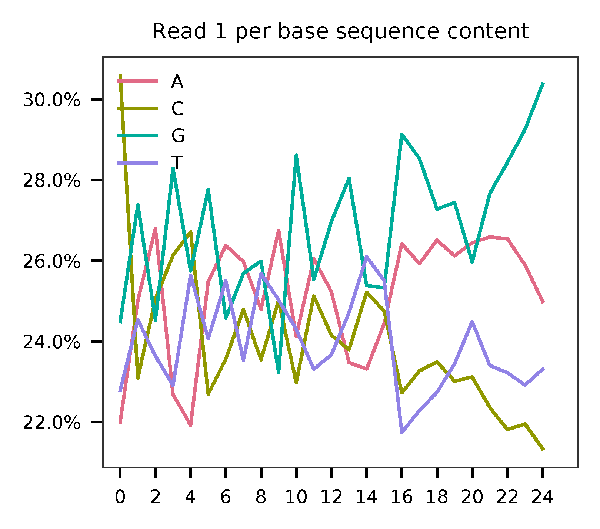
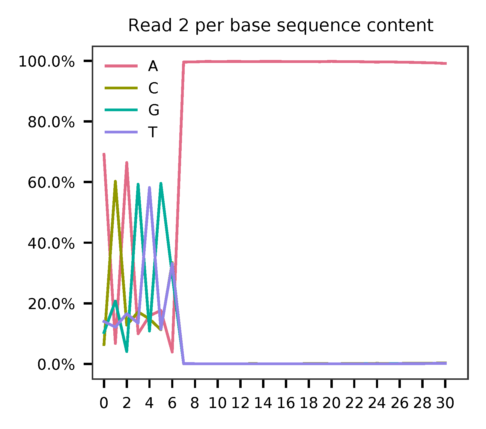
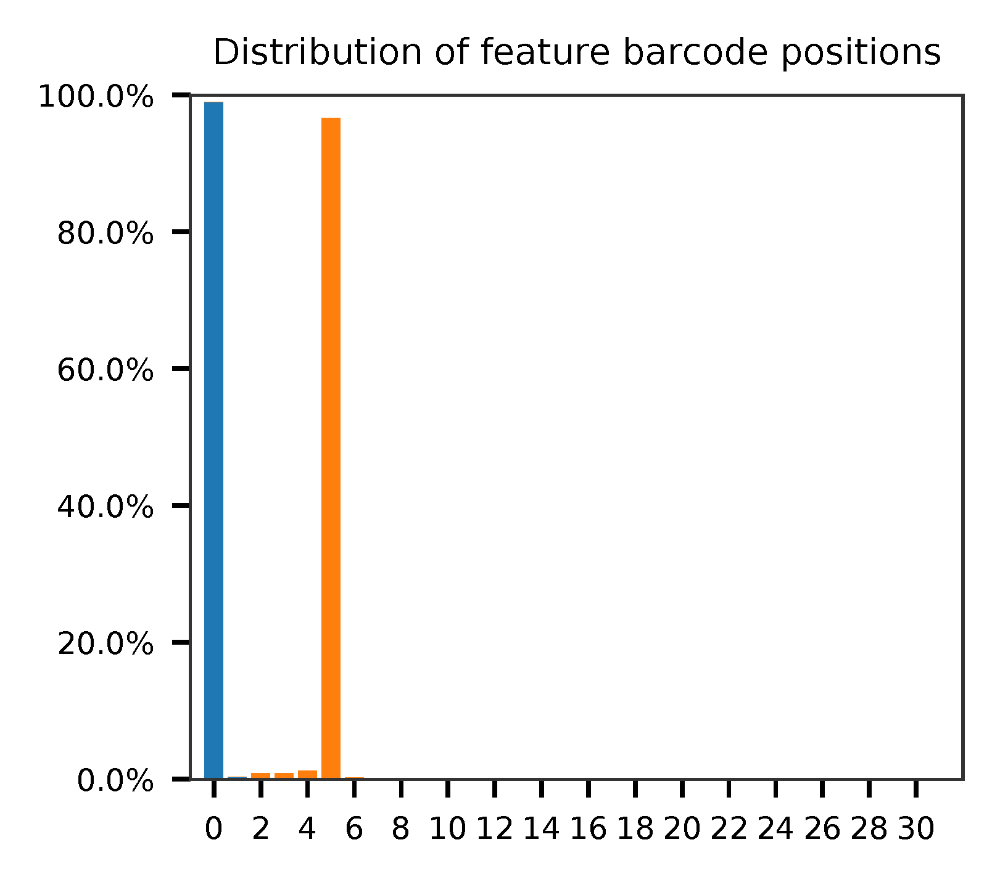

# fba tutorial

Dataset: CITE-Seq

Stoeckius, M., Hafemeister, C., Stephenson, W., Houck-Loomis, B., Chattopadhyay, P.K., Swerdlow, H., Satija, R., and Smibert, P. (2017). [Simultaneous epitope and transcriptome measurement in single cells](https://doi.org/10.1038/nmeth.4380). Nat. Methods 14, 865–868.

<br>

## Preparation

Download fastq files.

```shell
$ curl -O ftp.sra.ebi.ac.uk/vol1/fastq/SRR580/000/SRR5808750/SRR5808750_1.fastq.gz
$ curl -O ftp.sra.ebi.ac.uk/vol1/fastq/SRR580/000/SRR5808750/SRR5808750_2.fastq.gz
```

Download cell barcode info. These are the cell-associated barcodes in this single cell RNA-Seq library.


```shell
$ wget https://ftp.ncbi.nlm.nih.gov/geo/series/GSE100nnn/GSE100866/suppl/GSE100866_CBMC_8K_13AB_10X-ADT_umi.csv.gz

$ gzip -dc GSE100866_CBMC_8K_13AB_10X-ADT_umi.csv.gz | head -1 | sed 's/,/\n/g' | awk 'NF' > cell_barcodes.txt
```

Inspect cell barcodes.

```shell
$ head cell_barcodes.txt

CTGTTTACACCGCTAG
CTCTACGGTGTGGCTC
AGCAGCCAGGCTCATT
GAATAAGAGATCCCAT
GTGCATAGTCATGCAT
TACACGACACATCCGG
TCATTTGGTGTGAAAT
GGGCACTGTGAAGGCT
AACACGTCATTAACCG
CACATAGCAATGCCAT
```

Prepare feature barcodes (from the online methods section).

```shell
$ cat feature_barcodes.tsv

v2_BC1  ATCACG
v2_BC2  CGATGT
v2_BC3  TTAGGC
v2_BC4  TGACCA
v2_BC5  ACAGTG
v2_BC6  GCCAAT
v2_BC8  ACTTGA
v2_BC9  GATCAG
v2_BC10 TAGCTT
v2_BC11 GGCTAC
v2_BC12 CTTGTA
v2_BC13 AGTCAA
v2_BC14 AGTTCC
```

<br>

## QC

Sample the first 20,000 (set by `-n`) read pairs for quality control. Use `-t` to set the number of threads. The diagnostic results and plots are generated in the `qc` directory (set by `--output_directory`). By default, full length of read 1 and read 2 are searched against known cell and feature barcodes, respectively. The per base content of both read pairs and the distribution of matched barcode positions are summarized. Use `-r1_coords` and/or `-r2_coords` to limit the search range. Use `-cb_n` and/or `-fb_n` to set the mismatch tolerance for cell and feature barcode matching.

```shell
$ fba qc \
    -1 SC3_v3_NextGem_DI_CSP-Labeled_PBMCs_1K_antibody_S1_combined_R1_001.fastq.gz \
    -2 SC3_v3_NextGem_DI_CSP-Labeled_PBMCs_1K_antibody_S1_combined_R2_001.fastq.gz \
    -w filtered_feature_bc_matrix/barcodes.tsv.gz \
    -f SC3_v3_NextGem_DI_PBMC_CSP_1K_feature_ref.tsv \
    --output_directory qc \
    -n 20000
```

This library is constructed using Chromium Next GEM Single Cell 3ʹ Reagent Kit v3.1. The first 16 bases are cell barcodes and the following 12 bases are UMIs. Based on the base content plot, the GC content of cell barcodes are quite even. The UMIs are slightly T enriched.

<p align='center'>
  
</p>

As for read 2, based on per base content, it suggests that bases 0-9, 25-33, and 56-83 are GC balanced for the reads we have sampled. Could mean that their sequences are random at library-level. While bases 34-55 and 84-89 are constant sequences and we can almost read the bases. Bases 10-24 are less random but also not constant. They are actually our feature barcodes (See the distribution of matched barcode positions on read 2).

<p align='center'>
    
</p>

<p align='center'>
    
</p>


The fragment structure in this feature barocoding library infered from qc results matches the design ([Table 1](https://assets.ctfassets.net/an68im79xiti/6p0emIeLO8bsxinEbKgcfF/275a5752f4e4347f75a1f649bd824463/CG000149_DemonstratedProtocol_CellSurfaceProteinLabeling_RevB.pdf). Of course, this is an example dataset from 10x Genomics). Bases 34-56 are actually called 'Capture Sequence 1' on beads.

The detailed qc results are stored in `feature_barcoding_output.tsv.gz` file. `matching_pos` columns indicate the matched positions on reads. `matching_description` columns indicate mismatches in substitutions:insertions:deletions format. This is actually the output of regex method in `extract` subcommand.

```shell
$ gzip -dc qc/feature_barcoding_output.tsv.gz | head

read1_seq       cell_barcode    cb_matching_pos cb_matching_description read2_seq       feature_barcode fb_matching_pos fb_matching_description
GNAGGTTTCGTCGACACGGGTATGGCCA    GTAGGTTAGGTCGACA        0:16    3:0:0   GGAACGACGATCTCAGACCTCCGTAACGAACGTAGCTTTAAGGCCGGTCCTAGCAATGGCCATACCCGTGTCGACGAAACCTACCTGTCT      CD14_TCTCAGACCTCCGTA    10:25   0:0:0
TCGTGGGCAAGATTGAGTAAAAATTCAG    TCGTGGGCAAACTAGA        0:16    3:0:0   CAATCTACCGCTGGGCAATTACTCGCCCGATGTGGCTTTAAGGCCGGTCCTAGCAACTGAATTTTTACTCAATCTTGCCCACGACTGTCT      CD19_CTGGGCAATTACTCG    10:25   0:0:0
TCCGGGATCGTGGCTATGTGTTCGAGGG    no_match        NA      NA      TGGGTCAATTCTCATTGTAACTCCTTCCCTCAAAGCTTTAAGGCCGGTCCTAGCAACCCTCGAACACATAGCCACGATCCCGGACTGTCT      NA      NA      NA
GATTGGTGTGTCTCTCGGTGCCCAAAAT    no_match        NA      NA      TACACTGACAGCCGGACGACATTAAACGGAAGCCGCTTTAAGGCCGGTCCTAGCAAATTTTGGGCACCGAGAGACACACCAATCCTGTCT      NA      NA      NA
TGCTCGTAGTACAGGTAAGCGTGAAGCA    CATCGTCGTACAGGTG        2:17    2:0:1   GCCCACAACACTCCGAATCATGTTGACGGGGTTCGCTTTAAGGCCGGTCCTAGCAATGCTTCACGCTTACCTGTACTACGAGCACTGTCG      CD45RO_CTCCGAATCATGTTG  10:25   0:0:0
AGATGAAAGGGAGTAGGGTGCGGGTTAT    AGGGAGTAGGAGGGTG        7:22    2:0:1   TGCGTTTCTTCACCAGTACCTAGTCACACGTCAGCTTTAAGGCCGGCCCTAGCAAATAACCCGCACCCTACTCCCTTTCATCTCTGTCTC      CD15_TCACCAGTACCTAGT    9:24    0:0:0
CCTCCTCAGCTCTGCATATGAGCGAATT    no_match        NA      NA      AAGCAATGCTTCACCAGTACCTAGTCGTTCGTGTGCTTAAGGCCGGTCCTAGCAAAATTCGCTCATATGCAGAGCTGAGGAGGCTGTCTC      NA      NA      NA
TGATCTTAGAACACGTCAGGGTCCTGAA    TGATCTTTCAACACGT        0:16    2:0:0   GGGGGGGGGGGGGGGGAGGGGGCCGGAAAAGAACCCCGAGAGGCCAGCGCCAAACAAAAAAGAACAAAAAAGAGGAAAAAAAAAAAAAAA      no_match        NA      NA
GGGCTACAGGACGCTGGTTTCATTTTTT    CTGGTCTTCATTGTTC        13:28   2:0:1   CCTTAATCAACTCATTGTAACTCCTGTTCCCACAGCTTTAAGGCCGGTCCTAGCAAAAAAAATGAAACCAGCGTCCTGTAGCCCCTGTCT      CD3_CTCATTGTAACTCCT     10:25   0:0:0
```

<br>

## Barcode extraction

The length of cell and feature barcodes are all identical (16 and 15, respectively). And based on qc results, the distributions of staring and ending positions of cell and feature barcodes are very uniform. Search ranges are set to `0,16` on read 1 and `10,25` on read 2. Two mismatches for cell and feature barcodes (`-cb_m`, `-cf_m`) are allowed. And by default, three ambiguous nucleotides (Ns) for read 1 and read2 (`-cb_n`, `-cf_n`) are allowed.

```shell
$ fba extract \
    -1 SC3_v3_NextGem_DI_CSP-Labeled_PBMCs_1K_antibody_S1_combined_R1_001.fastq.gz \
    -2 SC3_v3_NextGem_DI_CSP-Labeled_PBMCs_1K_antibody_S1_combined_R2_001.fastq.gz \
    -w filtered_feature_bc_matrix/barcodes.tsv.gz \
    -f SC3_v3_NextGem_DI_PBMC_CSP_1K_feature_ref.tsv \
    -o feature_barcoding_output.tsv.gz \
    -r1_coords 0,16 \
    -r2_coords 10,25 \
    -cb_m 2 \
    -fb_m 2
```

Preview of result.

```shell
$ gzip -dc feature_barcoding_output.tsv.gz | head

read1_seq       cell_barcode    cb_num_mismatches       read2_seq       feature_barcode fb_num_mismatches
GGCGTGTGTCCATGATtcatgtatg       GGCGTGTGTCCATGAT        0       ACAGTGcaaaaaaaaaaaaaaaaaaaaaaaa v2_BC5_ACAGTG   0
CGACCTTCATAGACTCtacctcgcg       CGACCTTCATAGACTC        0       AGTCAAgaaaaaaaaaaaaaaaaaaaaaaaa v2_BC13_AGTCAA  0
CTGATCCTCAATAAGGtcgtttgga       CTGATCCTCAATAAGG        0       ACAGTGgaaaaaaaaaaaaaaaaaaaaaaaa v2_BC5_ACAGTG   0
TTGACTTTCACGACTAagtttgggg       TTGACTTTCACGACTA        0       AGTCAAtaaaaaaaaaaaaaaaaaaaaaaaa v2_BC13_AGTCAA  0
CGGAGTCAGGAGCGTTatccgtaat       CGGAGTCAGGAGCGTT        0       ACAGTGgaaaaaaaaaaaaaaaaaaaaaaaa v2_BC5_ACAGTG   0
TTTGGTTGTAGAGCTGgggcaagta       TTTGGTTGTAGAGCTG        0       ACAGTGcaaaaaaaaaaaaaaaaaaaaaaaa v2_BC5_ACAGTG   0
ACCCACTAGACCCACCgaaccttta       ACCCACTAGACCCACC        0       GCCAATtaaaaaaaaaaaaaaaaaaaaaaaa v2_BC6_GCCAAT   0
CGGGTCATCTGCGACGgcctttttt       CGGGTCATCTGCGACG        0       ACAGTGtaaaaaaaaaaaaaaaaaaaaaaaa v2_BC5_ACAGTG   0
CACATTTGTCATCCCTaccatccgc       CACATTTGTCATCCCT        0       ATCACGcaaaaaaaaaaaaaaaaaaaaaaaa v2_BC1_ATCACG   0
(py37) [s166631@Nucleus005 m1]$

```

Result summary.

```shell
2020-10-10 00:58:38,151 - fba.__main__ - INFO - fba version: 0.0.5dev
2020-10-10 00:58:38,151 - fba.__main__ - INFO - Initiating logging ...
2020-10-10 00:58:38,151 - fba.__main__ - INFO - Python version: 3.7
2020-10-10 00:58:38,151 - fba.__main__ - INFO - Using extract subcommand ...
2020-10-10 00:58:38,190 - fba.levenshtein - INFO - Number of reference cell barcodes: 8,617
2020-10-10 00:58:38,190 - fba.levenshtein - INFO - Number of reference feature barcodes: 13
2020-10-10 00:58:38,190 - fba.levenshtein - INFO - Read 1 coordinates to search: [0, 16]
2020-10-10 00:58:38,190 - fba.levenshtein - INFO - Read 2 coordinates to search: [0, 6]
2020-10-10 00:58:38,190 - fba.levenshtein - INFO - Cell barcode maximum number of mismatches: 1
2020-10-10 00:58:38,190 - fba.levenshtein - INFO - Feature barcode maximum number of mismatches: 1
2020-10-10 00:58:38,190 - fba.levenshtein - INFO - Read 1 maximum number of N allowed: 3
2020-10-10 00:58:38,190 - fba.levenshtein - INFO - Read 2 maximum number of N allowed: 3
2020-10-10 00:58:38,378 - fba.levenshtein - INFO - Matching ...
2020-10-10 01:03:53,185 - fba.levenshtein - INFO - Read pairs processed: 10,000,000
2020-10-10 01:09:06,495 - fba.levenshtein - INFO - Read pairs processed: 20,000,000
2020-10-10 01:14:21,285 - fba.levenshtein - INFO - Read pairs processed: 30,000,000
2020-10-10 01:19:29,675 - fba.levenshtein - INFO - Read pairs processed: 40,000,000
2020-10-10 01:24:37,057 - fba.levenshtein - INFO - Read pairs processed: 50,000,000
2020-10-10 01:29:43,965 - fba.levenshtein - INFO - Read pairs processed: 60,000,000
2020-10-10 01:34:49,195 - fba.levenshtein - INFO - Read pairs processed: 70,000,000
2020-10-10 01:39:56,196 - fba.levenshtein - INFO - Read pairs processed: 80,000,000
2020-10-10 01:45:00,512 - fba.levenshtein - INFO - Read pairs processed: 90,000,000
2020-10-10 01:50:05,621 - fba.levenshtein - INFO - Read pairs processed: 100,000,000
2020-10-10 01:55:10,058 - fba.levenshtein - INFO - Read pairs processed: 110,000,000
2020-10-10 02:00:13,782 - fba.levenshtein - INFO - Read pairs processed: 120,000,000
2020-10-10 02:05:17,903 - fba.levenshtein - INFO - Read pairs processed: 130,000,000
2020-10-10 02:10:21,821 - fba.levenshtein - INFO - Read pairs processed: 140,000,000
2020-10-10 02:15:29,741 - fba.levenshtein - INFO - Read pairs processed: 150,000,000
2020-10-10 02:20:31,313 - fba.levenshtein - INFO - Read pairs processed: 160,000,000
2020-10-10 02:25:35,345 - fba.levenshtein - INFO - Read pairs processed: 170,000,000
2020-10-10 02:30:39,005 - fba.levenshtein - INFO - Read pairs processed: 180,000,000
2020-10-10 02:35:41,376 - fba.levenshtein - INFO - Read pairs processed: 190,000,000
2020-10-10 02:40:42,501 - fba.levenshtein - INFO - Read pairs processed: 200,000,000
2020-10-10 02:44:36,110 - fba.levenshtein - INFO - Number of read pairs processed: 207,724,395
2020-10-10 02:44:36,112 - fba.levenshtein - INFO - Number of read pairs w/ valid barcodes: 63,646,484
2020-10-10 02:44:36,119 - fba.__main__ - INFO - Done.
```

<br>

## Matrix generation

Only fragments with correct (passed the criteria) cell and feature barcodes are included. UMI removal is powered by UMI-tools ([Smith, T., et al. 2017. Genome Res. 27, 491–499.](http://www.genome.org/cgi/doi/10.1101/gr.209601.116)). Use `-us` to set the UMI starting position on read 1. Use `-ul` to set the UMI length. Fragments with UMI length less than this value are discarded. Use `-um` to set mismatch threshold. UMI deduplication method is set by `-ud`. 

The generated feature count matrix can be easily imported into well-established single cell analysis packages: [Seruat](https://satijalab.org/seurat/) and [Scanpy](https://scanpy.readthedocs.io/en/stable/).

```shell
$ fba count \
    -i feature_barcoding_output.tsv.gz \
    -o matrix_featurecount.csv.gz \
    -us 16 \
    -ul 12 \
    -um 1 \
    -ud directional
```

Result summary.

```shell
2020-10-05 20:14:01,730 - fba.__main__ - INFO - fba version: 0.0.5dev
2020-10-05 20:14:01,730 - fba.__main__ - INFO - Initiating logging ...
2020-10-05 20:14:01,730 - fba.__main__ - INFO - Python version: 3.7
2020-10-05 20:14:01,731 - fba.__main__ - INFO - Using count subcommand ...
2020-10-05 20:14:01,731 - fba.count - INFO - UMI-tools version: 1.0.1
2020-10-05 20:14:01,733 - fba.count - INFO - UMI starting position on read 1: 16
2020-10-05 20:14:01,733 - fba.count - INFO - UMI length: 12
2020-10-05 20:14:01,734 - fba.count - INFO - UMI-tools deduplication threshold: 1
2020-10-05 20:14:01,734 - fba.count - INFO - UMI-tools deduplication method: directional
2020-10-05 20:14:01,734 - fba.count - INFO - Header line: read1_seq cell_barcode cb_num_mismatches read2_seq feature_barcode fb_num_mismatches
2020-10-05 20:14:23,086 - fba.count - INFO - Number of lines processed: 4,611,813
2020-10-05 20:14:23,089 - fba.count - INFO - Number of cell barcodes detected: 1,200
2020-10-05 20:14:23,089 - fba.count - INFO - Number of features detected: 30
2020-10-05 20:15:49,026 - fba.count - INFO - Total UMIs after deduplication: 3,217,333
2020-10-05 20:15:49,029 - fba.count - INFO - Median number of UMIs per cell: 2,565.0
2020-10-05 20:15:49,061 - fba.__main__ - INFO - Done.
```
