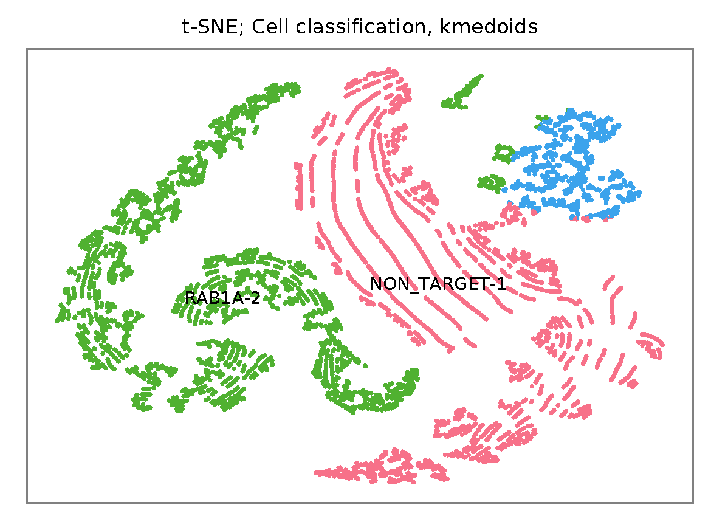

# fba tutorial

Dataset: 10k A375 Cells Transduced with (1) Non-Target and (1) Target sgRNA, Dual Indexed

The detailed description of this dataset can be found at [here](https://support.10xgenomics.com/single-cell-gene-expression/datasets/4.0.0/SC3_v3_NextGem_DI_CRISPR_10K).

<br>

## Preparation

Download fastq files.

```shell
$ wget https://cg.10xgenomics.com/samples/cell-exp/4.0.0/SC3_v3_NextGem_DI_CRISPR_10K/SC3_v3_NextGem_DI_CRISPR_10K_fastqs.tar

$ tar xvf SC3_v3_NextGem_DI_PBMC_CSP_1K/SC3_v3_NextGem_DI_PBMC_CSP_1K_fastqs.tar
```

Combine reads of different lanes.

```shell
$ cat SC3_v3_NextGem_DI_CRISPR_10K_fastqs/SC3_v3_NextGem_DI_CRISPR_10K_crispr_fastqs/SC3_v3_NextGem_DI_CRISPR_10K_crispr_S1_L00?_R1_001.fastq.gz > SC3_v3_NextGem_DI_CRISPR_10K_crispr_S1_combined_R1_001.fastq.gz

$ cat SC3_v3_NextGem_DI_CRISPR_10K_fastqs/SC3_v3_NextGem_DI_CRISPR_10K_crispr_fastqs/SC3_v3_NextGem_DI_CRISPR_10K_crispr_S1_L00?_R2_001.fastq.gz > SC3_v3_NextGem_DI_CRISPR_10K_crispr_S1_combined_R2_001.fastq.gz
```

Download cell barcode info. These are the cell-associated barcodes in this single cell RNA-Seq library.

```shell
$ wget https://cf.10xgenomics.com/samples/cell-exp/4.0.0/SC3_v3_NextGem_DI_CRISPR_10K/SC3_v3_NextGem_DI_CRISPR_10K_raw_feature_bc_matrix.tar.gz

$ tar zxvf SC3_v3_NextGem_DI_CRISPR_10K_raw_feature_bc_matrix.tar.gz
```

Inspect cell barcodes.

```shell
$ gzip -dc  filtered_feature_bc_matrix/barcodes.tsv.gz | head

AAACCCACACATAGCT-1
AAACCCACATCATGAC-1
AAACCCAGTCATCGGC-1
AAACCCAGTCGCACAC-1
AAACCCAGTGCAACGA-1
AAACCCATCAAGCGTT-1
AAACCCATCAGATGCT-1
AAACCCATCATCTACT-1
AAACCCATCCTTATGT-1
AAACCCATCTCGGCTT-1
```

Prepare feature barcodes.

```shell
$ wget https://cf.10xgenomics.com/samples/cell-exp/4.0.0/SC3_v3_NextGem_DI_CRISPR_10K/SC3_v3_NextGem_DI_CRISPR_10K_feature_ref.csv
```

Inspect feature barcode info.

```shell
$ cat SC3_v3_NextGem_DI_CRISPR_10K_feature_ref.csv

id,name,read,pattern,sequence,feature_type,target_gene_id,target_gene_name
RAB1A-2,RAB1A-2,R2,(BC)GTTTAAGAGCTAAGCTGGAA,GCCGGCGAACCAGGAAATA,CRISPR Guide Capture,ENSG00000138069,RAB1A
NON_TARGET-1,NON_TARGET-1,R2,(BC)GTTTAAGAGCTAAGCTGGAA,AACGTGCTGACGATGCGGGC,CRISPR Guide Capture,Non-Targeting,Non-Targeting
```

Clean up.

```shell
$ cut -d ',' -f1,5 SC3_v3_NextGem_DI_CRISPR_10K_feature_ref.csv | sed 's/,/\t/g' | tail -2 > SC3_v3_NextGem_DI_CRISPR_10K_feature_ref.tsv

$ cat SC3_v3_NextGem_DI_CRISPR_10K_feature_ref.tsv

RAB1A-2 GCCGGCGAACCAGGAAATA
NON_TARGET-1    AACGTGCTGACGATGCGGGC
```

<br>


## QC

Sample the first 20,000 (set by `-n`) read pairs for quality control. Use `-t` to set the number of threads. The diagnostic results and plots are generated in the `qc` directory (`--output_directory`). By default, full length of read 1 and read 2 are searched against known cell and feature barcodes, respectively. The per base content of both read pairs and the distribution of matched barcode positions are summarized. Use `-r1_coords` and/or `-r2_coords` to limit the search range.

```shell
fba qc \
    -1 SC3_v3_NextGem_DI_CRISPR_10K_crispr_S1_combined_R1_001.fastq.gz \
    -2 SC3_v3_NextGem_DI_CRISPR_10K_crispr_S1_combined_R2_001.fastq.gz \
    -w filtered_feature_bc_matrix/barcodes.tsv.gz \
    -f SC3_v3_NextGem_DI_CRISPR_10K_feature_ref.tsv \
    -r1_coords 0,16 \
    -n 20000 \
    -t $SLURM_CPUS_ON_NODE
```

This library is constructed using Chromium Next GEM Single Cell 3ʹ Reagent Kit v3.1. The first 16 bases are cell barcodes and the following 12 bases are UMIs. Based on the base content plot, the GC content of cell barcodes are quite even. The UMIs are slightly T enriched.

<p align='center'>
    
</p>

As for read 2, based on per base content, it suggests that bases 0-31 are constant and we can almost read the bases. They are actually [Template Switch Oligo (TSO) sequence](https://assets.ctfassets.net/an68im79xiti/4HEC1M6tFbBJXXTv7jVVo1/a271ac8d5fa73180e603df21030f9e9a/CG000316_ChromiumNextGEMSingleCell3__v3.1_CRISPR_Screening_Dual_Index_RevA.pdf). Staring from base 32, it seems there are two genotypes for the reads we have sampled.

<p align='center'>
    
</p>

<p align='center'>
    
</p>

The detailed qc results are stored in `feature_barcoding_output.tsv.gz` file. `matching_pos` columns indicate the matched positions on reads. `matching_description` columns indicate mismatches in substitutions:insertions:deletions format. This is actually the output of regex method in `extract` subcommand.

```shell
$ gzip -dc qc/feature_barcoding_output.tsv.gz | head

read1_seq       cell_barcode    cb_matching_pos cb_matching_description read2_seq       feature_barcode fb_matching_pos fb_matching_description
CNCCACACACGTGTTAatgagtactagc    CCTCACACACGTAGTT        0:15    2:0:1   AAGCAGTGGTATCAACGCAGAGTACATGGGATAGGTTTGGTCCTAGCCTTTCTATTAGCTCTTAGTAAGATTACACATGCAAGCATCCCC      no_match        NA      NA
GNCGCGATCAGCATTActtttgtcaccc    GTCGCGAAGAGCATTA        0:16    3:0:0   AAGCAGTGGTATCAACGCAGAGTACATGGGGACTGTTGCTGGTGTGTACTTGCTAAGGTTTATGTCAGTTCAAGATTATAAGCCCCCCAG      no_match        NA      NA
TNGGAAGGTAAGTGTAatcgagggaaca    TGGGAAGCAAAGTGTA        0:16    3:0:0   AAGCAGTGGTATCAACGCAGAGTACATGGGGGCCGGCGAACCAGGAAATAGTTTAAGAGCTAAGCTGGAAACAGCATAGCAAGTTTAAAT      RAB1A-2_GCCGGCGAACCAGGAAATA     31:50   0:0:0
CNCCCAAGTCGATAGGgagcgcaagcat    CCCAACTCACGATAGG        2:16    1:0:2   AAGCAGTGGTATCAACGCAGAGTACATGGGGGCCGGCGAACCAGGAAATAGTTTAAGAGCTAAGCTGGAAACAGCATAGCAAGTTTAAAT      RAB1A-2_GCCGGCGAACCAGGAAATA     31:50   0:0:0
CNCACTGCAAACGGTGggcgtaaatgag    CTCACTGGTAACGGTG        0:16    3:0:0   AAGCAGTGGTATCAACGCAGAGTACATGGGGGCCGGCGAACCAGGAAATAGTTTAAGAGCTAAGCTGGAAACAGCATAGCAAGTTTAAAT      RAB1A-2_GCCGGCGAACCAGGAAATA     31:50   0:0:0
ANCATCACAGGCGCTTgtcccactatat    AGCATCAGTGGCGCTT        0:16    3:0:0   AAGCAGTGGTATCAACGCAGAGTACATGGGGGCCGGCGAACCAGGAAATAGTTTAAGAGCTAAGCTGGAAACAGCATAGCAAGTTTAAAT      RAB1A-2_GCCGGCGAACCAGGAAATA     31:50   0:0:0
ANACGAACACTTTCATccaaaagaagtt    AAACGAAGTCTTTCAT        0:16    3:0:0   AAGCAGTGGTATCAACGCAGAGTACATGGGGGCCGGCGAACCAGGAAATAGTTTAAGAGCTAAGCTGGAAACAGCATAGCAAGTTTAAAT      RAB1A-2_GCCGGCGAACCAGGAAATA     31:50   0:0:0
ANCAACCAGTATCGTTgaaatcctggta    AACAACCTCTATCGTT        0:16    3:0:0   AAGCAGTGGTATCAACGCAGAGTACATGGGGAACGTGCTGACGATGCGGGCGTTTAAGAGCTAAGCTGGAAACAGCATAGCAAGTTTAAA      NON_TARGET-1_AACGTGCTGACGATGCGGGC       31:51   0:0:0
GNAGCCCGTACCACATgggcccagtatg    GAAGCCCCAACCACAT        0:16    3:0:0   AAGCAGTGGTATCAACGCAGAGTACATGGGGGCCGGCGAACCAGGAAATAGTTTAAGAGCTAAGCTGGAAACAGCATAGCAAGTTTAAAT      RAB1A-2_GCCGGCGAACCAGGAAATA     31:50   0:0:0
```

<br>


## Barcode extraction

Although the lengths of the two feature barcodes are one base different, they all start at the same position on read 2. For the purpose of feature barcode identification, let's include one extra downstream base (G) for the RAB1A-2 feature barcode to make their lengths equal.

```shell
$ cat SC3_v3_NextGem_DI_CRISPR_10K_feature_ref_edited.tsv

RAB1A-2 GCCGGCGAACCAGGAAATAG
NON_TARGET-1    AACGTGCTGACGATGCGGGC
```

Search ranges are set to `0,16` on read 1 and `31,51` on read 2. Two mismatches for cell and feature barcodes (`-cb_m`, `-cf_m`) are allowed.

```shell
$ fba extract \
    -1 SC3_v3_NextGem_DI_CRISPR_10K_crispr_S1_combined_R1_001.fastq.gz \
    -2 SC3_v3_NextGem_DI_CRISPR_10K_crispr_S1_combined_R2_001.fastq.gz \
    -w filtered_feature_bc_matrix/barcodes.tsv.gz \
    -f SC3_v3_NextGem_DI_CRISPR_10K_feature_ref_edited.tsv \
    -o feature_barcoding_output.tsv.gz \
    -cb_m 2 \
    -fb_m 2 \
    -r1_coords 0,16 \
    -r2_coords 31,51 \
    -t $SLURM_CPUS_ON_NODE \
    -m polyleven
```

Preview of result.

```shell
$ gzip -dc feature_barcoding_output.tsv.gz  | head
read1_seq       cell_barcode    cb_num_mismatches       read2_seq       feature_barcode fb_num_mismatches
GGCAGTCTCCGTTACTtatccagccttc    GGCAGTCAGCGTTACT        2       aagcagtggtatcaacgcagagtacatggggGCCGGCGAACCAGGAAATAGtttaagagctaagctggaaacagcatagcaagtttaaat    RAB1A-2_GCCGGCGAACCAGGAAATAG     0
TTACGTTGTGAATCGGgtggggctcttc    TTACGTTCAGAATCGG        2       aagcagtggtatcaacgcagagtacatggggAACGTGCTGACGATGCGGGCgtttaagagctaagctggaaacagcatagcaagtttaaa    NON_TARGET-1_AACGTGCTGACGATGCGGGC        0
TCGGGCAAGGATTGGTttctactcggaa    TCGGGCATCGATTGGT        2       aagcagtggtatcaacgcagagtacatgggaACGTGCTGACGATGCGGGCGtttaagagctaagctggaaacagcatagcaagtttaaat    NON_TARGET-1_AACGTGCTGACGATGCGGGC        2
ACAACCACACATCTAGcggcatcatact    ACAACCACACATCATG        2       aagcagtggtatcaacgcagagtacatggggCCGGCGAACCAGGAAATAGTttaagagctaagctggaaacagcatagcaagtttaaata    RAB1A-2_GCCGGCGAACCAGGAAATAG     2
AGACTCAAGTGCTAGAacagaactggtg    AGACTCATCTGCTAGA        2       aagcagtggtatcaacgcagagtacatggggAACGTGCTGACGATGCGGGCgtttaagagctaagctggaaacagcatagcaagtttaaa    NON_TARGET-1_AACGTGCTGACGATGCGGGC        0
GAGTTGTTCGAACATTctgcccgacgtc    GAGTTGTAGGAACATT        2       aagcagtggtatcaacgcagagtacatggggAACGTGCTGACGATGCGGGCgtttaagagctaagctggaaacagcatagcaagtttaaa    NON_TARGET-1_AACGTGCTGACGATGCGGGC        0
AGACTCAGTGGCACAAtgtcagaattca    AGACTCACAGGCACAA        2       aagcagtggtatcaacgcagagtacatggggGCCGGCGAACCAGGAAATAGtttaagagctaagctggaaacagcatagcaagtttaaat    RAB1A-2_GCCGGCGAACCAGGAAATAG     0
CGGTCAGTCTCATTGCcaactcaagccc    CGGTCAGAGTCATTGC        2       aagcagtggtatcaacgcagagtacatggggCCGGCGAACCAGGAAATAGTttaagagctaagctggaaacagcatagcaagtttaaata    RAB1A-2_GCCGGCGAACCAGGAAATAG     2
TGCACGGAGGATAACCcgtgcacgtaca    TGCACGGTCGATAACC        2       aagcagtggtatcaacgcagagtacatggggGCCGGCGAACCAGGAAATAGtttaagagctaagctggaaacagcatagcaagtttaaat    RAB1A-2_GCCGGCGAACCAGGAAATAG     0
```

<br>


## Matrix generation

Only fragments with correct (passed the criteria) cell and feature barcodes are included. UMI removal is powered by UMI-tools ([Smith, T., et al. 2017. Genome Res. 27, 491–499.](http://www.genome.org/cgi/doi/10.1101/gr.209601.116)). Use `-us` to set the UMI starting position on read 1. Use `-ul` to set the UMI length. Fragments with UMI length less than this value are discarded. UMI deduplication method is set by `-ud`.

The generated feature count matrix can be easily imported into well-established single cell analysis packages: [Seruat](https://satijalab.org/seurat/) and [Scanpy](https://scanpy.readthedocs.io/en/stable/).

```shell
$ fba count \
    -i feature_barcoding_output.tsv.gz \
    -o matrix_featurecount.csv.gz \
    -ul 12 \
    -us 16 \
    -um 1 \
    -ud directional
```

Result summary.

```shell
2020-09-18 23:29:47,605 - fba.count - INFO - UMI-tools version: 1.0.1
2020-09-18 23:29:47,605 - fba.count - INFO - UMI-tools deduplication method: directional
2020-09-18 23:29:47,605 - fba.count - INFO - UMI-tools deduplication threshold: 1
2020-09-18 23:29:47,605 - fba.count - INFO - UMI length: 12
2020-09-18 23:29:47,656 - fba.count - INFO - UMI starting position on read 1: 16
2020-09-18 23:35:45,608 - fba.count - INFO - Number of lines processed: 95,618,809
2020-09-18 23:35:45,642 - fba.count - INFO - Number of cell barcodes detected: 11,772
2020-09-18 23:35:45,643 - fba.count - INFO - Number of features detected: 2
2020-09-18 23:50:21,432 - fba.count - INFO - Total UMIs after deduplication: 7,193,513
2020-09-18 23:50:21,491 - fba.count - INFO - Median number of UMIs per cell: 479.0
```

<br>

## Demultiplexing

Cells are classified based on feature count matrix. The method used is described in [Stoeckius et al. 2018](https://doi.org/10.1186/s13059-018-1603-1) with small modifications.

```shell
$ fba demultiplex \
    -i matrix_featurecount.csv.gz \
    --output_directory demultiplexed \
    -m 1
```


Heatmap of relative expressions of features across all cells.
<p align='center'>
    
</p>


t-SNE embedding based on the expressions of features.
<p align='center'>
    
</p>
